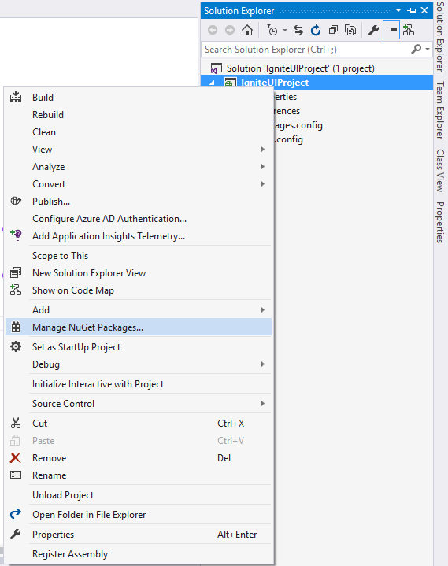

<!--
|metadata|
{
    "fileName": "Using-Ignite-UI-NuGet-Packages",
    "controlName": [],
    "tags": ["NuGet"]
}
|metadata|
-->

# %%ProductName%% NuGet パッケージの使用

### このトピックの内容

このトピックは、以下のセクションで構成されます。

-   [%%ProductName%% NuGet パッケージの使用](#usingNuGet)
-   [オンライン プライベート フィードから %%ProductName%% パッケージをインストール](#privateFeedInstallation)
-   [ローカル フィードから %%ProductName%% パッケージをインストール](#localFeedInstallation)
-   [%%ProductName%% パッケージを GUI によりインストール](#guiInstallation)
-   [%%ProductName%% パッケージをパッケージ マネージャー コンソールによりインストール](#consoleInstallation)
-   [%%ProductNameMVC%% NuGet パッケージのインストール ファイル](#whatIsInstalled)
-   [%%ProductName%% NuGet パッケージのアンインストール](#uninstalling)
-   [%%ProductNameASPNETCore%% の NuGet パッケージの使用](#aspnetcore)

## <a id="usingNuGet"></a> %%ProductName%% NuGet パッケージの使用

NuGet はツールおよびサービスを提供するパッケージ マネージャーです。2010 年に .NET などの Microsoft 開発プラットフォームのオープンソース パッケージ マネージャーとして公開されました。NuGet を使用して開発を向上して自動化できます。

NuGet でパッケージをインストールすると、ライブラリ ファイルがソリューションにコピーされ、プロジェクトを自動的に更新します。つまり、参照を追加、構成ファイルを変更、更に以前のバージョンのスクリプト ファイルを置き換えます。NuGet は Visual Studio 2010 以後で利用可能ですが、Visual Studio 2012 以後デフォルトで含まれます。使用方法の詳細については、[Nuget ヘルプ](http://docs.nuget.org/ndocs/guides/install-nuget)を参照してください。

Infragistics %%ProductName%% コントロールは NuGet パッケージとして公開されます。この NuGet パッケージは、プロジェクトの必要な Infragistics ファイルおよびアセンブリをすばやく簡単にインストールできる方法です。

NuGet パッケージを使用する 2 通りの方法があります。インフラジスティックスが提供するすべての Nuget パッケージを常に最新に保つことができるよう [https://packages.infragistics.com/nuget/licensed](https://packages.infragistics.com/nuget/licensed) にホストされているプライベート Nuget フィードのご使用をお勧めします。この方法では、新しいプロジェクトを作成するときにパッケージの最新版を取得できます。または既存のプロジェクトのパッケージを復元することもできます。

もう 1 つの方法は、Nuget インストーラーを実行して %%ProductName%% Nuget パッケージをローカルにインストールする方法です。インストーラーは、利用可能な %%ProductName%% NuGet パッケージをすべて表示する「Infragistics (ローカル)」と呼ばれるローカル フィードを作成します。インストールで [製品キー] フィールドが空の場合、インストーラーはパッケージのトライアル版をインストールします。この方法では、%%ProductName%% Nuget パッケージを使用する際にアセンブリを最新版に更新したい場合、手動で最新版をインストールする必要があります。 

## <a id="privateFeedInstallation"></a> オンライン プライベート フィードから %%ProductName%% パッケージをインストール

はじめにパッケージ ソースとしてインフラジスティックス フィードを追加します。ツール/オプション/NuGet パッケージ マネージャー/パッケージ ソースへ移動します。

新しいソースの追加ボタンで新しいパッケージ ソースを追加します。名前を「インフラジスティックス フィード」と入力します (任意の名前を使用します)。ソースを [*https://packages.infragistics.com/nuget/licensed*](https://packages.infragistics.com/nuget/licensed) に設定し、OK をクリックしてソースを保存します。


パッケージに参照を追加する方法がいくつかあります。簡単な方法は、プロジェクトを右クリックして [Nuget パッケージの管理] を選択します。

[NuGet パッケージの管理] ダイアログでパッケージ ソースに [Infragistics] フィードを選択するとユーザー名とパスワードの入力を促されます。インフラジスティックス ウェブサイトのアカウント ログインで使用する資格情報を入力してください。


[ログインを保持] チェックボックスをチェックすることにより資格情報が Windows に保存され、次回より資格情報マネージャーに処理されます。資格情報を入力するとインストールできるパッケージのリストが取得できます。パッケージを選択後、プロジェクトに必要なアセンブリがインストールされ、packages.config がインストールされたパッケージで更新されます。

## <a id="localFeedInstallation"></a> ローカル フィードから %%ProductName%% パッケージをインストール

%%ProductName%% NuGet パッケージをプロジェクトにインストールするには、GUI またはコンソールを使用できます。両方を以下に説明します。すべての手順およびスクリーンショットは Visual Studio 2015 に基づいていますが、Visual Studio の以前のバージョンもほとんど同じです。このトピックで詳細に説明するため、NuGet を使用した経験がない場合も作業をすぐに開始できます。

 1. 新しい %%ProductName%% Web アプリケーション プロジェクトを作成します。名前を IgniteUIProject に設定します。

 2. 空のプロジェクトを選択します。

 3. プロジェクトを作成した後、ソリューション エクスプローラーは以下のようになります。
 
 プロジェクトはプロパティ、参照、および Web.config の 3 つのデフォルト ノードを含みます。

 
### <a id="guiInstallation"></a> %%ProductName%% パッケージを GUI によりインストール

%%ProductName%% NuGet パッケージを GUI からインストールするには、プロジェクト名を右クリックし、「NuGet パッケージの管理」をコンテキスト メニューから選択します。
 

これは **NuGet パッケージの管理**ビューを開きます。このビューでプロジェクトで利用可能なすべてのパッケージを表示します。

パッケージ ソースを **Infragistics (ローカル)** に変更します。


「参照」タブに移動すると、利用可能な %%ProductName%% NuGet パッケージのリストが表示されます。

パッケージを選択すると、右パネルに詳細情報が表示されます。ここに選択したパッケージの依存関係のリストがあります。これらのアセンブリは自動的にプロジェクトにインストールされます。

[インストール] ボタンをクリックして、選択したパッケージはプロジェクトに追加されます。 


### <a id="consoleInstallation"></a> %%ProductName%% パッケージをパッケージ マネージャー コンソールによりインストール

以下で、%%ProductName%% パッケージをパッケージ マネージャー コンソールを使用して追加する方法を説明します。コンソールでは、インストールするパッケージを検索する必要がないため、より速くアセンブリを追加します。


コンソールを表示するには、Visual Studio の**ツール** メニューを選択し、**NuGet パッケージ マネージャー** の **パッケージ マネージャー コンソール** を選択します。


**パッケージ マネージャー コンソール**は画面の下部に表示されます。インストールを開始するには、「Install-Package *パッケージ名*」を入力するだけです。たとえば、「Infragistics.Web.Mvc.JP」をインストールする場合、「Install-Package Infragistics.Web.Mvc.JP」と入力すると、マネージャーがこのアセンブリおよびすべての依存関係をインストールします。コンソールでパッケージ ソース ドロップダウンから Infragistics (ローカル) を選択することに注意してください。

インストールが完了した後、コンソールに %%ProductName%% パッケージがプロジェクトに正常に追加されましたというメッセージが表示されます。


## <a id="whatIsInstalled"></a> %%ProductNameMVC%% NuGet パッケージのインストール ファイル


%%ProductNameMVC%% パッケージをインストールする場合、JavaScript および Content フォルダーがプロジェクトに追加されます。このフォルダーは Infragistics JS および CSS リソースを含みます。MVC パッケージをインストールする場合、必要なアセンブリも参照に追加されます。

## <a id="uninstalling"></a> %%ProductName%% NuGet パッケージのアンインストール

パッケージによりインストールされるアセンブリをアンインストールできます。GUI またはパッケージ マネージャー コンソールで行うことができます。インストール方法に関係なく、いずれかの方法を使用できます。

アセンブリを解除するには、プロジェクトを右クリックして **NuGet パッケージの管理**を選択します。すべてのインストールされたアセンブリが表示されます。アンインストールするアセンブリを選択して **[アンインストール]** ボタンをクリックします。


これは選択したアセンブリのみをアンインストールします。パッケージで依存関係としてインストールされるアセンブリが保持されることに注意してください。 

また、アセンブリにその他のアセンブリと依存関係がある場合、アンインストールできません。たとえば、**Infragistics.Web.MVC.JP** をプロジェクトにインストールしましたが、依存関係としてインストールされた IgniteUI をアンインストールしようとすると、依存関係があるため、アンインストールできないことを説明するエラー メッセージが表示されます。アンインストールするには、依存関係のアセンブリを最初にすべてアンインストールする必要があります。 


コンソールでアセンブリをアンインストールするには、「Uninstall-Package *パッケージ名*」を入力します。たとえば、「Uninstall-Package IgniteUI.MVC.JP」。高パフォーマンスアプリケーションの開発を簡単にすばやく開始できます。

## <a id="aspnetcore"></a> %%ProductNameASPNETCore%% の NuGet パッケージの使用

%%ProductNameASPNETCore%% の NuGet パッケージを使用する場合、ASP.NET Core アプリケーションの作成で次の情報に注意してください。%%ProductNameASPNETCore%% 2017.2 バージョン以前、ASP.NET Core MVC の NuGet パッケージ名は Infragistics.Web.Mvc として配布されていました。2017.2 バージョンで、同じく Infragistics.Web.Mvc と呼ばれる MVC4 および MVC5 パッケージと区別するために、パッケージは Infragistics.Web.AspNetCore に名前変更されました。

ASP.NET Core 2.x プロジェクトに Infragistics.Web.AspNetCore パッケージをインストールすると、パッケージはデフォルトでインストールされる Microsoft.AspNetCore.All パッケージの NuGet 依存関係の下に配置されます。

Infragistics.Web.AspNetCore パッケージは、IgniteUI と依存関係があります。つまり、このパッケージをインストールすると、プロジェクトに必要な %%ProductName%% スクリプト ファイルもインストールします。デフォルト プロジェクトが PackageRefrences を使用するため、静的なスクリプト ファイルが自動的にプロジェクトに追加されません。スクリプト ファイルは %UserProfile%\.nuget\packages フォルダーにインストールされます。アプリケーションに必要な %%ProductName%% ファイルをコピーしてプロジェクトの  wwwroot フォルダーに貼り付けます。.cshtml ページで、このフォルダーからスクリプトを参照する必要があります。

スクリプト ファイルの追加後、%%ProductNameASPNETCore%% コントロールを追加する .cshtml ページで使用できます。名前空間を以下のようにインポートする必要があります。

```js
@using Infragistics.Web.Mvc 
```

以下、%%ProductName%% スクリプトを参照します。たとえば、以下のようです:

```js
<link href="~/css/themes/infragistics/infragistics.theme.css" rel="stylesheet" /> 

<link href="~/css/structure/infragistics.css" rel="stylesheet" /> 

<script src="~/js/infragistics.core.js"></script> 

<script src="~/js/infragistics.lob.js"></script> 
```

%%ProductName%% スクリプトを使用する前に jQuery および jQueryUI を参照する必要があります。完了後、シナリオに応じて %%ProductNameASPNETCore%% コントロールを作成できます。この例では、以下のコードを使用して数値エディターを作成します。

```js
@(Html.Infragistics().NumericEditor().ID("newEditor").MaxValue(100).Render())
```