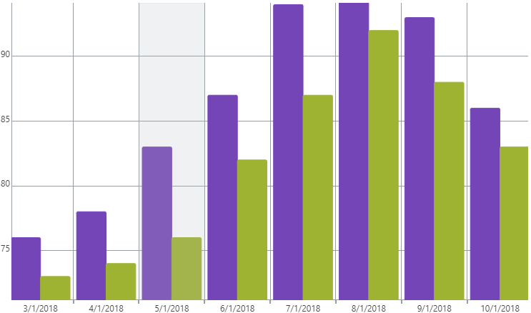

<!--
|metadata|
{
    "fileName": "igcategorychart-category-highlight-layer",
    "controlName": "igCategoryChart",
    "tags": ["API", "CategoryChart"]
}
|metadata|
-->

# カテゴリ ハイライト レイヤー

Category Highlight Layer は、カテゴリ上にポインタをホバー時にチャートのカテゴリを強調表示します。

## カテゴリ強調表示レイヤー

カテゴリ強調表示レイヤーは、`isCategoryHighlightingEnabled` オプションを true に設定して有効にできます。

以下のコード スニペットは、`igCategoryChart` で Category Highlight Layer を有効にする方法を示します。

*In HTML:*

```html
$(function () {
     $("chart1").igCategoryChart({
	     isCategoryHighlightingEnabled: true
     });
});
```

以下のスクリーンショットは、Category Highlight Layer を使用した igCategoryChart コントロールを示します。




## <a id="relatedtopics"/>関連トピック:

- [項目強調表示レイヤー](igcategorychart-item-highlight-layer.html)

- [カテゴリ強調表示レイヤー](igcategorychart-category-tooltip-layer.html)
