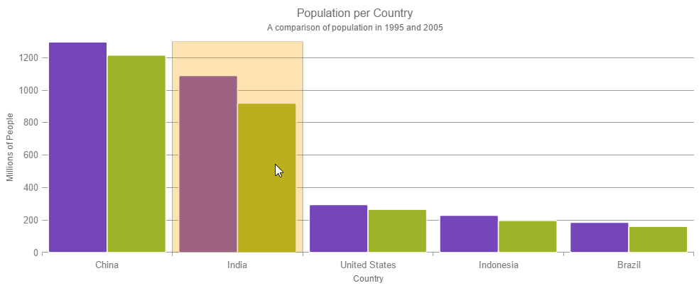
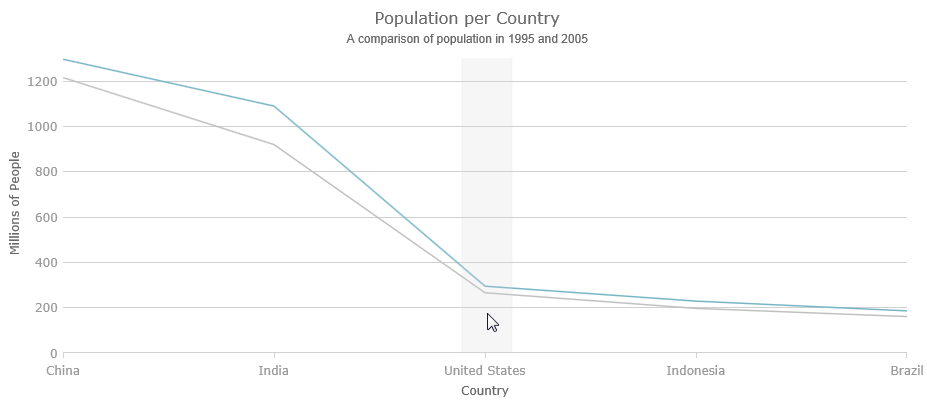

<!--
|metadata|
{
    "fileName": "hoverinteractions-category-highlight-layer",
    "controlName": "",
    "tags": []
}
|metadata|
-->

# カテゴリ強調表示レイヤーの構成 (igDataChart)

## トピックの概要

### 目的

このトピックは、ホバー操作に使用されるカテゴリ強調表示レイヤーについての情報を提供します。カテゴリ強調表示レイヤーのプロパティについて説明し、実装例を示します。

### 前提条件

このトピックを理解するために、以下のトピックを参照することをお勧めします。

- [igDataChart の追加](igDataChart-Adding.html): このトピックでは、`igDataChart`™ コントロールをページに追加し、データにバインドする方法を紹介します。

- [igDataChart をデータにバインド](igDataChart-DataBinding.html): このトピックでは、`igDataChart`™ コントロールを各種データ ソース (JavaScript 配列、IQueryable<T>、Web サービス) にバインドする方法について説明します。


### このトピックの内容

このトピックは、以下のセクションで構成されます。

-   [概要](#overview)
	-   [プレビュー](#preview)
-   [プロパティ](#properties)
-   [例](#example)
-   [関連コンテンツ](#related-content)
    -   [トピック](#topics)
    -   [サンプル](#samples)


## <a id="overview"></a> 概要

#### カテゴリ強調表示レイヤーの概要

`categoryHighlightLayer` は、`igDataChart` コントロール内の 1 つまたはすべてのカテゴリ軸を対象にしています。軸に、軸の主グリッド線の間に配置されるシリーズ、たとえば `columnSeries` などが含まれる場合、現在のカテゴリを塗りつぶすシェイプが描画されます。

`lineSeries` シリーズなどその他のシリーズの場合、マウス位置に最も近いグリッドラインで調節可能な厚さを持つバンドを描画します。この場合、`useInterpolation` プロパティが有効になると、x 位置がカーソルの x 位置に付け加えられます。

`brush` プロパティを設定することによって、強調表示領域の色を変更できます。このプロパティの詳細は、[ホバー操作プロパティ参照 (igDataChart)](HoverInteractions-Common-Properties.html) のトピックを参照してください。

### <a id="preview"></a> プレビュー

以下の画像は、追加の `categoryHighlightLayer` で描画された `igDataChart` コントロールのプレビューです。




## <a id="properties"></a> プロパティ

#### カテゴリ強調表示レイヤーのサマリー

以下の表で、`categoryHighlightLayer` レイヤーのプロパティを簡単に説明します。

プロパティ名|プロパティ タイプ|説明
---|---|---
bandHighlightWidth|double|このプロパティは、グリッドライン上に配置されたシリーズの強調表示領域の幅を指定します。たとえば、`lineSeries`、`areaSeries` および `splineSeries` です。このプロパティは、グリッドライン間に配置されたシリーズがある場合は影響を及ぼしません。たとえば、`columnSeries` と `waterfallSeries` です。このプロパティが設定されると、グリッドラインの周りに指定されたサイズの縞模様シェイプを強調表示します。
targetAxis|categoryAxisBase|このプロパティは、どの軸に有効なカテゴリ強調表示レイヤーを設定するかを指定します。
useInterpolation|bool|このプロパティは、強調表示バンドがグリッドラインにスナップするのでなくカーソルにスナップすべきかどうかを指定します。このプロパティは、グリッドライン間に配置されたシリーズがある場合は影響を及ぼしません。たとえば、`columnSeries` および `waterfallSeries` です。


## <a id="example"></a> 例

以下のスクリーンショットは、以下の設定の結果、`categoryHighlightLayer` オブジェクトの **`bandHighlightWidth`** プロパティを持つ `igDataChart` コントロールの外観がどのようになるか示します。

プロパティ|値
---|---
bandHighlightWidth|50



以下のコードはこの例を実装します。

**JavaScript の場合:**

```
<script type="text/javascript">
    $(function () {
        $("#chart").igDataChart({
            dataSource: data,
            axes: [{
                type: "categoryX",
                name: "NameAxis",
                label: "CountryName",
            }, {
                type: "numericY",
                name: "PopulationAxis",
            }],
            series: [
			{
                type: "column",
                name: "2005Population",
                xAxis: "NameAxis",
                yAxis: "PopulationAxis",
                valueMemberPath: "Pop2005"
            },
			{
                type: "line",
                name: "1995Population",
                xAxis: "NameAxis",
                yAxis: "PopulationAxis",
                valueMemberPath: "Pop1995"
            },
			{
                type: "categoryHighlightLayer",
                name: "catHighlightLayer",
                title: "categoryHighlight",
                useInterpolation: false,
                transitionDuration: 500,
				bandHighlightWidth: 50
            }]
        });
    });
</script>
```


## <a id="related-content"></a>関連コンテンツ

### <a id="topics"></a>トピック

- [ホバー操作の概要 (igDataChart)](HoverInteractions-Hover-Interactions-Overview.html): このトピックは、利用可能な異なる型のホバー操作レイヤーなど、`igDataChart` コントロール上で利用できるホバー操作について概念的な情報を提供します。

- [ホバー操作プロパティ参照 (igDataChart)](HoverInteractions-Common-Properties.html): このトピックは、ホバー操作機能が、series クラスから継承したツールチップの相互作用を強調表示、ホバリングおよび相互作用するために使用するプロパティおよびメソッドについての情報を提供します。

- [十字線レイヤーの構成 (igDataChart)](HoverInteractions-Crosshair-Layer.html): このトピックは、ホバー操作に使用される十字線レイヤーについての情報を提供します。十字線のプロパティについて説明し、実装例を示します。

- [カテゴリ強調表示レイヤーの構成 (igDataChart)](HoverInteractions-Category-Highlight-Layer.html): このトピックは、ホバー操作に使用されるカテゴリ強調表示レイヤーについての情報を提供します。カテゴリ強調表示レイヤーのプロパティについて説明し、実装例を示します。

- [カテゴリ ツールチップ レイヤーの構成 (igDataChart)](HoverInteractions-Category-Tooltip-Layer.html): このトピックは、ホバー操作に使用されるカテゴリ ツールチップ レイヤーについての情報を提供します。カテゴリ ツールチップ レイヤーのプロパティについて説明し、実装例を提供します。

- [項目ツールチップ レイヤーの構成 (igDataChart)](HoverInteractions-Item-Tooltip-Layer.html): このトピックは、ホバー操作に使用される項目ツールチップ レイヤーについての情報を提供します。項目ツールチップ レイヤーのプロパティについて説明し、実装例も提供します。


### <a id="samples"></a>サンプル

このトピックについては、以下のサンプルも参照してください。

- [ホバー操作 - カテゴリ強調表示レイヤー](%%SamplesUrl%%/data-chart/category-highlight-layer): このサンプルは、`igDataChart`™ コントロールで 1 つまたはすべてのカテゴリ軸を対象としたカテゴリ強調表示レイヤーを紹介します。このサンプル オプション ペインでは、カテゴリ強調表示レイヤーのプロパティを変更できます。強調表示の色、アウトライン、太さなどの変更が可能です。

- [ホバー操作 - カテゴリ項目強調表示レイヤー](%%SamplesUrl%%/data-chart/category-item-highlight-layer): このサンプルは、カテゴリ項目強調表示レイヤーでカテゴリ軸を使用、その場でバンド図形またはマーカーを描画してシリーズの項目を強調表示します。このサンプル オプション ペインでは、カテゴリ強調表示レイヤーのプロパティを変更できます。強調表示の色、アウトライン、太さなどの変更が可能です。

- [ホバー操作 - カテゴリ ツールチップ レイヤー](%%SamplesUrl%%/data-chart/category-tooltip-layer): このサンプルは、カテゴリ軸を使用してグループ化されたツールチップを表示するカテゴリ ツール チップ レイヤーを紹介します。このサンプル オプション ペインでは、ツールチップの位置の変更など、レイヤーのプロパティを編集できます。

- [ホバー操作 - 十字線レイヤー](%%SamplesUrl%%/data-chart/crosshair-layer): このサンプルは、ターゲットとする実際の値に一致する十字線を提供する十字線レイヤーを紹介します。このサンプル オプション ペインでは、十字線の太さの変更など、レイヤー プロパティを編集できます。

- [ホバー操作 - 項目ツールチップ レイヤー](%%SamplesUrl%%/data-chart/item-tooltip-layer): このサンプルは、すべてのターゲット シリーズに項目ツールチップ レイヤーを表示するツールチップ レイヤーを紹介します。このサンプル オプション ペインでは、トランジション期間の変更など、レイヤー プロパティを編集できます。

- [ホバー操作 - 複数レイヤー](%%SamplesUrl%%/data-chart/multiple-layers): このサンプルは、`igDataChart` コントロール内での複数レイヤーの相互作用を紹介します。このサンプルでは、項目ツールチップ レイヤー、十字線レイヤー、およびカテゴリ強調表示レイヤーを表示します。


 

 


