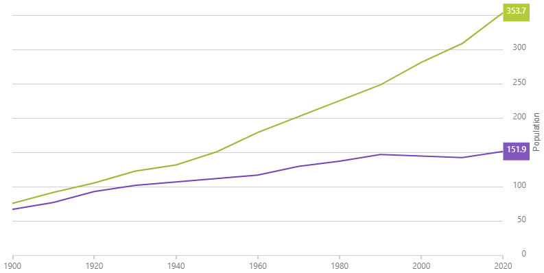

<!--
|metadata|
{
    "fileName": "hoverinteractions-final-value-layer",
    "controlName": "",
    "tags": []
}
|metadata|
-->

# 最終値レイヤーの構成 (igDataChart)

## トピックの概要

### 目的

このトピックは、最終値レイヤーについての情報を提供します。最終値レイヤーのプロパティについて説明し、実装例を示します。

### 前提条件

本トピックの理解を深めるために、以下のトピックを参照することをお勧めします。

- [Adding igDataChart](igDataChart-Adding.html): igDataChart の追加:このトピックでは、igDataChart コントロールをページに追加し、データにバインドする方法を紹介します。

- [igDataChart をデータへバインド](igDataChart-DataBinding.html): このトピックでは、[igDataChart](igDataChart-DataBinding.html)™ コントロールを各種データ ソース (JavaScript 配列、IQueryable<T>、Web サービス) にバインドする方法について説明します。

### このトピックの内容

このトピックは、以下のセクションで構成されます。

-   [概要](#overview)
	-   [プレビュー](#preview)
-   [プロパティ](#properties)
-   [例](#example)
-   [関連コンテンツ](#related-content)
    -   [トピック](#topics)
    -   [サンプル](#samples)

##  概要

#### 項目ツールチップ レイヤーの概要

`finalValueLayer` は、チャートでデータの最終値を表す注釈を表示します。

###  プレビュー

以下の画像は、`finalValueLayer` を使用して描画した `igDataChart` コントロールのプレビューです。

##  のプロパティ

#### 項目ツールチップ レイヤーについて

以下の表は `finalValueLayer` レイヤーのプロパティの概要です。

プロパティ名 | プロパティ型 | 説明
---|---|---
finalValueSelectionMode | `enumeration`| 最終値を識別するメソッドを指定します。

##  例

このサンプルは、最終値に軸注釈を表示する最終レイヤーを示します。

   [Final Value Layer](%%SamplesEmbedUrl%%/data-chart/final-value-layer)
   

## 関連リンク

### トピック

- [ホバー インタラクションの概要 (igDataChart)](HoverInteractions-Hover-Interactions-Overview.html): このトピックは、利用可能な異なる型のホバー操作レイヤーなど、`igDataChart` コントロールで使用できるホバー操作について概念的な情報を提供します。

### サンプル

以下のサンプルでは、このトピックに関連する追加情報を提供します。

- [ホバー操作 – 複数レイヤー](%%SamplesUrl%%/data-chart/final-value-layer): このサンプルは、`igDataChart` で最終値注釈レイヤーを使用しています。
