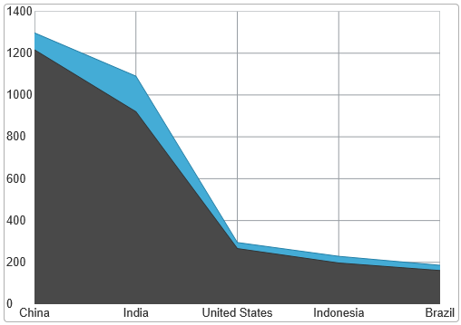

<!--
|metadata|
{
    "fileName": "igdatachart-new-default-style",
    "controlName": "igDataChart",
    "tags": ["Charting","Styling","Theming"]
}
|metadata|
-->

# 新しいデフォルト スタイル (igDataChart)


## トピックの概要


### 目的

このトピックでは、2014.1 リリースで `igDataChart`コントロールに適用される新しいデフォルト スタイルの詳細を提供します。変更された視覚領域を説明し、レガシー CSS ファイルを使用して以前のスタイルに戻る方法を説明します。

### 前提条件

このトピックを理解するために、以下のトピックを参照することをお勧めします。

-	[Ignite UI のスタイル設定とテーマ設定](Deployment-Guide-Styling-and-Theming.html): このトピックでは、デザイン段階でのアプリケーションのセットアップ手順について説明し、実稼働環境で CSS を使用するためのオプションを紹介すると同時に、テーマの作成またはカスタマイズについての概要を示します。

-	[igDataChart の追加](igDataChart-Adding.html): このトピックでは、`igDataChart`™ コントロールをページに追加し、データにバインドする方法を紹介します。

##新しいデフォルトのスタイル
### 概要

新しいデフォルト スタイルは、チャートの外観を更新するためにさまざまな設定を変更します。以下の画面は、以前のスタイルと新しいデフォルト スタイルを比較します。


##### 旧スタイル



##### 新しいデフォルトのスタイル


### 新しいデフォルト スタイルの変更

以下の表で、新しいデフォルト スタイルと以前の %%ProductName%% スタイルの違いを簡単に説明します。

<table class="table">
	<tbody>
	    <tr>
	        <th>変更</th>
	        <th>詳細</th>
	    </tr>
	    <tr>
	        <td>軸線の表示状態の機能拡張</td>
	        <td>
	            すべての軸 (グリッド) 線は、ブラシ ストロークが設定されない場合、チャートの判断ロジックはシリーズ タイプに基づいて表示する線を決定する自動動作を使用します。これはチャートを描画するパフォーマンスを向上します。
	            <ul>
	                <li>副グリッド線以外にすべての軸 (グリッド) 線が表示されます。</li>
	
	            <li>すべての水平カテゴリ シリーズ (柱状、折れ線、エリア シリーズ) の線は常に表示されます。</li>
	
	            <li>すべての垂直カテゴリ シリーズ (棒シリーズ) は垂直線のみを表示します。散布、極座標、およびラジアル シリーズはすべてのグリッド線を表示します。</li>
	            </ul>
	        </td>
	    </tr>
	    <tr>
	        <td>軸目盛の長さ</td>
	        <td>すべてのカテゴリ軸で、デフォルトの目盛の長さは 5 ピクセルです。(以前のスタイルでは、長さは 0 です。)</td>
	    </tr>
	    <tr>
	        <td>一番近いピクセルに吸着される軸線</td>
	        <td>水平と垂直のグリッド線は、現在、外観を簡潔にするために一番近いピクセル数に丸めて吸着されます。たとえば、y=2.213 に設定された線は y=2.000 で描画されます。(以前のテンプレートでは、グリッド線のスナップはありません。)
	        </td>
	    </tr>
	    <tr>
	        <td>軸ラベルの余白</td>
	        <td>すべての軸ラベルに対してデフォルトで 5 ピクセルの余白が追加されます。</td>
	    </tr>
	    <tr>
	        <td>エリア シリーズの不透明度</td>
	        <td>エリアに似たすべてのシリーズ (エリア、スプライン エリア、ポーラ エリアなど) は、現在、それらのエリアのビジュアルに対して半透明のブラシを使用します。(以前のスタイルでは、完全に不透明です。)</td>
	    </tr>
	    <tr>
	        <td>色の改善</td>
	        <td>チャートに利用可能な色を変更しました。軸線のカラー パレットを変更しました。チャートの外観を向上しました。以下の要素に使用する色が変更されます (それだけに限定されません)。
	            <ul>
	                <li>ラベルのフォント</li>
	
	                <li>シリーズ ブラシ</li>
	
	                <li>アウトライン</li>
	            </ul>
	        </td>
	    </tr>
	</tbody>
</table>

チャートでこれらの項目を構成する方法の詳細は、以下の[スタイルの構成](#_Style_config)セクションを参照してください。

###<a id="_Style_config"></a> 新しいデフォルト スタイルの構成

以下の表は、新しいデフォルト スタイル設定の構成可能な属性の概要を提供し、プロパティ設定にマップします。

<table class="table table-bordered">
    <thead>
        <tr>
            <th colspan="2">
構成の目的:
            </th>
            <th>
使用するプロパティ:
            </th>
            <th>
設定する値のタイプ:
            </th>
        </tr>
    </thead>
    <tbody>
        <tr>
            <td rowspan="2">
軸線
            </td>
            <td>
軸ストローク線
            </td>
            <td>
[axes[0].stroke](%%jQueryApiUrl%%/ui.igDataChart#options:axes.stroke)
            </td>
            <td rowspan="2">
color
            </td>
        </tr>
        <tr>
            <td>
軸の主線
            </td>
            <td>
[axes[0].majorStroke](%%jQueryApiUrl%%/ui.igDataChart#options:axes.majorStroke)
            </td>
        </tr>
        <tr>
            <td colspan="2">
軸線の配置
            </td>
            <td>
[alignsGridLinesToPixels](%%jQueryApiUrl%%/ui.igDataChart#options:alignsGridLinesToPixels)
            </td>
            <td>
value
            </td>
        </tr>
        <tr>
            <td>
軸目盛り
            </td>
            <td>
目盛の長さ
            </td>
            <td>
[axes[0].tickLength](%%jQueryApiUrl%%/ui.igDataChart#options:axes.tickLength)
            </td>
            <td>
length
            </td>
        </tr>
        <tr>
            <td colspan="2">
軸ラベルの余白
            </td>
            <td>
[axes[0].labelMargin](%%jQueryApiUrl%%/ui.igDataChart#options:axes.labelMargin)
                <br />
[axes[0].labelTopMargin](%%jQueryApiUrl%%/ui.igDataChart#options:axes.labelTopMargin)
                <br />
[axes[0].labelRightMargin](%%jQueryApiUrl%%/ui.igDataChart#options:axes.labelRightMargin)
                <br />
[axes[0].labelBottomMargin](%%jQueryApiUrl%%/ui.igDataChart#options:axes.labelBottomMargin)
                <br />
[axes[0].labelLeftMargin](%%jQueryApiUrl%%/ui.igDataChart#options:axes.labelLeftMargin)
            </td>
            <td>
margin
            </td>
        </tr>
        <tr>
            <td colspan="2">
エリア シリーズの不透明度
            </td>
            <td>
[series[0].areaFillOpacity](%%jQueryApiUrl%%/ui.igDataChart#options:series.areaFillOpacity)
            </td>
            <td>
opacity
            </td>
        </tr>
        <tr>
            <td rowspan="2">
チャートの色
            </td>
            <td>
シリーズ
            </td>
            <td>
[brushes](%%jQueryApiUrl%%/ui.igDataChart#options:brushes)
                <br />
[outlines](%%jQueryApiUrl%%/ui.igDataChart#options:outlines)
            </td>

            <td rowspan="2">
color
            </td>
        </tr>
        <tr>
            <td>
ラベル フォントの色
            </td>
            <td>
[axes[0].labelTextColor](%%jQueryApiUrl%%/ui.igDataChart#options:axes.labelTextColor)
            </td>
        </tr>
    </tbody>
</table>


##以前のスタイルに戻る


### レガシー スタイル ファイルの場所

レガシー チャート スタイルは以下の保管場所にあります。

```
%%InstallPath%%\css\structure\modules\infragistics.ui.chart.legacy.css
```

### レガシー CSS ファイルを適用

レガシー スタイルを適用するには、`igDataChart` が使用されるページの *HEAD* セクションにスタイルへのリンクを含めます。`igLoader` を使用している場合、ローダーのリソースに CSS ファイルを含めます。

**JavaScript の場合:**

```
$.ig.loader({
    scriptPath: '{IG Resources root}/js/',
    cssPath: '{IG Resources root}/css/',
    resources: 'igDataChart.Category, {IG Resources root}/css/structure/modules/infragistics.ui.chart.legacy.css'
});
```


## 関連コンテンツ


### トピック

このトピックの追加情報については、以下のトピックも合わせてご参照ください。

-	[シリーズ タイプ (igDataChart)](igDataChart-Series-Types.html): このトピックでは、`igDataChart` コントロールが生成できるチャート シリーズの種類を概念的に説明します。

-	[構成可能な視覚要素 (igDataChart)](igDataChart-Visual-Elements.html): このトピックでは、`igDataChart` コントロールとそれらを管理するプロパティの構成可能なすべての視覚要素の一覧を示します。

### サンプル

このトピックについては、以下のサンプルも参照してください。

-	[カテゴリ シリーズ](%%SamplesUrl%%/data-chart/category-series): このサンプルでは、`igDataChart` コントロールで利用できるさまざまなカテゴリ シリーズを紹介します。


 

 


