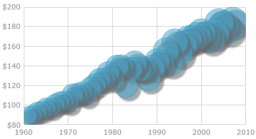

<!--
|metadata|
{
    "fileName": "igdatachart-styling-the-chart-series",
    "controlName": "igDataChart",
    "tags": ["Charting","Styling"]
}
|metadata|
-->

# チャート シリーズのスタイル設定 (igDataChart)


##トピックの概要

### 目的

このトピックは、`igDataChart`™ コントロールのシリーズのスタイル設定方法の概要について紹介し、例として影付きの効果をシリーズに適用する方法を紹介します。

### 前提条件

このトピックを理解するために、以下のトピックを参照することをお勧めします。


-	[igDataChart の追加](igDataChart-Adding.html)

このトピックでは、`igDataChart` コントロールをページに追加し、データにバインドする方法を紹介します。


### このトピックの内容

このトピックは、以下のセクションで構成されます。

-   [概要](#introduction)
-   [影付きの効果を適用したチャート シリーズのスタイル設定](#drop-shadow-effect)
    -   [影付き効果の構成の概要](#drop-shadow-effect-config)
    -   [影のタイプ](#shadow-types)
    -   [影付き効果の構成の概要表](#drop-shadow-effect-chart)
    -   [プロパティ設定](#property-settings)
    -   [例 – モノリス シャドウによる影付き効果](#example)
    -   [例 – コンパウンド シャドウによる影付き効果](#example-drop-shadow-effect)
-   [関連コンテンツ](#related-content)
    -   [トピック](#topics)
    -   [サンプル](#samples)


##<a id=""></a>概要


### チャート シリーズのスタイル設定の概要

igDataChart のシリーズは、複数の要素でスタイル設定できますが、異なるフィールとアウトライン ブラシをシリーズに適用することが重要な点です。これはシリーズの [`brush`](%%jQueryApiUrl%%/ui.igDataChart#options:brush) と [`outline`](%%jQueryApiUrl%%/ui.igDataChart#options:outline) プロパティで処理されます。シリーズのルック アンド フィールのその他の要素、たとえばアウトラインの太さやシリーズの不透明度なども、シリーズの [`strokeThickness`](%%jQueryApiUrl%%/ui.igDataChart#options:strokeThickness) および [`opacity`](%%jQueryApiUrl%%/ui.igDataChart#options:opacity) のプロパティで構成できます。

上記で説明するスタイル設定の制御に加え、[`isDropShadowEnabled`](%%jQueryApiUrl%%/ui.igDataChart#options:isDropShadowEnabled) プロパティでも[影付き効果をチャート シリーズに適用できます](#drop-shadow-effect)。


##<a id="drop-shadow-effect"></a>影付きの効果を適用したチャート シリーズのスタイル設定

###<a id="drop-shadow-effect-config"></a> 影付き効果の構成の概要

影付き効果により、シリーズはあたかも3Dのように見えます。



シリーズの [`isDropShadowEnabled`](%%jQueryApiUrl%%/ui.igDataChart#options:isDropShadowEnabled) プロパティを "true" に設定すると、シリーズに影付き効果が適用されます。[構成可能な影のタイプ](#_Configurable_shadow_types)の場合、効果のカスタマイズとして、ぼかしの半径、色、方向、および不透明度が[series](igDataChart-Series-Types.html) の影に関連するプロパティでサポートされています (詳細は[影付き効果の構成の概要表](#drop-shadow-effect-chart)、[プロパティの設定](#property-settings)およびコード例を参照してください)。

###<a id="shadow-types"></a> 影のタイプ

2 種類の影が影付き効果で使用できます。シリーズの影が、塗りつぶし図形やアウトライン図形の個別の影、または単独のモノリス シャドウかにより使用するタイプが決定されます。

-   モノリス シャドウ – シリーズで表示される影は 1 種類のみ。
-   コンパウンド シャドウ – シリーズの塗りつぶし部分およびアウトライン部分で個別の影。

影のタイプのデフォルトはモノリスです。コンパウンド タイプを使用するメリットは、影付き効果の表示を微調整できる点です。

>**注:** 現在、コンパウンド シャドウにのみ [blur](#Blur) が適用できます。制限についての詳細は、[注意事項](#GoogleBug)を参照してください。

影のタイプは、[`useSingleShadow`](%%jQueryApiUrl%%/ui.igDataChart#options:useSingleShadow) プロパティで制御されます。このプロパティを *"true"* (既定) に設定するとモノリス シャドウが適用され、"false" に設定するとコンパウンド シャドウが適用されます。

### <a id="drop-shadow-effect-chart"></a> 影付き効果の構成の概要表

以下の表で、チャートの影付き効果で構成できる要素を簡単に説明し、構成に使用するプロパティにマップします。既定の影付き効果のスタイル設定は、シリーズのタイプによって異なります。表の後に、影のタイプの設定について、詳細や例が記載されています。

<table class="table table-striped">
	<tbody>
		<tr>
			<th>
				構成可能な項目
			</th>

			<th>
				詳細
			</th>

			<th>
				プロパティ
			</th>
		</tr>

		<tr>
			<td>
				<a name="_Hlk356484826"></a>構成可能な影のタイプ
			</td>

			<td>
				各シリーズに対し個別に影を構成 (スタイル設定) する、またはシリーズ全体を 1 つの表示にするのいずれかを指定します。
			</td>

			<td><ul>
				<li>
				<a href="%%jQueryApiUrl%%/ui.igDataChart#options:useSingleShadow" target="_blank">useSingleShadow</a></li>
				</ul>
			</td>
		</tr>

		<tr>
			<td>
				方向とオフセット
			</td>

			<td>
				投影する方向。シリーズの境界線四角形の左上端を基点に X/Y オフセット座標で指定した水平および垂直のオフセットです。
			</td>

			<td><ul>
				<li><a href="%%jQueryApiUrl%%/ui.igDataChart#options:shadowOffsetX" target="_blank">shadowOffsetX</a></li>
				<br>
				<li><a href="%%jQueryApiUrl%%/ui.igDataChart#options:shadowOffsetY" target="_blank">shadowOffsetY</a></li>
				</ul>
			</td>
		</tr>

		<tr>
			<td>
				色と不透明度
			</td>

			<td>
				影の色。半透明が指定されている場合は、半透明な影を描画します。
			</td>

			<td><ul>
				<li>
				<a href="%%jQueryApiUrl%%/ui.igDataChart#options:shadowColor" target="_blank">shadowColor</a></li>
				</ul>
			</td>
		</tr>

		<tr>
			<td>
				<a id="Blur" name="Blur"></a>ぼかし
			</td>

			<td>
				影の縁の定義レベル (シャープとぼかし) です。ぼかしのレベルは、等高線の広がりやフェード アウトの全体のピクセル数で定義されます。値が大きいと、影のぼかしが強くなります。
			</td>

			<td><ul>
				<li>
				<a href="%%jQueryApiUrl%%/ui.igDataChart#options:shadowBlur" target="_blank">shadowBlur</a></li>
				</ul>
			</td>
		</tr>
	</tbody>
</table>


### <a id="property-settings"></a>プロパティ設定

以下の表は、影付き効果の各プロパティ設定で構成できる項目を示しています。

<table class="table table-bordered">
	<tbody>
		<tr>
			<th colspan="2">
				構成の目的:
			</th>

			<th>
				使用するプロパティ:
			</th>

			<th>
				設定の選択肢:
			</th>
		</tr>

		<tr>
			<td colspan="2">
				使用される影付き効果
			</td>

			<td>
				<a href="%%jQueryApiUrl%%/ui.igDataChart#options:isDropShadowEnabled" target="_blank">isDropShadowEnabled</a>
			</td>

			<td>*“true”*</td>
		</tr>

		<tr>
			<td colspan="2">
				影のタイプ
			</td>

			<td>
				<a href="%%jQueryApiUrl%%/ui.igDataChart#options:useSingleShadow" target="_blank">useSingleShadow</a>
			</td>

			<td>
				“true” or “false”
			</td>
		</tr>

		<tr>
			<td colspan="2">
				影の色や不透明度
			</td>

			<td>
				<a href="%%jQueryApiUrl%%/ui.igDataChart#options:shadowColor" target="_blank">shadowColor</a>
			</td>

			<td>
				任意の HTML カラー名、HEX カラー コードまたは RGBA カラー定義
			</td>
		</tr>

		<tr>
			<td rowspan="2">
				方向とオフセット
			</td>

			<td>
				シリーズ表示の影の水平オフセット
			</td>

			<td>
				<a href="%%jQueryApiUrl%%/ui.igDataChart#options:shadowOffsetX" target="_blank">shadowOffsetX</a>
			</td>

			<td>
				ピクセルで指定したオフセットを表す double 値
			</td>
		</tr>

		<tr>
			<td>
				シリーズ表示の影の垂直オフセット
			</td>

			<td>
				<a href="%%jQueryApiUrl%%/ui.igDataChart#options:shadowOffsetY" target="_blank">shadowOffsetY</a>
			</td>

			<td>
				ピクセルで指定したオフセットを表す double 値
			</td>
		</tr>

		<tr>
			<td colspan="2">
				ぼかしのレベル
			</td>

			<td>
				<a href="%%jQueryApiUrl%%/ui.igDataChart#options:shadowBlur" target="_blank">shadowBlur</a>
			</td>

			<td>
				ぼかしのレベルを表す、任意のピクセルの double 値。値が大きいと、影のぼかしが強くなります。

				 <blockquote>
					<a id="GoogleBug" name="GoogleBug"></a>

					**注:** モノリス シャドウには、ぼかし効果は適用できません。**useSingleShadow** プロパティが "true"</span> に設定されている場合、shadowBlur 設定は無視され、影にぼかしが適用されることはありません。これは、<a href="https://code.google.com/p/chromium/issues/detail?id=100703" target="_blank">Google® Chrome™ のバグ</a>に対応するための制限です。すべての主要なブラウザーで同じ動作効果を保証することが目的です。上記の Chrome のバグが解消され次第、この効果はアップデートの対象となる予定です。

					

					それまでは、影をぼかす必要がある場合、コンパウンド シャドウを使用してください (useSingleShadow:"true")。
				</blockquote>
			</td>
		</tr>
	</tbody>
</table>

### <a id="example"></a> 例 – モノリス シャドウによる影付き効果

この例は、[モノリス](#shadow-types)の影付きを適用しスタイル設定する方法を示します。[`useSingleShadow`](%%jQueryApiUrl%%/ui.igDataChart#options:useSingleShadow) プロパティは デフォルトで"true" に設定されているため、明示的なコード設定は必要ありません。

以下のスクリーンショットは、以下の影の設定の結果、`igDataChart` コントロールの折れ線シリーズの外観がどのようになるか示しています。

<table class="table table-striped">
	<thead>
		<tr>
			<th>プロパティ</th>
			<th>値</th>
		</tr>
	</thead>
	<tbody>
		<tr>
			<td>[isDropShadowEnabled](%%jQueryApiUrl%%/ui.igDataChart#options:isDropShadowEnabled)</td>
			<td>true</td>
		</tr>
		<tr>
			<td>[shadowBlur](%%jQueryApiUrl%%/ui.igDataChart#options:shadowBlur)</td>
			<td>20</td>
		</tr>
		<tr>
			<td>[shadowColor](%%jQueryApiUrl%%/ui.igDataChart#options:shadowColor)</td>
			<td>"darkBlue"</td>
		</tr>
		<tr>
			<td>[shadowOffsetX](%%jQueryApiUrl%%/ui.igDataChart#options:shadowOffsetX)</td>
			<td>10</td>
		</tr>
		<tr>
			<td>[shadowOffsetY](%%jQueryApiUrl%%/ui.igDataChart#options:shadowOffsetY)</td>
			<td>-15</td>
		</tr>
	</tbody>
</table>


以下のコードはこの例を実装します。

**JavaScript の場合:**

```
series: [
    {
        type: "column",
        isDropShadowEnabled: true,
        shadowBlur: 20,
        shadowColor: "darkBlue",
        shadowOffsetX: 10,
        shadowOffsetY: -15
    }
```

### <a id="example-drop-shadow-effect"></a> 例 – コンパウンド シャドウによる影付き効果

この例は、[コンパウンド](#_Configurable_shadow_types)の影付きにぼかしを適用する方法を示します。

以下のスクリーンショットは、以下の影の設定の結果、`igDataChart` コントロールの柱状シリーズの外観がどのようになるか示しています。

<table class="table table-striped">
	<tbody>
		<tr>
			<th>
				プロパティ
			</th>

			<th>
				値
			</th>
		</tr>

		<tr>
			<td>
				<a href="%%jQueryApiUrl%%/ui.igDataChart#options:isDropShadowEnabled" target="_blank">isDropShadowEnabled</a>
			</td>

			<td>true</td>
		</tr>

		<tr>
			<td>
				<a href="%%jQueryApiUrl%%/ui.igDataChart#options:useSingleShadow" target="_blank">useSingleShadow</a>
			</td>

			<td>false</td>
		</tr>

		<tr>
			<td>
				<a href="%%jQueryApiUrl%%/ui.igDataChart#options:shadowBlur" target="_blank">shadowBlur</a>
			</td>

			<td>20</td>
		</tr>

		<tr>
			<td>
				<a href="%%jQueryApiUrl%%/ui.igDataChart#options:shadowColor" target="_blank">shadowColor</a>
			</td>

			<td>“darkBlue”</td>
		</tr>

		<tr>
			<td>
				<a href="%%jQueryApiUrl%%/ui.igDataChart#options:shadowOffsetX" target="_blank">shadowOffsetX</a>
			</td>

			<td>10</td>
		</tr>

		<tr>
			<td>
				<a href="%%jQueryApiUrl%%/ui.igDataChart#options:shadowOffsetY" target="_blank">shadowOffsetY</a>
			</td>

			<td>-15</td>
		</tr>
	</tbody>
</table>


以下のコードはこの例を実装します。

**JavaScript の場合:**

```
series: [
    {
        type: "column",
        isDropShadowEnabled: true,
        useSingleShadow: false,
        shadowBlur: 20,
        shadowColor: "darkBlue",
        shadowOffsetX: 10,
        shadowOffsetY: -15,
      }
```


##<a id="related-content"></a>関連コンテンツ


###<a id="topics"></a> トピック

このトピックの追加情報については、以下のトピックも合わせてご参照ください。


-	[igDataChart のスタイル設定](igDataChart-Styling-Themes.html): このトピックは、`igDataChart` コントロールにスタイルおよびテーマを適用する方法を紹介します。

-	[Ignite UI のスタイル設定とテーマ設定](Deployment-Guide-Styling-and-Theming.html): Ignite UI™ ライブラリのスタイルとテーマの更新に関する概要とその手順を説明します。


### <a id="samples"></a>サンプル

このトピックについては、以下のサンプルも参照してください。

-	[ドロップ シャドウ](%%SamplesUrl%%/data-chart/drop-shadows): このサンプルは、`igDataChart` コントロールで影付きの効果をデータ シリーズに適用する方法を紹介します。


 

 


