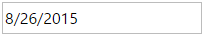

<!--
|metadata|
{
    "fileName": "igdateeditor-overview",
    "controlName": "igEditors",
    "tags": ["Editing","Getting Started"]
}
|metadata|
-->

# igDateEditor の概要


Ignite UI™ 日付エディター、つまり `igDateEditor` は日付に書式設定されたデータを編集できる入力フィールドを描画するコントロールです。`igDateEditor` コントロールは、ブラウザーから公開される異なる地域のオプションを認識することにより、ローカライズをサポートします。

`igDateEditor` コントロールは、任意のサーバー技術を使用する作業を構成できる豊富なクライアント側 API を公開します。Ignite UI™ のコントロールはサーバー非依存ですが、Microsoft® ASP.NET MVC Framework 専用のラッパーが機能するコントロールでは、希望する .NET™ 言語を使用してコントロールを構成できます。

`igDateEditor` コントロールは、大幅にスタイル変更ができるため、デフォルトのスタイルとまったく異なるルック アンド フィールのコントロールを実現できます。スタイル設定オプションでは、独自のスタイルも jQuery UI の ThemeRoller のスタイルも使用できます。

>**注:** 新しい日付エディターの大きな変更点の 1 つは、リストとドロップダウンのサポートが廃止されたことです。ドロップダウンやリストに関連するメソッドを使用しようとすると、メソッドが使用できないことを通知するメッセージが表示されます。 

図 1: ユーザーに描画された `igDateEditor`



## 機能

`igDateEditor` には次のような特徴があります。

-   全体のテーマのサポート
-   検証
-   カスタム入力フォーマットの定義
-   カスタム表示形式の定義
-   最小値と最大値の設定
-   ローカライズ
-   JavaScript クライアント API
-   ASP.NET MVC ラッパー

## igDateEditor の Web ページへの追加

1.  最初に、アプリケーションに必要なローカライズ済みのリソースを含めます。組み込むリソースの詳細は、「[Ignite UI で JavaScript リソースを使用](Deployment-Guide-JavaScript-Resources.html)」ヘルプ トピックをご覧ください。
2.  ご自分の HTML ページまたは ASP.NET MVC View で、必要な JavaScript ファイル、CSS ファイル、および ASP.NET MVC アセンブリを参照してください。

    **HTML の場合:**

    ```html
    <link type="text/css" href="/css/themes/infragistics/infragistics.theme.css" rel="stylesheet" />
    <link type="text/css" href="/css/structure/infragistics.css" rel="stylesheet" />
    <script type="text/javascript" src="/Scripts/jquery.min.js"></script>
    <script type="text/javascript" src="/Scripts/jquery-ui.min.js"></script>
    <script type="text/javascript" src="/Scripts/Samples/infragistics.core.js"></script>
	<script type="text/javascript" src="/Scripts/Samples/infragistics.lob.js"></script>
    ```

    **Razor の場合:**

    ```csharp
    @using Infragistics.Web.Mvc;

    <link type="text/css" href="@Url.Content("~/css/themes/infragistics/infragistics.theme.css")" rel="stylesheet" />
    <link type="text/css" href="@Url.Content("~/css/structure/infragistics.css")" rel="stylesheet" />

    <script type="text/javascript" src="@Url.Content("~/Scripts/jquery-1.9.1.min.js")"></script>
    <script type="text/javascript" src="@Url.Content("~/Scripts/jquery-ui.min.js")"></script>
    <script type="text/javascript" src="@Url.Content("~/Scripts/Samples/infragistics.core.js")"></script>
	<script type="text/javascript" src="@Url.Content("~/Scripts/Samples/infragistics.lob.js")"></script>
    <script type="text/javascript" src="@Url.Content("~/Scripts/Samples/modules/i18n/regional/infragistics.ui.regional-en.js")"></script>
    ```

3.  jQuery の実装では、HTML 内のターゲット要素として INPUT、DIV、または SPAN を作成します。ASP.NET MVC の実装では、含める要素を MVC ラッパーが作成するため、この手順はオプションです。

    **HTML の場合:**

    ```html
    <input id="dateEditor"/>
    ```

4. 上記の手順完了後、日付エディターを初期化します。

    > **注:** ASP.NET MVC View では、その他のオプションをすべて設定した後で `Render` メソッドを呼び出す必要があります。

    **JavaScript の場合:**

    ```js
    <script type="text/javascript">
          $('#dateEditor').igDateEditor();
    </script>
    ```

    **Razor の場合:**

    ```csharp
    @(Html.Infragistics().DateTimeEditor()
                 .ID("dateEditor")
                 .Render())
    ```

5.  Web ページを実行し、`igDateEditor` コントロールの基本セットアップを表示します。

## Value オプションの正しい設定

このトピックのこのセクションでは、一般的に使用されるいくつかのシナリオや特定のシナリオで、`igDateEditor` が value オプションの設定をどのように処理するかを示します。

value が空で編集モードの場合は、日のみなど日付の一部を入力します。日付の他の部分は日付オブジェクトによって生成されます。これは、日付オブジェクトが現在の日付を取得して、日付の足りない部分を補うことを意味します。 

すでに入力された値の一部の日を削除した場合、入力がぼかしになり、エディターが前回入力された日付から足りない部分を補います。たとえば、2015 年 2 月 28 日が入力されている場合に日を削除すると、入力がぼかしになった後で、日付は 2 月 28 日に戻ります。

But if you change a single field of the date, the editor will validate whether the newly created date is correct and if it is not correct it will recalculate it. For example, lets assume that the initially entered value was 01/31/2016 and you change only the month to February. Than the editor will take the day field and recalculate it as February has only 29 days. So the date will become 02/29/2016. Lets take a look at one more example. What will happen if we change only the date? If for example, you try to change manually the 02/29/2016 date to 02/30/2016 the editor will return the day to 29th as it will assume that you entered a wrong, not existing date.

Lets consider another scenario where we have the value set to the last day of a particular month. What will happen if you change the whole date by only adding a month in edit mode? The result will be that the editor will try to create the date by using the JavaScript Date object. For the sake of clarity lets take a look at the following example. The initially set value is again 01/31/2016, than we focus the editor and enter 2 for the month so the date in edit mode will look like this `_2/__/__`. Then the editor will try to use the previously used day and year and to fill in the deleted fields, but as we know February has only 29 days (two less then January) and that is why the JavaScript object will recalculate the date and add two more days to 29th of February and thus the date will become 3/2/2016.

注意が必要な最後のシナリオは、値に誤りがある場合です。たとえば、2015 年 2 月 29 日と入力すると、2015 年はうるう年ではないため、エディターが自動的に日付を修正します。表示される日付は、2015 年 2 月 28 日になります。 

`minValue`、`maxValue`、および `value` オプションで文字列値を使用する場合、エディターは JavaScript Date オブジェクトのコンストラクターを使用して日付オブジェクトを作成し、相対するオプションの値として使用します。
>**注:** このプロパティは、日付を取得するために `displayInputFormat` 設定を使用しません。 

## 関連リンク

-   [日付と時刻書式設定](%%SamplesUrl%%/editors/date-and-time-formats) 
-   [Ignite UI の概要](NetAdvantage-for-jQuery-Overview.html)
-   [Ignite UI で JavaScript リソースを使用](Deployment-Guide-JavaScript-Resources.html)

 

 


