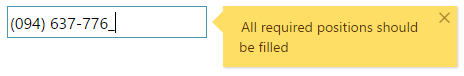

<!--
|metadata|
{
    "fileName": "igmaskeditor--overview",
    "controlName": "igEditors",
    "tags": ["Editing","Getting Started"]
}
|metadata|
-->

# igMaskEditor の概要

##igMaskEditor の概要

Ignite UI™ のマスク エディターまたは `igMaskEditor` は、指定の入力マスクによって決定される入力制限を強制する入力フィールドを描画するコントロールです。`igMaskEditor` コントロールは、ブラウザーから公開される異なる地域のオプションを認識することにより、ローカライズをサポートします。`igMaskEditor` コントロールは、任意のサーバー技術を使用する作業を構成できる豊富なクライアント側 API を公開します。Ignite UI™ のコントロールはサーバー非依存ですが、Microsoft® ASP.NET MVC Framework 専用のラッパーが機能するコントロールでは、希望する .NET™ 言語を使用してコントロールを構成できます。`igMaskEditor` コントロールは、大幅にスタイル変更ができるため、デフォルトのスタイルとまったく異なるルック アンド フィールのコントロールを実現できます。スタイル設定オプションでは、独自のスタイルも jQuery UI の ThemeRoller のスタイルも使用できます。<br />図 1: `igMaskEditor` コントロールの電話番号マスクの適用




##機能

`igMaskEditor` には以下の特徴があります。
-   全体のテーマのサポート
-   検証
-   カスタム パスの定義
-   異なるデータ モード
-   ローカライズ
-   JavaScript クライアント API
-   ASP.NET MVC ラッパー


>**注:** 新しいマスク エディターの大きな変更点の 1 つは、リストとドロップダウンのサポートが廃止されたことです。ドロップダウンやリストに関連するメソッドを使用しようとすると、メソッドが使用できないことを通知するメッセージが表示されます。 
   
##igMaskEditor の Web ページへの追加

1.  最初に、アプリケーションに必要なローカライズ済みのリソースを含めます。組み込むリソースの詳細は、「[Ignite UI で JavaScript リソースを使用](Deployment-Guide-JavaScript-Resources.html)」ヘルプ トピックをご覧ください。
2.  ご自分の HTML ページまたは ASP.NET MVC View で、必要な JavaScript ファイル、CSS ファイル、および ASP.NET MVC アセンブリを参照してください。

	**HTML の場合:**
    ```html
    <link type="text/css" href="/css/themes/infragistics/infragistics.theme.css" rel="stylesheet" />
    <link type="text/css" href="/css/structure/infragistics.css" rel="stylesheet" />
    <script type="text/javascript" src="/Scripts/jquery.min.js"></script>
    <script type="text/javascript" src="/Scripts/jquery-ui.min.js"></script>
    <script type="text/javascript" src="/Scripts/Samples/infragistics.core.js"></script>
	<script type="text/javascript" src="/Scripts/Samples/infragistics.lob.js"></script>
    ```

    **Razor の場合:**
    ```csharp
    @using Infragistics.Web.Mvc;
    <link type="text/css" href="@Url.Content("~/css/themes/infragistics/infragistics.theme.css")" rel="stylesheet" />
    <link type="text/css" href="@Url.Content("~/css/structure/infragistics.css")" rel="stylesheet" />
    <script type="text/javascript" src="@Url.Content("~/Scripts/jquery-1.9.1.min.js")"></script>
    <script type="text/javascript" src="@Url.Content("~/Scripts/jquery-ui.min.js")"></script>
    <script type="text/javascript" src="@Url.Content("~/Scripts/Samples/infragistics.core.js")"></script>
	<script type="text/javascript" src="@Url.Content("~/Scripts/Samples/infragistics.lob.js")"></script>
    <script type="text/javascript" src="@Url.Content("~/Scripts/Samples/modules/i18n/regional/infragistics.ui.regional-en.js")"></script>
    ```
3.  jQuery の実装では、HTML 内のターゲット要素として INPUT、DIV、または SPAN を作成します。ASP.NET MVC の実装では、含める要素を MVC ラッパーが作成するため、この手順はオプションです。 

	**HTML の場合:**
    ```html
    <input id="maskEditor" />
    ```

4. 上記の手順完了後、数値エディターを初期化します。

    >**注:** ASP.NET MVC View では、その他のオプションをすべて設定した後で `Render` メソッドを呼び出す必要があります。

    **JavaScript の場合:**

    ```js
    <script type="text/javascript">
           $('#maskEditor').igMaskEditor();
    </script>
    ```

    **Razor の場合:**

    ```csharp
    @(Html.Infragistics().MaskEditor()
                 .ID("maskEditor")
                 .Render())
    ```

5.  Web ページを実行し、`igMaskEditor` コントロールの基本セットアップを表示します。

##関連リンク

-   [マスク エディターの基本サンプル](%%SamplesUrl%%/editors/mask-editor-basic)
-   [Ignite UI の概要](NetAdvantage-for-jQuery-Overview.html)
-   [Ignite UI で JavaScript リソースを使用](Deployment-Guide-JavaScript-Resources.html)
 
 

