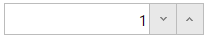

<!--
|metadata|
{
    "fileName": "ignumericeditor-overview",
    "controlName": "igEditors",
    "tags": ["Editing","Getting Started"]
}
|metadata|
-->

# igNumericEditor の概要


##igNumericEditor の概要

Ignite UI™ 数値エディター、つまり `igNumericEditor` は `dataMode` 値で決定された数値のみを受け付ける入力フィールドを描画するコントロールです。`igNumericEditor` コントロールは、ブラウザーから公開される異なる地域のオプションを認識することにより、ローカライズをサポートします。

`igNumericEditor` コントロールは、任意のサーバー技術を使用する作業を構成できる豊富なクライアント側 API を公開します。Ignite UI™ のコントロールはサーバー非依存ですが、Microsoft® ASP.NET MVC Framework 専用のラッパーが機能するコントロールでは、希望する .NET™ 言語を使用してコントロールを構成できます。

`igNumericEditor` コントロールは、大幅にスタイル変更ができるため、デフォルトのスタイルとまったく異なるルック アンド フィールのコントロールを実現できます。スタイル設定オプションでは、独自のスタイルも jQuery UI の ThemeRoller のスタイルも使用できます。

図 1: ユーザーに描画された `igNumericEditor`



[基本的な使用方法サンプル](%%SamplesUrl%%/editors/basic-usage)

##機能


`igNumericEditor` には次のような特徴があります。

-   全体のテーマのサポート
-   検証
-   異なるデータ モード
-   JavaScript クライアント API
-   ASP.NET MVC ラッパー
-   最小値と最大値


##igNumericEditor の Web ページへの追加


1.  最初に、アプリケーションに必要なローカライズ済みのリソースを含めます。組み込むリソースの詳細は、「[Ignite UI で JavaScript リソースを使用](Deployment-Guide-JavaScript-Resources.html)」ヘルプ トピックをご覧ください。
2.  ご自分の HTML ページまたは ASP.NET MVC View で、必要な JavaScript ファイル、CSS ファイル、および ASP.NET MVC アセンブリを参照してください。

    **HTML の場合:**

    ```html
    <link type="text/css" href="/css/themes/infragistics/infragistics.theme.css" rel="stylesheet" />
    <link type="text/css" href="/css/structure/infragistics.css" rel="stylesheet" />
    <script type="text/javascript" src="/Scripts/jquery.min.js"></script>
    <script type="text/javascript" src="/Scripts/jquery-ui.min.js"></script>
    <script type="text/javascript" src="/Scripts/Samples/infragistics.core.js"></script>
	<script type="text/javascript" src="/Scripts/Samples/infragistics.lob.js"></script>
    ```

    **Razor の場合:**

    ```csharp
    @using Infragistics.Web.Mvc;

    <link type="text/css" href="@Url.Content("~/css/themes/infragistics/infragistics.theme.css")" rel="stylesheet" />
    <link type="text/css" href="@Url.Content("~/css/structure/infragistics.css")" rel="stylesheet" />

    <script type="text/javascript" src="@Url.Content("~/Scripts/jquery.min.js")"></script>
    <script type="text/javascript" src="@Url.Content("~/Scripts/jquery-ui.min.js")"></script>
    <script type="text/javascript" src="@Url.Content("~/Scripts/Samples/infragistics.core.js")"></script>
	<script type="text/javascript" src="@Url.Content("~/Scripts/Samples/infragistics.lob.js")"></script>
    <script type="text/javascript" src="@Url.Content("~/Scripts/Samples/modules/i18n/regional/infragistics.ui.regional-en.js")"></script>
    ```

3.  jQuery の実装では、HTML 内のターゲット要素として INPUT、DIV、または SPAN を作成します。ASP.NET MVC の実装では、含める要素を MVC ラッパーが作成するため、この手順はオプションです。

    **HTML の場合:**

    ```html
    <input id="numericEditor"/>
    ```

4. 上記の手順完了後、数値エディターを初期化します。

    >**注:** ASP.NET MVC View では、その他のオプションをすべて設定した後で `Render` メソッドを呼び出す必要があります。

    **JavaScript の場合:**

    ```js
    <script type="text/javascript">
    $('#numericEditor').igNumericEditor();
    </script>
    ```

    **Razor の場合:**

    ```csharp
    @(Html.Infragistics().NumericEditor()
         .ID("numericEditor")
         .DataMode(NumericEditorDataMode.Int)
         .MinValue(0)
         .Value(0)
         .ButtonType(TextEditorButtonType.Spin)
         .Width(120)
         .Render())
    ```

5.  Web ページを実行し、`igNumericEditor` コントロールの基本セットアップを表示します。

##固有のオプション

`igNumericEditor` は、多くのプロパティを他のエディターと共有していますが、多くの独自なプロパティがあります。最初に、`dataMode` プロパティを見てみましょう。このプロパティは、エディターの入力値の型を設定または取得するために使用できます。デフォルト値は "double" ですが、int、float、byte および other も選択できます。すべての値については、[igNumericEditor jQuery API](%%jQueryApiUrl%%/ui.igNumericEditor) を参照してください。 

他にも固有のオプションとして、`decimalSeparator` があり、小数点記号として表示する文字を選択できます。`groupSeparator` にも同様の機能がありますが、このオプションでは、千以上の大きな数値の桁区切りとして使用する文字を選択できます。これらの使用例は後述しますが、その前にもう 1 つプロパティを見てみましょう。`groups` は配列を値として取得します。このプロパティは、セパレーターを使用する桁数の決定に使用できます。グループは、左から右にカウントされます。また、このオプションは表示モードでのみ有効であることに注意してください。

```js
$('#divEditor').igNumericEditor({
	width: "300",
	groups: [1,2,3],
	groupSeparator:"-"
});
```


 

>**注:** すべてのプロパティについては、[API ドキュメント](%%jQueryApiUrl%%/ui.igNumericEditor)を参照してください。

##関連リンク


-   [基本的な使用方法サンプル](%%SamplesUrl%%/editors/basic-usage)
-   [Ignite UI の概要](NetAdvantage-for-jQuery-Overview.html)
-   [Ignite UI で JavaScript リソースを使用](Deployment-Guide-JavaScript-Resources.html)

 

 


