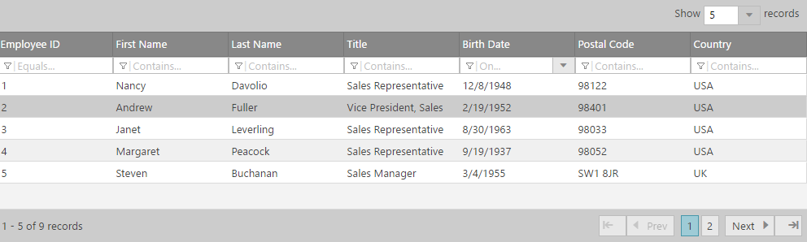

<!--
|metadata|
{
    "fileName": "iggrid-overview",
    "controlName": "igGrid",
    "tags": ["Getting Started","Grids"]
}
|metadata|
-->

# igGrid の概要

## igGrid の概要

`igGrid` は、表形式データの表示および操作に使用される jQuery ベースのクライアント側グリッドです。そのライフサイクル全体はクライアント側に存在し、サーバー側の技術からは独立しています。

 

## 機能

`igGrid` コントロールでは、次のように多数の異なる機能がサポートされています。

-   列サイズの変更
-   列の非表示
-   列の集計
-   行セレクター
-   Groupby
-   ツールチップ
-   並べ替え
-   フィルタリング
-   ページング
-   選択
-   更新
-   jQuery テンプレート
-   バーチャル スクロール

さらに、このグリッドは次もサポートしています。

-   高機能データ操作
-   キーボード ナビゲーション
-   豊富なクライアント側 API
-   ASP.NET MVC ラッパー

## igGrid の Web ページへの追加

次のステップは、いずれかの jQuery クライアント コードを使用して、Web ページに jQuery グリッドの基本的な実装を作成する方法を示します。どの実装を選択するかについて詳細は、[「Ignite UI の概要」](NetAdvantage-for-jQuery-Overview.html)を参照してください。

[igGrid の概要のサンプル](%%SamplesUrl%%/grid/overview)

最初に、アプリケーションに必要なローカライズ済みのリソースを含めます。組み込むリソースの詳細は、「[Ignite UI で JavaScript リソースを使用](Deployment-Guide-JavaScript-Resources.html)」ヘルプ トピックをご覧ください。

1.  HTML ページに**必要な JavaScript および CSS ファイルを参照**してください。**HTML の場合:**

    ```
    <script src="scripts/jquery.js" type="text/javascript"></script>
    <script src="scripts/jquery-ui.js" type="text/javascript"></script>
    <script src="scripts/infragistics.core.js" type="text/javascript"></script><script src="scripts/infragistics.lob.js" type="text/javascript"></script>
    <link href="css/themes/infragistics/infragistics.theme.css" rel="stylesheet" type="text/css" />
    <link href="css/structure/infragistics.css" rel="stylesheet" type="text/css" />
    ```

2. 次に、グリッドのデータ ソースとしての役割を果たす **JSON 配列を作成**します。

    **JavaScript の場合:**

    ```
    var products = [  
		{ "ProductID": 1, "Name": "Adjustable Race", "ProductNumber": "AR-5381" },  
		{ "ProductID": 2, "Name": "Bearing Ball", "ProductNumber": "BA-8327" },  
		{ "ProductID": 3, "Name": "BB Ball Bearing", "ProductNumber": "BE-2349" },  
		{ "ProductID": 4, "Name": "Headset Ball Bearings", "ProductNumber": "BE-2908" },  
		{ "ProductID": 316, "Name": "Blade", "ProductNumber": "BL-2036" },  
		{ "ProductID": 317, "Name": "LL Crankarm", "ProductNumber": "CA-5965" },  
		{ "ProductID": 318, "Name": "ML Crankarm", "ProductNumber": "CA-6738" },  
		{ "ProductID": 319, "Name": "HL Crankarm", "ProductNumber": "CA-7457" },  
		{ "ProductID": 320, "Name": "Chainring Bolts", "ProductNumber": "CB-2903" },  
		{ "ProductID": 321, "Name": "Chainring Nut", "ProductNumber": "CN-6137" }
	];
    ```

3. 与えられたデータを描画するために *igGrid* が使用する**テーブル DOM 要素を定義**します。

    **HTML の場合:**

    ```
    <table id=”grid1”></table>
    ```

4. 上記のセットアップが完了したら、*ID*、*columns*、*dataSource* などの**オプションを設定**します。

    1.  [columns](%%jQueryApiUrl%%/ui.iggrid#options:columns) – `igGrid` の列オブジェクト定義。
        -   `headerText` – 列のヘッダーのテキスト。
        -   `key` – データ ソースのキー フィールドの名前。
        -   `dataType` – 列のデータ型。「string」、「number」または「date」を指定できます。

    2.  [dataSource](%%jQueryApiUrl%%/ui.iggrid#options:dataSource) – `igGrid` がデータを表示しているデータ。次のようなオプションがあります。
	    -   JSON オブジェクト
	    -   JavaScript 配列
	    -   XML
	    -   リモート データ
	    -   テーブル DOM 要素
	    
	    **JavaScript の場合:**
	
	    ```
	    $(function () {
            $("#grid1").igGrid({
                columns: [
                    { headerText: "Product ID", key: "ProductID", dataType: "number" },
                    { headerText: "Product Name", key: "Name", dataType: "string" },
                    { headerText: "Product Number", key: "ProductNumber", dataType: "string" },
                ],
                width: '500px',
                dataSource: products
            });
        });
	    ```

5.  Web ページを実行します。`igGrid` は JSON 配列にバインドし、データを表示します。

     

## 関連コンテンツ

### トピック

-   [igGrid/igDataSource アーキテクチャの概要](igGrid-igDataSource-Architecture-Overview.html)
-   [Ignite UI の概要](NetAdvantage-for-jQuery-Overview.html) 
-   [Ignite UI で JavaScript リソースを使用](Deployment-Guide-JavaScript-Resources.html)

### サンプル

-   [igGrid の概要のサンプル](%%SamplesUrl%%/grid/overview) 

 

 


