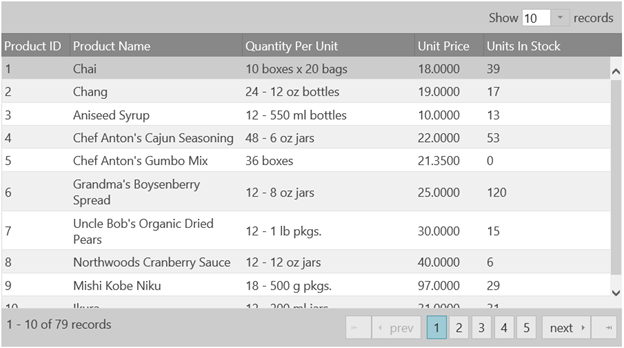

<!--
|metadata|
{
    "fileName": "iggrid-binding-to-web-services",
    "controlName": "igGrid",
    "tags": ["Data Binding","Grids","How Do I"]
}
|metadata|
-->

# igGrid を Web サービスにバインディング

## 概要

このドキュメントでは、Ignite UI® グリッドまたは `igGrid` を *oData* プロトコルの Web ベース データ ソースにバインドする方法を説明します。

## 以下の手順を実行します。

1.  HTML ページに必要な JavaScript および CSS ファイルを参照してください。

    **HTML の場合:**
   
    ```
    <script src="jquery.min.js" type="text/javascript"></script>
    <script src="jquery-ui.min.js" type="text/javascript"></script>
    <script src="infragistics.core.js" type="text/javascript"></script>
	<script src="infragistics.lob.js" type="text/javascript"></script>
    <link href="infragistics.theme.css" rel="stylesheet" type="text/css" />
    <link href="infragistics.css" rel="stylesheet" type="text/css" />
    ```

2.  このチュートリアルは、JSONP データ形式を返す [Netflix oData カタログ API](http://developer.netflix.com/docs/oData_Catalog) を使用します。HTML ページのスクリプト タグに、URL を保持する変数を追加します。

    **JavaScript の場合:**

    ```
    url = “http://odata.netflix.com/Catalog/Titles?$format=json&$callback=?";
    ```

3.  `dataSource` および `responseDataKey` プロパティを設定する `JSONPDataSource` のインスタンスを作成します。

    **JavaScript の場合:**

    ```
    jsonp = new $.ig.JSONPDataSource({ dataSource: url, responseDataKey: "d.results" });
    ```

    > **注:** サービスから返されるデータは次の形式です。

    **JavaScript の場合:**

    ```
    ?({
    "d" : {
    "results": [
    {
    "__metadata": {…
    ```

    これが、`responseDataKey` を `"d.results"` に設定する必要がある理由です。

4.  データ ソースを表すために、列テンプレートを使用する必要があります。次のコードは、Web サービスから返された画像、データの説明を表示する列テンプレートを表しています。

    **JavaScript の場合:**

    ```
    template: ""
	...
	template: "<p> ${Synopsis} </p>"
    ```

5.  次に、名前、画像、および概要の列を定義してグリッドを初期化する必要があります。

    **JavaScript の場合:**

	```
	$("#netflixGrid").igGrid({
        columns: [
            {headerText:"Movie Name", key:"Name", width: "150px"},
            {headerText:"Image", key:"BoxArt", width: "300px", template: "" },
            {headerText:"Movie Synopsis", key:"Synopsis", width: "400px", template: "<p> ${Synopsis} </p>"}
        ],
        dataSource: jsonp,
        height:'400px',
        features: [
            {
               name : 'Paging',
               pageSize : 20
            }
        ]
        });
    });
	```

6.  与えられたデータを描画するために `igGrid` が使用するテーブル DOM 要素を定義します。

    **HTML の場合:**

    ```
    <table id=”netflixGrid”></table>
    ```

7.  Web ページを実行します。`igGrid` が Web サービスにバインドして、返されたデータを表示します。

	

## 関連リンク

-   [*igDataSource* を REST サービスへバインド](igDataSource-Binding-to-REST-Services.html)

 

 


