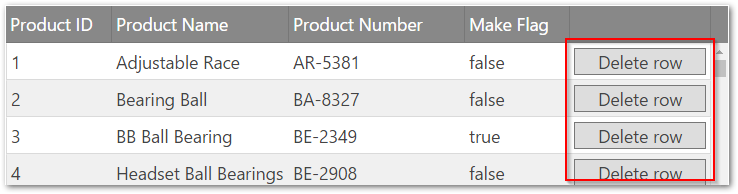

<!--
|metadata|
{
    "fileName": "creating-a-basic-column-template-in-the-iggrid",
    "controlName": "igGrid",
    "tags": ["Grids","How Do I","Templating"]
}
|metadata|
-->

# 基本的な列テンプレートの作成 (igGrid)

## トピックの概要

### 目的

このトピックでは、`igGrid`™ コントロールの基本的な列テンプレートを作成する方法を紹介します。

### このトピックの内容

このトピックは、以下のセクションで構成されます。

-   [**igGrid での基本的な列テンプレートの作成**](#basic-tempalte)
    -   [プレビュー](#preview)
    -   [前提条件](#prerequisites)
    -   [手順](#steps)
-   [**関連コンテンツ**](#related-content)
    -   [トピック](#topics)
    -   [サンプル](#samples)


## <a id="basic-tempalte"></a> igGrid での基本的な列テンプレートの作成

この例では、基本的な列テンプレートをグリッドに適用します。最初の 2 列には意図的に空白のままにしたヘッダー テキスト フィールドがありますが、これらはセルに各値を入れる前に移動されます。最後の列にはデータ ソースからの各値の前に `Price: $` が挿入されます。

### <a id="preview"></a> プレビュー

以下のスクリーンショットは最終結果のプレビューです。赤いアウトラインで囲まれた列にのみ列テンプレートが適用されます。



### <a id="prerequisites"></a> 前提条件

手順を完了するには空の HTML ページが必要です。

### <a id="steps"></a> 手順

以下のステップでは、`igGrid` の基本的な列テンプレートを作成する方法を紹介します。

1. HTML ページを準備

	HTML ページを準備するには、`igLoader` を追加し、`igHierarchicalGrid` リソースをロードするよう構成します。
	
	**JavaScript の場合:**
	
	```js
	<script src="http://localhost/ig_ui/js/infragistics.loader.js"></script>
	<script type="text/javascript">
		$.ig.loader({
			scriptPath: "http://localhost/ig_ui/js/",
			cssPath: "http://localhost/ig_ui/css/",
			resources: "igGrid"
		});
	</script>
	```

2. 列テンプレートを追加して適用

	1. ページにサンプル データを追加し、ページの本文にテーブル タグ付けします。
	
		**JavaScript の場合:**
		
		```js
		<script type="text/javascript">
		var northwindProducts = [{
			"ProductID": 1,
			"ProductName": "Chai",
			"QuantityPerUnit": "10 boxes x 20 bags",
			"UnitPrice": "18.0000"
		}, {
			"ProductID": 2,
			"ProductName": "Chang",
			"QuantityPerUnit": "24 - 12 oz bottles",
			"UnitPrice": "19.0000"
		}];
		</script>
		```
		
		**HTML の場合:**
		
		```html
		<body>
			<table id="grid1"></table>
		</body>
		```
	
	2. 列テンプレートを設定した igGrid を追加します。
	
		**JavaScript の場合:**
		
		```js
		<script type="text/javascript">
		$.ig.loader(function () {
	        $("#grid1").igGrid({
				width: 700,
				columns: [
					{ headerText: " ", key: "ProductID", dataType: "number", template: "ID: ${ProductID}", width: 50},
					{ headerText: " ", key: "ProductName", dataType: "string", template: "Product Name: ${ProductName}", width: 250 },
					{ headerText: "Quantity ", key: "QuantityPerUnit", dataType: "string", width: 200 },
					{ headerText: "Unit Price", key: "UnitPrice", dataType: "number", template: "Price: ${UnitPrice}", width: 100 }
				],
				autoGenerateColumns: false,
				dataSource: northwindProducts                  
	        })
		});
		</script>
		```

3. (オプション) 結果を確認します。

	ファイルを保存し、開いて結果をプレビューします。


## <a id="related-content"></a> 関連コンテンツ

### <a id="topics"></a> トピック

このトピックの追加情報については、以下のトピックも合わせてご参照ください。

- [Infragistics テンプレート エンジン](igTemplating-Overview.html): このセクションには、Infragistics® テンプレート エンジンの使用に関するトピックが含まれています。

### <a id="samples"></a> サンプル

このトピックについては、以下のサンプルも参照してください。

- [列テンプレート](%%SamplesUrl%%/grid/column-template): このサンプルは、igGrid の列テンプレート機能を使用して列にボタンを挿入する方法を紹介します。


 

 


