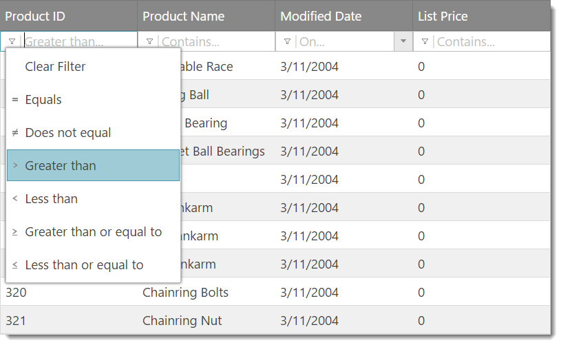
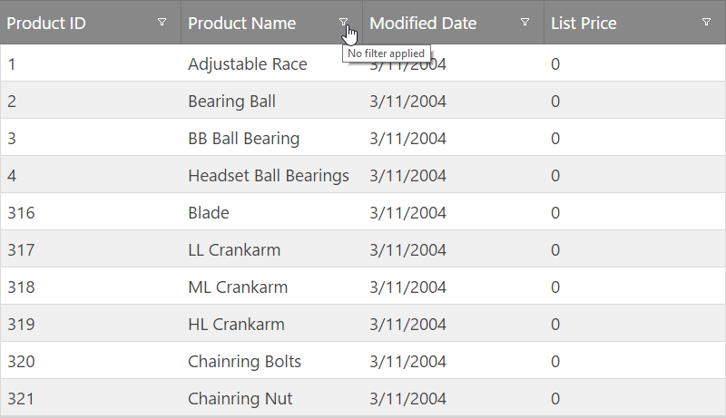
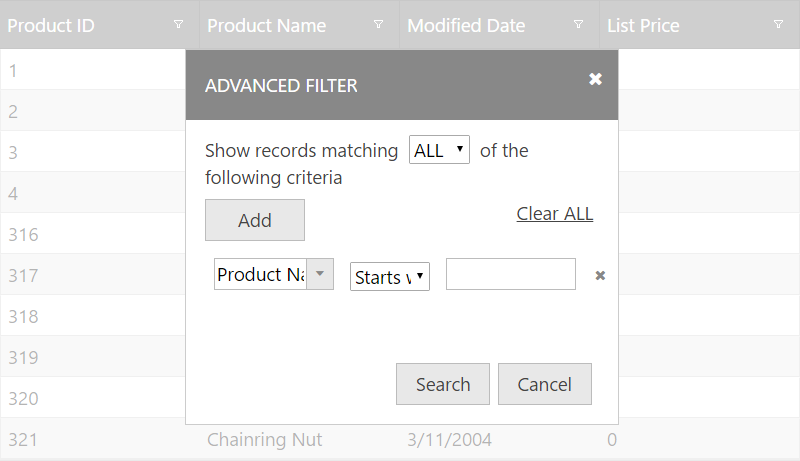
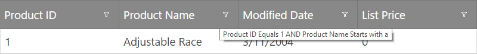

<!--
|metadata|
{
    "fileName": "iggrid-filtering",
    "controlName": "igGrid",
    "tags": ["Filtering"]
}
|metadata|
-->

# フィルタリング (igGrid)

## 概要

`igGrid` のフィルタリング機能によりユーザーは、データを Excel 形式でフィルターすることができます。

> **注:** フィルタリングは、任意の jQuery UI ウィジェットのライフサイクルに従う、jQuery UI ウィジェットとして実装されます。

### このトピックの内容

このトピックは、以下のセクションで構成されます。

-   [フィルタリングの永続化](#persistence)
-   [モードのフィルタリング](#modes)
-   [構成と検討事項](#considerations)
-   [フィルタリングを有効にする](#enable)
-   [リモート フィルタリング](#remote)
-   [列の設定](#column-settings)
-   [クライアント側イベント](#client-side-events)
-   [API の使用](#api)
-   [デフォルトの条件一覧](#default-conditions-list)
-   [フィルタリング オプションのリスト (プロパティ)](#properties)
-	[カスタム フィルタリング条件](#customCond)
-   [CSS クラスのフィルタリング](#css)
-   [キーボード操作](#keyboard-interaction)
-   [重大な変更点](#changes)
-   [関連コンテンツ](#related-content)


## <a id="persistence"></a> フィルタリングの永続化

`igGrid` バインディングの間にフィルタリングの永続化は 14.1 リリースの新機能です。以前のデフォルト動作を置き換えます。

> **注:**
> フィルタリングの永続化はデフォルトで True です。これは重大な変更です。

`igGridFiltering` を有効する場合、[`persist`](%%jQueryApiUrl%%/ui.iggridfiltering#options:persist) モードで使用されます。**dataBind()** への呼び出しの後、UI およびデータ ソース ビューで永続化が適用されます。フィルター エディターはクリアされなく、データ ソースのフィルターも残ります。

フィルタリングの永続化は `igHierarchicalGrid` にも実装されています。

以下のサンプルは、フィルター機能の永続化機能を紹介します。

<div class="embed-sample">
   [機能の永続化](%%SamplesEmbedUrl%%/grid/feature-persistence)
</div>

ユーザーが *igGrid* を再バインドした後にフィルターをクリアする以前の動作に戻るには、[`persist`](%%jQueryApiUrl%%/ui.iggridfiltering#options:persist) オプションで機能を無効できます。以下はコード スニペットです。

**JavaScript の場合:**

```js
features: [
  { 
     name: "Filtering", 
     persist: false 
  }
] 
```

## <a id="modes"></a> モードのフィルタリング

モード オプションは、詳細と簡易の 2 つの値を取ります。簡易フィルタリング モードを設定すると、該当する列ヘッダー セルの下、列ヘッダーごとにすべてのフィルターが描画されます。詳細フィルタリングを構成すると、詳細フィルタリング ボタンが列ヘッダー テキストの隣に描画されます (デフォルト)。詳細ボタンをクリックすると、より複雑なフィルタリング条件が使用できる「詳細」フィルタリング ダイアログが表示されます。

## <a id="considerations"></a> 構成と検討事項

-   すべてのフィルター行条件は常に「AND」演算子で結合されています。
-   詳細フィルタリング ダイアログは、複数のフィルターを結合するため「AND」演算子または「OR」演算子を公開しています。
-   また詳細フィルター ダイアログでは、複数のフィルターを 1 つの列に設定できます。
-   実際のデータ フィルタリングは `igDataSource` コントロールを介して単独で行われます。
-   デフォルトでは、式 URL キーが設定されていない場合、`igDataSource` フィルタリング機能と同様に oData エンコードを想定しています。
-   フィルター行は、キーボード上の TAB キーと Shift-TAB キーでナビゲートできます。
-   フィルター ドロップダウンにフォーカスされている場合、ENTER キーをオープンでき、フィルター ドロップダウン項目は上下矢印キーでナビゲートできます。
-   他のグリッド機能が「UI ダーティな」イベントをトリガーする (ページングが有効な場合にページ サイズが変更されるなど) と必ず、デフォルトと異なるすべての UI プリセットは、フィルタリングにより自動的にクリアされます。
-   複数のフィルタリング条件を同じ列に構成するには、フィルタリング モードが詳細に設定されている場合、詳細フィルター ダイアログからそれらの条件を追加する必要があります。
-   詳細フィルタリングを使用し、詳細ダイアログ フィルター行で列を最初の列から選択すると必ず、条件付きの 2 番目の列は、列タイプに応じて自動的に更新されます。したがって、列が数値列の場合、数値条件のみが一覧されるといった具合です。さらに 3 番目の列エディターが更新されると、その列が日付列の場合、正規の入力要素ではなく date ピッカーが描画されます。
-   モード「簡易」と結合された `filterDelay` オプションは、エンド ユーザーの作業をシームレスに行うために重要な役割を果たします。遅延時間が長くなるほど、フィルター要求をトリガーする前にエンド ユーザーがフィルター入力を行うことができる時間が増えます。
-   フィルタリングを使用する場合は、正しい列タイプを設定することが非常に重要です。列タイプが正しく構成されていないと、数値列を「string」型またはその逆に設定する場合など、予期しないエラーまたは動作が行われる可能性があります。
-   `caseSensitive` オプションを true に設定すると、フィルタリングで大文字と小文字を区別することもできます。このオプションはローカル フィルタリングのみで動作します。

`dataFiltering` イベント関数から現在の式オブジェクトのリストを取得できます。

**JavaScript の場合:**

```js
$(document).delegate("#grid1", "iggridfilteringdatafiltering", function (evt, ui) {
	var expressions = ui.expressions;
}
```




図 1: 簡易フィルタリング (モード:「簡易」)



図 2: 詳細フィルタリング (モード:「詳細」)



図 3: 詳細フィルタリング ダイアログ



図 4: フィルタリング ツールチップ (モード:「詳細」)

## <a id="enable"></a> フィルタリングを有効にする

フィルタリングを開始するには、まず必要な JavaScript および CSS の依存関係を組み込む必要があります。必要な依存関係を組み込む最も簡単な方法は、スクリプトとスタイルを組み合わせて縮小したものを使用することです。

リスト 1: アプリケーションへの組み込みに必要な CSS 参照および JavaScript 参照

**HTML の場合:**

```html
<link type="text/css" href="infragistics.theme.css" rel="stylesheet" />
<link type="text/css" href="infragistics.css" rel="stylesheet" />
<script type="text/javascript" src="jquery.min.js"></script>
<script type="text/javascript" src="jquery-ui.min.js"></script>
<script type="text/javascript" src="infragistics.core.js"></script>
<script type="text/javascript" src="infragistics.lob.js"></script>
```

リスト 2: 縮小も結合もしていない CSS 参照および JavaScript 参照の最小セット - フィルタリングにのみ必要


**HTML の場合:**

```html
<script type="text/javascript" src="infragistics.util.js"></script>
<script type="text/javascript" src="infragistics.util.jquery.js"></script>
<script type="text/javascript" src="infragistics.dataSource.js"></script>
<script type="text/javascript" src="infragistics.ui.shared.js"></script>
<script type="text/javascript" src="infragistics.ui.popover.js"></script>
<script type="text/javascript" src="infragistics.ui.editors.js"></script>
<script type="text/javascript" src="infragistics.ui.grid.framework.js"></script>
<script type="text/javascript" src="infragistics.ui.grid.shared.js"></script>
<script type="text/javascript" src="infragistics.ui.grid.filtering.js"></script>
```

リスト 3 は、グリッド フィルタリングの構成に使用するサンプル コードを示します。

リスト 3: フィルタリングのサンプル グリッド コード

**JavaScript の場合:**

```js
//Basic filtering on client
$("#myGrid").igGrid({
    dataSource: "/GetCensusData/",
    columns: [
        { headerText: "State", key: "StateName" },
        { headerText: "Congressional District", key: "CongressionalDistrict" },
        { headerText: "Population", key: "TotalPopulation" }
    ]
    features:[
        {
            name: "Filtering", 
            allowFiltering: true,
            caseSensitive: false,
            columnSettings: [
                {columnKey: "StateName", allowFiltering: false} 
            ]            
        }
    ]
});
```

リスト 4: サンプル JSON 応答

**JavaScript の場合:**

```js
[
   {"AverageFamilySize":3.36, "AverageHouseholdSize":2.91, "CongressionalDistrict":"14", "StateName": "Illinois", "TotalPopulation":720663},
   {"AverageFamilySize":3.00, "AverageHouseholdSize":2.43, "CongressionalDistrict":"15", "StateName": "Illinois", "TotalPopulation":595833},
   {"AverageFamilySize":3.16, "AverageHouseholdSize":2.67, "CongressionalDistrict":"16", "StateName": "Illinois", "TotalPopulation":691356}
]
```

リスト 5: グリッドのインスタンス化に必要な HTML 要素


**HTML の場合:**

```html
<table id="myGrid"></table>
```

**詳細フィルターのサンプル**
<div class="embed-sample">
   [igGrid 詳細フィルター](%%SamplesEmbedUrl%%/grid/advanced-filtering)
</div>

リスト 6: ASP.NET MVC ラッパーで使用する Razor または CSHTML マークアップ


**Razor の場合:**

```csharp
@Html.Infragistics().Grid(Model).ID("grid1").PrimaryKey("ProductID").Height("400px").Columns(column =>
    {
        column.For(x => x.ProductID).HeaderText("Product ID").DataType("number");
        column.For(x => x.Name).HeaderText("Product Name");
        column.For(x => x.ModifiedDate).HeaderText("Modified Date");
        column.For(x => x.ListPrice).HeaderText("List Price");
    }).Features(features => {
        features.Filtering().Mode(FilterMode.Advanced);
    })
	.DataSourceUrl(Url.Action("GridGetData"))
	.DataBind()
	.Render()
)
```

## <a id="remote"></a> リモート フィルタリング
フィルタリングをリモートに構成している場合 (type オプションが remote に設定されているなど)、エンド ユーザー アクションに基づいて (あるいは、プログラムによるフィルタリングを実行している場合は渡されたパラメーターに基づいて) すべてのフィルタリング式が自動的にエンコードされるよう、URL が自動的に構成されます。`filterExprUrlKey` が指定されていない場合、oData URI 規則がエンコードで自動的に使用されます。

> **注:** oData URI 規則の詳細については、[http://www.odata.org/documentation/odata-version-2-0/uri-conventions/](http://www.odata.org/documentation/odata-version-2-0/uri-conventions/) をご覧ください。

それ以外の場合は、グリッドは以下の方法でフィルタリング情報をエンコードします (例)。

```
http://<SERVER>/grid/GridGetData? filter(Name)=startsWith(a)&filter(ModifiedDate)=today()&filterLogic=AND
```

ASP.NET MVC ラッパーを使用して LINQ (IQueryable) 経由でサーバー側データをバインドする場合、URL にエンコードされたすべてのフィルタリング情報は自動的に LINQ 式の句 (Where 句) に変換されるため、データをフィルターするのに余分な作業は必要ありません。


## <a id="column-settings"></a> 列の設定

列設定にはそれぞれ、特定の列に適用される、つまり columnKey プロパティで指定されたカスタム オプションが含まれています。表 1 に、`columnSettings` オプションの一部である単一オブジェクトに設定できるすべての使用可能なプロパティを示します。

> **注:** `columnSettings` オプションは表 1 に一覧されたオブジェクトの配列です。

表 1: igGridFiltering columnSettings

プロパティ|説明
---|---
[`columnKey`](%%jQueryApiUrl%%/ui.iggridfiltering#options:columnSettings.columnKey) | この列設定が適用される列のキー。columnKey と columnIndex は相互に排他的です。
[`columnIndex`](%%jQueryApiUrl%%/ui.iggridfiltering#options:columnSettings.columnIndex) | この列設定が適用される列のインデックス。columnKey と columnIndex は相互に排他的です。
[`allowFiltering`](%%jQueryApiUrl%%/ui.iggridfiltering#options:columnSettings.allowFiltering) | 該当の列でフィルタリングが有効か無効かを指定します。デフォルトは true です。
[`condition`](%%jQueryApiUrl%%/ui.iggridfiltering#options:columnSettings.condition) | 列に使用される[デフォルト フィルタリング条件](#default-conditions-list)。
[`conditionList`](%%jQueryApiUrl%%/ui.iggridfiltering#options:columnSettings.conditionList) | 列で使用可能な条件を定義する文字列の配列。 未設定の場合、列のデータ型ごとのデフォルトの条件、そして `customConditions` で定義された条件が適用されます。
[`customConditions`](%%jQueryApiUrl%%/ui.iggridfiltering#options:columnSettings.customConditions) | [カスタムのフィルター条件](#customCond)を定義しているオブジェクト (スキーマは左記の通り:  {labelText: "/*dataType='string'*/", expressionText: "/*dataType='string'*/", requireExpr: /*dataType='bool'*/, filterImgIcon: "/*dataType='string'*/", filterFunc: /*dataType='string or function'*/ })。 
[`defaultExpressions`](%%jQueryApiUrl%%/ui.iggridfiltering#options:columnSettings.defaultExpressions) | 初期フィルター式の配列。フィルター式オブジェクトのスキーマは次のように定義されます: {fieldName: "/*dataType='string'*/", cond: "/*dataType='string'*/" expr: "/*dataType='string'*/"}


リスト 7: columnSettings の使用例


**JavaScript の場合:**

```
    $("#grid1").igGrid({
        columns: [
            { headerText: "Product ID", key: "ProductID", dataType: "number" },
            { headerText: "Product Name", key: "Name", dataType: "string" },
            { headerText: "Product Number", key: "ProductNumber", dataType: "string" },
        ],
        width: '500px',
        dataSource: products,
        features: [
            {
                name: 'Filtering',
                columnSettings: [
                    {columnKey: 'ProductID', condition: “startsWith” }
                ]
            }
        ]
    });
```
	
## <a id="client-side-events"></a> クライアント側イベント

2 種類の方法でクライアント側イベントのフィルタリングにバインドできます。これはそれぞれ、リスト 8 とリスト 9 に記載します。リスト 8 に記載したアプローチでバインドする場合、jQuery `on()` メソッドを使用する必要があります。

リスト 8: アプリケーションの任意の場所からのクライアント側イベントへのバインド


**JavaScript の場合:**
```
$("#grid1").on("iggridfilteringdatafiltered", handler);
```

リスト 9: フィルタリング機能を初期化する場合にイベント名をオプション指定した、クライアント側イベントへのバインド (大文字と小文字を区別)

**JavaScript の場合:**
```
    $(function () {
        $("#grid1").igGrid({
            columns: [
                { headerText: "Product ID", key: "ProductID", dataType: "number" },
                { headerText: "Product Name", key: "Name", dataType: "string" },
                { headerText: "Product Number", key: "ProductNumber", dataType: "string" },
            ],
            width: '500px',
            dataSource: products,
            features: [
                {
                    name: 'Filtering',
                    dataFiltering: handler
                }
            ]
        });
    });

    //Handler code
    function handler(event, args) {

    }
```
	
> **注:** すべての「ing」イベントはキャンセルできます。「ing」イベントをキャンセルするには、その該当イベント ハンドラーは false を返す必要があります。

表 2: クライアント側イベントのフィルタリング

<table class="table table-striped">
	<thead>
		<tr>
            <th>
クライアント側イベント名
			</th>
            <th>
説明
			</th>
            <th>
引数
			</th>
        </tr>
	</thead>
	<tbody>
        <tr>
            <td>
dataFiltering
			</td>
            <td>
フィルタリング要求を行う前に発生するイベント (ローカルまたはリモート)です
			</td>
            <td>
columnKey: フィルタリングのトリガー元となる列キー <br />

columnIndex: 列のインデックス <br />

owner: フィルタリング ウィジェット オブジェクトへの参照 <br />
			</td>
        </tr>
        <tr>
            <td>
dataFiltered
			</td>

            <td>
データがフィルターされ、グリッドで描画された後に発生するイベント
			</td>

            <td>
dataFiltering と同じです

                <blockquote>
**注:** 式の配列は、`dataFiltering` イベント関数 (ui.expressions) から取得できます。
				</blockquote>
			</td>
        </tr>
        <tr>
            <td>
dropDownOpening
			</td>
            <td>
フィルタリング ドロップダウンを開く直前に発生するイベント
			</td>
            <td>
dropDown: フィルタリング ドロップ ダウンへの参照 <br />
owner: フィルタリング ウィジェット オブジェクトへの参照
			</td>
        </tr>
        <tr>
            <td>
dropDownOpened
			</td>
            <td>
フィルタリング ドロップダウンを開いた後に発生するイベントです。
			</td>
            <td>
dropDownOpening と同じです
			</td>
        </tr>
        <tr>
            <td>
dropDownClosing
			</td>
            <td>
フィルタリング ドロップダウンを閉じる直前に発生するイベント
			</td>
            <td>
dropDownOpening と同じです
			</td>
        </tr>

        <tr>
            <td>
dropDownClosed
			</td>
            <td>
フィルタリング ドロップダウンを閉じた後に発生するイベント
			</td>
            <td>
dropDownOpening と同じです
			</td>
        </tr>
        <tr>
            <td>
filterDialogOpening
			</td>
            <td>
詳細フィルタリング ダイアログを開く前に発生するイベント
			</td>
            <td>
dialog: jQuery オブジェクト ラッパーにおけるフィルタリング要素への参照 <br />
owner: フィルター ウィジェット オブジェクトへの参照
			</td>
        </tr>
        <tr>
            <td>
filterDialogOpened
			</td>
            <td>
詳細フィルタリング ダイアログを開いた後に発生するイベント
			</td>
            <td>
filterDialogOpening と同じです
			</td>
        </tr>
        <tr>
            <td>
filterDialogMoving
			</td>
            <td>
詳細フィルタリング ダイアログを移動しているときに発生するイベント
			</td>
            <td>
filterDialogOpening と同じです
			</td>
        </tr>
        <tr>
            <td>
filterDialogFilterAdding
			</td>
            <td>
新しいフィルターが詳細フィルタリング ダイアログに追加される前に発生するイベント
			</td>
            <td>
filtersTableBody: jQuery オブジェクトでラップされた任意のフィルターを保持する TABLE 要素への参照 <br />
owner: フィルタリング ウィジェット オブジェクトへの参照
			</td>
        </tr>

        <tr>
            <td>
filterDialogFilterAdded
			</td>
            <td>
新しいフィルターが詳細フィルタリング ダイアログに追加された後に発生するイベント
			</td>
            <td>
filter: jQuery オブジェクト ラッパーにおける filterRow 要素への参照 <br />
owner: フィルタリング ウィジェット オブジェクトへの参照
			</td>
        </tr>

        <tr>
            <td>
filterDialogClosing
			</td>
            <td>
詳細フィルタリング ダイアログが閉じる直前に発生するイベント
			</td>
            <td>
owner: 呼び出しウィジェット (これ) への参照
			</td>
        </tr>

        <tr>
            <td>
filterDialogClosed
			</td>
            <td>
詳細フィルタリング ダイアログを閉じた後に発生するイベント
			</td>
            <td>
owner: 呼び出しウィジェット (これ) への参照
			</td>
        </tr>

        <tr>
            <td>
filterDialogContentsRendering
			</td>
            <td>
コンテンツが詳細フィルタリング ダイアログに描画される前に発生するイベント
			</td>
            <td>
dialogElement: コンテンツが jQuery オブジェクト ラッパーで描画されるダイアログ要素 <br />
owner: フィルタリング ウィジェット オブジェクトへの参照
			</td>
        </tr>

        <tr>
            <td>
filterDialogContentsRendered
			</td>
            <td>
コンテンツが詳細フィルタリング ダイアログに描画された後に発生するイベント
			</td>
            <td>
filterDialogContentsRendering と同じです
			</td>
        </tr>

        <tr>
            <td>
filterDialogFiltering
			</td>
            <td>
詳細フィルタリング ダイアログで OK ボタンを押し、フィルタリングを開始するときに発生するイベント
				<blockquote>
**注:** それでも dataFiltering イベントと dataFiltered イベントはこのイベントの後に発生します。
                </blockquote>
            </td>
            <td>
filterDialogOpening と同じです
			</td>
        </tr>
    </tbody>
</table>

## <a id="api"></a> API の使用

グリッドをプログラムでフィルターするためには、`igGridFiltering` ウィジェットで filter() 関数を呼び出す必要があります。フィルター関数は次のように定義されます。

```
filter(expressions, updateUI)
```


expressions 引数は式オブジェクトの配列です。リスト 10 は、各式オブジェクトの構造の概要を示しています。updateUI 引数はオプションで、グリッドがプログラムでフィルターされたときに UI が更新されないよう、明示的に false に設定できます。

リスト 10: 式オブジェクト構造のフィルタリング

**JavaScript の場合:**

```js
{
    expr: <filter expression string>,
    cond: [<filtering condition>](#default-conditions-list),
    fieldName: [<column key>](%%jQueryApiUrl%%/ui.iggrid#options:columns.key)
}
```

リスト 11 とリスト 12 は、`igGridFiltering` ウィジェットの filter() 関数の使用例を示しています。

リスト 11: ProductID = 1 によるフィルター

**JavaScript の場合:**

```js
$("#grid1").igGridFiltering('filter', ([{ fieldName: "ProductID", expr: 1, cond: "equals"}]));
```

リスト 12: ProductID = 1 および ProductName startsWith “a” によるフィルター

**JavaScript の場合:**
```js
$("#grid1").igGridFiltering('filter', ([{ fieldName: "ProductID", expr: 1, cond: "equals"}, {fieldName: "ProductName", expr: "a", cond: "startsWith"} ]));
```

リスト 13: 適用したフィルタリング式を取得

** Javascript の場合:**

```js
var expressions = $('#grid1').data('igGrid').dataSource.settings.filtering.expressions;
```

## <a id="default-conditions-list"></a> デフォルトの条件一覧

以下の条件 (データ タイプ別) は、グリッドでフィルタリングするときに使用できます。

- 文字列
  -   startsWith
  -   endsWith
  -   contains
  -   doesNotContain
  -   equals
  -   doesNotEqual
  -   null
  -   notNull
  -   empty
  -   notEmpty
- 数値
  -   equals
  -   doesNotEqual
  -   greaterThan
  -   lessThan
  -   greaterThanOrEqualTo
  -   lessThanOrEqualTo
  -   null
  -   notNull
  -   empty
  -   notEmpty
- ブール値
  -   true
  -   false
  -   null
  -   notNull
  -   empty
  -   notEmpty
- 日付
  -   on
  -   notOn
  -   after
  -   before
  -   today
  -   yesterday
  -   thisMonth
  -   lastMonth
  -   nextMonth
  -   thisYear
  -   lastYear
  -   nextYear
  -   null
  -   notNull
  -   empty
  -   notEmpty
- 時刻
  -   at
  -   notAt
  -   before
  -   after
  -   atBefore
  -   atAfter
- オブジェクト
  -   null
  -   notNull
  -   empty
  -   notEmpty

## <a id="properties"></a> フィルタリング オプションのリスト (プロパティ)

オプションとデフォルト値は括弧内に示します

オプションとデフォルト値は括弧内に示します|説明
---|---
caseSensitive (false)|大文字と小文字を区別するフィルタリングを有効または無効にします (ブール型)このオプションはローカル フィルタリングのみで動作します。
filterSummaryAlwaysVisible (true)|デフォルトでは、いったんフィルタリングを実行すると、グリッドのフッター領域にサマリー ラベルが表示され、検出された一致の数を示します。ページングを有効にすると、フィルター サマリーは、レコードがいくつ表示されているかを示す左側の領域を置き換えます。ページがそれぞれ変更されると、フィルター サマリーはページング ラベルと置き換えられます。
filterSummaryTemplate (${matches} 一致するレコード)|フィルター サマリー ラベルのテンプレート
filterDropDownAnimations (“linear”)|承認済みの値は「linear」と「none」です
filterDropDownAnimationDuration (500)|filterDropDownAnimations が「linear」に設定されている場合のアニメーションの期間
filterDropDownWidth (0)|フィルター ドロップダウン幅のデフォルト幅。0 に設定されている場合、幅はコンテンツにしたがって自動的に大きくなります
filterDropDownHeight (0)|filterDropDownWidth と同じですが、高さに使用します
filterExprUrlKey (null)|リモート フィルタリングを実行している場合に URL にエンコードする式キー。デフォルト値の null は oData URI 規則を使用することを前提としています ([documentation/odata-version-2-0/uri-conventions/](http://www.odata.org/documentation/odata-version-2-0/uri-conventions/))
filterDropDownItemIcons (true)|フィルター条件の小さな画像アイコンは、このオプションが有効な場合にあらゆるドロップダウン項目の前に描画されます。このオプションはデフォルトで有効になっています。
columnSettings ([])|フィルタリング条件のカスタム列設定のリスト。リスト中の列設定オブジェクトそれぞれのフォーマットを以下に示します。
type (“remote”)|フィルタリング操作のタイプ。リモートまたはローカルです。ローカル設定は、データ ソースに現在バインドされているデータでフィルタリングを実行することを示します。
filterDelay (500)|フィルタリングをトリガーする前の遅延時間。エンド ユーザーが入力している際、ほとんどの場合はキーストロークごとのフィルタリング要求は必要ありません。これはキーストロークを行うごとに開始する遅延時間で、前のキーストロークと考えられる次のキーストローク (ある場合) の間の時間がこの値を超えるとキャンセルされます。
mode (“simple”)|簡易フィルタリングはグリッドのヘッダーの下のフィルター行を描画し、各列には専用のエディターとボタン (オプション) が常に表示されています。「詳細」フィルタリングはヘッダーのボタンを描画し、このボタンをクリックすると、複数の条件 (列ごとに複数の条件でも) を構成できる詳細フィルタリング ダイアログが開きます
advancedModeEditorsVisible (false)|このオプションを true に設定すると、フィルター モードが Advanced でも、専用フィルタリング エディターが列ヘッダーごとに描画されます。詳細フィルタリング ダイアログは、各列フィルター ドロップダウンの終わりにある詳細ボタンからアクセスできます。
advancedModeHeaderButtonLocation (“left”)|フィルタリング モードが Advanced の場合、advancedModeEditorsVisible は false で、詳細ボタンはヘッダー テキストの隣のヘッダーで描画されるため、このプロパティはボタンをヘッダー テキストの前または後に描画するかどうか管理します。並べ替えが有効で、列が並べ替えられている場合、並べ替えインジケーターは、常に右側に描画されます。
filterDialogWidth (350)|詳細フィルタリング ダイアログの幅 (該当する場合)。
filterDialogHeight ('')|詳細フィルタリング ダイアログの高さ (該当する場合)。デフォルトでは、コンテンツとともに値が大きくなるため、高さは設定されていません。
filterDialogFilterDropDownDefaultWidth (80)|これは、詳細フィルタリングで追加されたあらゆるドロップダウン フィルター条件のデフォルト幅です。これはどのフィルター行でも 2 番目のドロップダウンになります。フィルター行は、プレーン HTML SELECT 要素でもあり、エンド ユーザーはフィルタリング条件リストから選択できます。
filterDialogExprInputDefaultWidth (80)|これは、詳細フィルタリング ダイアログのフィルター行ごとに最後のボックスとして追加されたあらゆるフィルター式入力のデフォルト幅です。
filterDialogColumnDropDownDefaultWidth (null)|これは、詳細フィルタリングで追加されたあらゆるドロップダウン列フィルターのデフォルト幅です。これはどのフィルター行でも最初のドロップダウンになります。フィルター行は、igEditor でもあり、エンド ユーザーは列リストから選択できます。
renderFilterButton (true)|あらゆるフィルター行セルのフィルター ドロップダウン ボタンの描画を有効または無効にします。これが false に設定されている場合、エンド ユーザーは事前に定義されたフィルターのみ使用でき、入力フィールドにテキストを入力できます。
filterButtonLocation (“left”)|フィルター ドロップダウン ボタンの場所。「左」または「右」です。
tooltipTemplate ("${condition} フィルターを適用しています")|エンド ユーザーがフィルタリング ドロップダウン ボタンの上にホバーする場合に表示されるツールチップ テンプレートです
filterDialogAddButtonWidth (100)|詳細フィルター ダイアログの「Add」ボタンの幅
filterDialogOkCancelButtonWidth (100)|詳細フィルター ダイアログの OK ボタンとキャンセル ボタンの幅
filterDialogMaxFilterCount (5)|詳細フィルタリング ダイアログに追加できるフィルターの最大数。この数字を超えると、検証エラー メッセージが表示されます。
featureChooserText ("フィルターの表示")|フィルターが表示され、モードがシンプルである場合、フィルターの内容が表示されます。
featureChooserTextHide ("フィルターの非表示")|フィルターが非表示で、モードがシンプルである場合、フィルターの内容は表示されません。
featureChooserTextAdvancedFilter ("フィルター")|フィルター モードが詳細である場合、フィルターの内容が表示されます。

## <a id="customCond"></a> カスタム フィルタリング条件

ローカル モード (type="local") のフィルター機能で、列ごとにカスタムのフィルター条件を定義します。
カスタムの条件は指定の列の条件リスト (列のデータ型によるデフォルトの条件の後) に追加され、データを処理するためのカスタム比較演算子フィルター関数の設定を可能にします。
条件は関連する列の列設定で [`customConditions`](%%jQueryApiUrl%%/ui.iggridfiltering#options:columnSettings.customConditions) オプションを使用して定義します。
割り当てられた値は、各プロパティ名が一意の条件キーを、カスタムの条件宣言が値を表すオブジェクトである必要があります。

条件の動作および表示を調整する更なるオプションがサポートされます:
-	`requireExpr` - 条件にフィルター式を入力する必要があるかどうかを指定します。
-	`labelText`  -  列の条件ドロップダウンに表示されるラベル テキストを指定します。
- 	`expressionText` - requireExpr が false の場合、条件をドロップダウンで選択するとエディタに表示されるテキストを指定します。
-	`filterImgIcon` - simple フィルター モードでドロップダウン項目に適用される css クラスを指定します。
-	`filterFunc` - 条件が適用された場合に使用される、カスタムの比較演算子フィルター関数 (または関数名) を指定します。
 
 コード例 14: カスタム条件の使用例とサンプル


**JavaScript の場合:**
```
$("#grid1").igGrid({
   columns: [ 
                { headerText: "Employee ID", key: "EmployeeID", dataType: "string", hidden: true },
                { headerText: "First Name", key: "FirstName", dataType: "string" },
                { headerText: "Last Name", key: "LastName", dataType: "string" },
                { headerText: "Register Date", key: "RegistererDate", dataType: "date" },
                { headerText: "Country", key: "Country", dataType: "string" },
                { headerText: "Age", key: "Age", dataType: "number" },
                { headerText: "Is Active", key: "IsActive", dataType: "bool" }
            ],
    dataSource: employees,
    width: '500px',
    dataSource: products,
    features: [
        {
            name: 'Filtering',
            columnSettings: [
               {
                     columnKey: "Country",
                     customConditions: {
                        USA: {
                             labelText: 'USA',
                             expressionText: "USA",
                             filterFunc: function(value, expression, dataType, ignoreCase, preciseDateFormat) {  return value === "USA";}
                        },
                        Canada:{
                              labelText: 'Canada',
                              expressionText: "Canada",
                              filterFunc: function(value, expression, dataType, ignoreCase, preciseDateFormat) {  return value === "Canada";}
                        }
                     }
                }
            ]
        }
    ]
});
```

**サンプル:**
<div class="embed-sample">
　  [igGrid フィルタリングのカスタム条件](%%SamplesEmbedUrl%%/grid/custom-conditions-filtering)
</div>

## <a id="css"></a> CSS クラスのフィルタリング

要素に適用される CSS クラスのリスト|CSS クラスが適用される範囲
---|---
ui-iggrid-filterrow ui-widget |ヘッダー テーブルのフィルター行 TR に適用されるクラス
ui-iggrid-filtercell |あらゆるフィルター セル TH に適用されるクラス
ui-iggrid-filtereditor |あらゆるフィルター エディター要素 (igEditor) に適用されるクラス
ui-menu ui-widget ui-widget-content ui-iggrid-filterddlist ui-corner-all |UL フィルター ドロップダウン リストに適用されるクラス
ui-iggrid-filterdd |ドロップダウン UL をラップする DIV に適用されるクラス
ui-iggrid-filterddlistitem |各フィルター ドロップダウン リスト項目 (LI) に適用されるクラス
ui-iggrid-filterddlistitemcontainer |テキストをあらゆるフィルター リスト項目 (LI) に保持する要素に適用されるクラス
ui-iggrid-filterddlistitemadvanced |モードが詳細の場合にエディターが表示されるようオプションを構成する場合に、[詳細] ボタンを保持するリスト項目に適用されるクラス
ui-iggrid-filterddlistitemicons ui-state-default |フィルタリング アイコンが表示される場合にリスト項目に適用されるクラス
ui-iggrid-filterddlistitemclear |「クリア」フィルター リスト項目に適用されるクラス
ui-iggrid-filterddlistitemhover ui-state-hover |ホバーされるときにリスト項目に適用されるクラス
ui-iggrid-filterddlistitemactive ui-state-active |選択されるときにリスト項目に適用されるクラス
ui-iggrid-filterbutton ui-corner-all ui-icon ui-icon-triangle-1-s |あらゆるフィルタリング ドロップダウン ボタンに適用されるクラス
ui-iggrid-filterbutton ui-iggrid-filterbuttonadvanced ui-icon ui-icon-search |モードが詳細の場合にボタンに適用されるクラス。ヘッダーで描画される場合 (デフォルト動作) にボタンにも適用されます。
ui-iggrid-filterbuttonright ui-iggrid-filterbuttonadvanced ui-icon ui-icon-search |右側で描画される場合に、詳細フィルタリング ボタンに適用されるクラス
ui-iggrid-filterbuttonhover ui-state-hover |ホバーされるときにフィルター ボタンに適用されるクラス
ui-iggrid-filterbuttonactive ui-state-active |選択されるときにフィルター ボタンに適用されるクラス
ui-iggrid-filterbuttonfocus ui-state-focus |フォーカスされているものの選択されていないときにフィルター ボタンに適用されるクラス。
ui-iggrid-filterbuttondisabled ui-state-disabled |無効になっている場合にフィルタリング ボタンに適用されるクラス
ui-iggrid-filterbuttondate |date フィルターが列に定義されている場合にフィルター ボタンに適用されるクラス
ui-iggrid-filterbuttonstring |string フィルターが列に適用されている (デフォルト) 場合にフィルター ボタンに適用されるクラス
ui-iggrid-filterbuttonnumber |number フィルターが列に適用されている (デフォルト) 場合にフィルター ボタンに適用されるクラス
ui-iggrid-filterbuttonbool |boolean フィルターが列に適用されている (デフォルト) 場合にフィルター ボタンに適用されるクラス
ui-iggrid-filterbuttonadvancedhover ui-state-hover |ホバーされるときに詳細ボタンに適用されるクラス
ui-iggrid-filterbuttonadvancedactive ui-state-active |選択されるときに詳細ボタンに適用されるクラス
ui-iggrid-filterbuttonadvancedfocus ui-state-focus |フォーカスされているときに詳細ボタンに適用されるクラス
ui-iggrid-filterbuttonadvanceddisabled ui-state-disabled |無効になっているときに詳細ボタンに適用されるクラス
ui-iggrid-filtericon |あらゆるフィルター ドロップダウン リスト項目の画像アイコン領域に適用されるクラス
ui-iggrid-filtericoncontainer |項目アイコンのコンテナー要素に適用されるクラス
ui-iggrid-filtericonstartswith |項目が「startsWith」条件を保持している場合に項目アイコンのスパンに適用されるクラス
ui-iggrid-filtericonendswith |項目が「endsWith」条件を保持している場合に項目アイコンのスパンに適用されるクラス
ui-iggrid-filtericoncontains |項目が「contains」条件を保持している場合に項目アイコンのスパンに適用されるクラス
ui-iggrid-filtericonequals |項目が「equals」条件を保持している場合に項目アイコンのスパンに適用されるクラス
ui-iggrid-filtericondoesnotequal |項目が「notEquals」条件を保持している場合に項目アイコンのスパンに適用されるクラス
ui-iggrid-filtericondoesnotcontain |項目が「doesNotContain」条件を保持している場合に項目アイコンのスパンに適用されるクラス
ui-iggrid-filtericongreaterthan |項目が「greaterThan」条件を保持している場合に項目アイコンのスパンに適用されるクラス
ui-iggrid-filtericonlessthan |項目が「lessThan」条件を保持している場合に項目アイコンのスパンに適用されるクラス
ui-iggrid-filtericongreaterthanorequalto |項目が「greaterThanOrEqualTo」条件を保持している場合に項目アイコンのスパンに適用されるクラス
ui-iggrid-filtericonlessthanorequalto |項目が「lessThanOrEqualTo」条件を保持している場合に項目アイコンのスパンに適用されるクラス
ui-iggrid-filtericontrue |項目が「true」条件を保持している場合に項目アイコンのスパンに適用されるクラス
ui-iggrid-filtericonfalse |項目が「false」条件を保持している場合に項目アイコンのスパンに適用されるクラス
ui-iggrid-filtericonafter |項目が「after」条件を保持している場合に項目アイコンのスパンに適用されるクラス
ui-iggrid-filtericonbefore |項目が「before」条件を保持している場合に項目アイコンのスパンに適用されるクラス
ui-iggrid-filtericontoday |項目が「today」条件を保持している場合に項目アイコンのスパンに適用されるクラス
ui-iggrid-filtericonyesterday |項目が「yesterday」条件を保持している場合に項目アイコンのスパンに適用されるクラス
ui-iggrid-filtericonthismonth |項目が「thisMonth」条件を保持している場合に項目アイコンのスパンに適用されるクラス
ui-iggrid-filtericonlastmonth |項目が「lastMonth」条件を保持している場合に項目アイコンのスパンに適用されるクラス
ui-iggrid-filtericonnextmonth |項目が「nextMonth」条件を保持している場合に項目アイコンのスパンに適用されるクラス
ui-iggrid-filtericonthisyear |項目が「this year」条件を保持している場合に項目アイコンのスパンに適用されるクラス
ui-iggrid-filtericonlastyear |項目が「lastYear」条件を保持している場合に項目アイコンのスパンに適用されるクラス
ui-iggrid-filtericonnextyear |項目が「nextYear」条件を保持している場合に項目アイコンのスパンに適用されるクラス
ui-iggrid-filtericonon |項目が「on」条件を保持している場合に項目アイコンのスパンに適用されるクラス
ui-iggrid-filtericonnoton |項目が「notOn」条件を保持している場合に項目アイコンのスパンに適用されるクラス
ui-iggrid-filtericonclear |項目が「clear」条件を保持している場合に項目アイコンのスパンに適用されるクラス
ui-widget-overlay ui-iggrid-blockarea |詳細フィルター ダイアログが表示されており、その背後の領域がグレーアウトされている (ブロック領域です) 場合、フィルタリング ブロック領域に適用されるクラス
ui-dialog ui-draggable ui-resizable ui-iggrid-dialog ui-widget-content ui-corner-all |フィルター ダイアログ要素に適用されるクラス
ui-dialog-titlebar ui-iggrid-filterdialogcaption ui-widget-header ui-corner-all ui-helper-reset ui-helper-clearfix |フィルター ダイアログ ヘッダー キャプション領域に適用されるクラス
ui-dialog-title |フィルター ダイアログ ヘッダー キャプション タイトルに適用されるクラス
ui-iggrid-filterdialogaddcondition |フィルター ダイアログ追加条件領域に適用されるクラス
ui-iggrid-filterdialogaddconditionlist |フィルター ダイアログ追加条件 SELECT ドロップダウンに適用されるクラス。
ui-iggrid-filterdialogaddbuttoncontainer ui-helper-reset |フィルター ダイアログ追加ボタンに適用されるクラス
ui-dialog-buttonpane ui-widget-content ui-helper-clearfix ui-iggrid-filterdialogokcancelbuttoncontainer |フィルター ダイアログ OK ボタンおよびキャンセル ボタンに適用されるクラス。
ui-iggrid-filtertable ui-helper-reset |フィルター ダイアログ フィルター テーブルに適用されるクラス
ui-icon ui-icon-closethick |フィルター テーブルからフィルターを削除する場合に使用する「X」ボタンに適用するクラス
ui-iggrid-filterdialogclearall |フィルター ダイアログ「すべてクリア」ボタンに適用されるクラス。

## <a id="keyboard-interaction"></a> キーボード操作

簡易フィルタリング モードが有効な場合、以下のキーボード操作が可能です。

グリッドにフォーカスがある場合:

-	TAB: フィルタリング UI のフォーカス可能な要素間でフォーカスを移動: [フィルタリング] ボタンおよびエディター。
[フィルタリング] ボタンにフォーカスがある場合:
-	ENTER/SPACE: フィルタリング条件ドロップダウンを開く。ドロップダウンで利用可能な項目を UP/DOWN キー移動できます。
-	UP/DOWN: セルのアクティブなフィルタリング条件の変更。
-	TAB: フィルタリング エディター要素へフォーカスを移動。

詳細フィルタリング モードが有効な場合、以下のキーボード操作が可能です。

グリッドにフォーカスがある場合:
-	TAB: 最初の [フィルター] ボタンへフォーカスを移動。
フィルター ボタンにフォーカスがある場合:
-	ENTER: 詳細フィルター ダイアログを開く。
-	TAB: ページの次の [フィルター] ボタンまたは次のフォーカス可能な要素へ移動。

詳細フィルター ダイアログにフォーカスがある場合:

-	TAB: ダイアログの要素間でフォーカスを移動。
-	ESCAPE: ダイアログを閉じる。

_注_: 列選択ドロップダウンと条件ドロップダウンは異なります。一つは igCombo でもう一つは標準 `<select>` 要素です。`<select>` 要素は、SPACE/ENTER を開き、そのコンテンツは UP/DOWN キーで移動、ENTER キーで選択できます。igCombo は Enter/Space キーでは開けません。値は、UP/DOWN キーで直接変更できます。

## <a id="changes"></a> 重大な変更点

- 動作の変更

デフォルトのフィルタリング条件 (which depends on the column data type) またはフィルタリング [*columnSettings*](%%jQueryApiUrl%%/ui.iggridfiltering#options:columnSettings) の [*condition*](%%jQueryApiUrl%%/ui.iggridfiltering#options:columnSettings.condition) オプションで明示的に設定した条件がドロップダウン条件リストから選択できるようになりました。唯一の例外は列で、デフォルト (または明示的に設定した) 条件で Boolean 列や「今日」、「昨日」、「今月」などの条件を含む日付列などのユーザー入力を要求しません。エンドユーザーは、適用するために明示的に選択する必要があります。

- DOM 構造の変更

フィルタリング ドロップダウン条件リストの DOM 構造が変更されました。18.2 以前のバージョンでは、各列ごとに div 要素が描画されました。18.2 バージョン以降、パフォーマンスの改善を目的にすべての列で 1 つの div 要素のみ描画するようになりました。

## <a id="related-content"></a> 関連コンテンツ

### <a id="topics"></a> トピック

-   [igGrid の概要](igGrid-Overview.html)

### <a id="samples"></a> サンプル

-   [フィルタリング](%%SamplesUrl%%/grid/simple-filtering)
 

 

