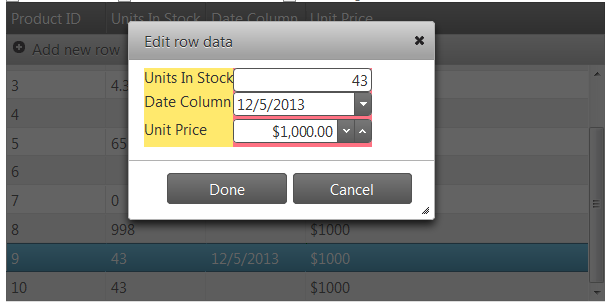
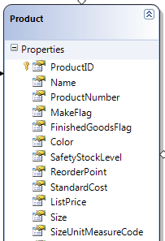

<!--
|metadata|
{
    "fileName": "iggrid-updating-rowedittemplate-configuring",
    "controlName": "igGrid",
    "tags": ["Editing","Grids","How Do I","Templating"]
}
|metadata|
-->

# 行編集テンプレートの構成 (igGrid)

## トピックの概要

### 目的

このトピックでは、行編集テンプレートと組み合わせた `igGrid™` コントロールの更新機能の使用方法を説明します。

### 前提条件

以下の表は、このトピックを理解するための前提条件として必要なトピックと記事の一覧です。

- [igGrid の概要](igGrid-Overview.html): `igGrid` は、表形式データの表示および操作に使用される jQuery ベースのクライアント側グリッドです。そのライフサイクル全体はクライアント側に存在し、サーバー側の技術からは独立しています。

- [更新の概要 (igGrid)](igGrid-Updating.html): このトピックでは、`igGrid`™ コントロールの更新機能の使用方法を説明します。

- [行編集テンプレートの概要 (igGrid)](igGrid-Updating-RowEditTemplate.html): このドキュメントでは、行編集テンプレートの使用時に指定される具体的なプロパティおよびメソッドについて説明します。

- [igTemplating](igTemplating-Overview.html): このトピックでは、Infragistics® テンプレート化エンジンの使用方法について説明します。


### このトピックの内容

このトピックは、以下のセクションで構成されます。

- [**概要**](#introduction)
- [**JavaScript での行編集テンプレートの構成**](#javascript)
	- [概要](#js-overview)
	- [手順](#js-steps)
- [**ASP.NET MVC での行編集テンプレートの構成**](#mvc)
	- [要件](#mvc-requirements)
	- [概要](#mvc-overview)
	- [手順](#mvc-steps)
- [**関連コンテンツ**](#related-content)


## <a id="introduction"></a> 概要

行編集テンプレートを使用すると、インライン編集の場合とは異なり、ポップアップ ダイアログ内でレコードを編集できるようになります。

この機能は `igGridUpdating` ウィジェットの一部として実装されます。バージョン 12.2 からは、`editMode` オプションに rowedittemplate という新しい値が追加されています。この値を指定すると、行編集テンプレートが有効になります。

行編集テンプレートはダイアログ ウィンドウとして表示されます。



行テンプレート自体は、次のいずれかの形で定義されます。

-   列のデータ型に基づいて自動的に生成される。
-   デベロッパーが `RowEditDialogRowTemplate` オプションを使用して文字列として指定する。
-   `RowEditDialogRowTemplateID` オプションを使用したテンプレート要素への参照。

`showReadonlyEditors` とぃう新しいオプションが導入されています。このオプションの値によっては、特定の列に関して編集が無効になるため、テンプレート内にエディターが表示されません。

行編集テンプレートは、表示するエディターのタイプを特定するために、`ColumnSettings` を使用して更新を行います (行編集テンプレートを手動で定義した場合、そのテンプレートが使用されることになります)。行編集テンプレートには、さまざまな理由から許容されないデータがエンドユーザーによって入力されたときにインライン表示される検証画像や検証メッセージもあります。


## <a id="javascript"></a> JavaScript での行編集テンプレートの構成
ここでは、`igGrid` で行編集テンプレートを構成する手順を示します。

### <a id="js-overview"></a> 概要

以下はプロセスの概念的概要です。

1.  [必要な JavaScript および CSS ファイルの参照](#js-reference-resources)
2.  [サンプル データの定義](#js-define-data)
3.  [行編集ダイアログ行テンプレート用のテンプレート要素の定義](#js-define-template)
4.  [HTML プレースホルダーを定義します。](#js-define-html)
5.  [igGrid インスタンスの作成](#js-instantiate-grid)
6.  [rowEditDialogOpening クライアント側イベントの処理](#js-handle-event)

### <a id="js-steps"></a> 手順

以下の手順では、`igGrid` で行編集テンプレートを構成する方法を示します。

1. 必要な JavaScript および CSS ファイルを参照します。 <a id="js-reference-resources"></a>

	次のコード ニペットでは、`igGrid` の更新機能を参照するために Infragistics Loader が使用されています。
	
	**HTML の場合:**
	
	```
	<script src="jquery.min.js" type="text/javascript"></script>
	<script src="jquery-ui.min.js" type="text/javascript"></script> 
	<script src="infragistics.loader.js"></script>
	<script type="text/javascript">
	    $.ig.loader({
	        scriptPath: "http://localhost/ig_ui/js/",
	        cssPath: "http://localhost/ig_ui/css/",
	        resources: "igGrid.Selection,igGrid.Updating"
	    });
	</script>
	```

2. バインドするデータを定義します。 <a id="js-define-data"></a>	

	次のコードは、オブジェクトの JavaScript 配列を定義するものです。
	
	このデータが `igGrid` のデータ ソースとして使用されます。
	
	**JavaScript の場合:**
	
	```
	var namedData = new Array();
	namedData[0] = { "ProductID": 1, "UnitsInStock": 100, "ProductDescription": "Laptop", "UnitPrice": "$1000", "DateCol": "24/7/2012" };
	namedData[1] = { "ProductID": 2, "UnitsInStock": 15, "ProductDescription": "Hamburger" };
	namedData[2] = { "ProductID": 3, "UnitsInStock": 4.356, "ProductDescription": "Beer", "UnitPrice": "$1000" };
	namedData[3] = { "ProductID": 4, "UnitsInStock": null, "ProductDescription": null, "UnitPrice": null };
	namedData[4] = { "ProductID": 5, "UnitsInStock": "65", "ProductDescription": "trainers", "UnitPrice": "$1000", "DateCol": "24/6/2012" };
	```

3. 行編集ダイアログ行テンプレート用のテンプレート要素を定義します。 <a id="js-define-template"></a>

	次のコードでは、行編集テンプレート用の行テンプレートとして使用するテンプレート要素が定義されています。カスタムの書式設定やスタイルは、このテンプレート要素を使用して指定できます。
	
	**HTML の場合:**
	
	```
	<style type="text/css">
	        .tableBackGround
	        {
	            background-color: #FF7283;
	        }
	        .labelBackGround
	        {
	            background-color: #FFE96D;
	        }
	    </style>
	<script id="rowEditDialogRowTemplate1" type="text/x-jquery-tmpl">
	   <tr class="tableBackGround">                  
	      <td class="labelBackGround"> 
	           ${headerText}
	      </td>
	      <td data-key='${dataKey}'>
	          <input /> 
	      </td>
	    </tr>
	</script>
	```

4. HTML プレースホルダーを定義します。 <a id="js-define-html"></a>

	**HTML の場合:**
	
	```
	<table id="grid1"></table>
	```

5. `igGrid` をインスタンス化します。 <a id="js-instantiate-grid"></a>
	
	次のコードは更新機能を有効にするもので、`editMode` は 「rowedittemplate」 になるように設定されています。
	
	行編集ダイアログのコンテナーは、`rowEditDialogContainment` プロパティで owner に設定されています。したがって、行編集ダイアログはグリッド領域内でのみドラッグ可能です。
	
	列設定値が定義され、ProductID 列が `ReadOnly` になるように設定されています。`ShowReadonlyEditors` オプションは *false* になっているため、無効な列 (この場合、ProductID 列) がダイアログ ウィンドウにエディターとして表示されることはありません。
	
	行編集テンプレートは、表示するエディターのタイプを特定するために、`ColumnSettings` を使用して更新を行います。行編集テンプレートには、許容されないデータがエンドユーザーによって入力されたときにインライン表示される検証画像や検証メッセージもあります。DateCol の EditorType は DatePicker になるように指定され、UnitPrice は必須入力データと定義されています。したがって、DateCol は DatePicker エディターとして表示されることになり、UnitPrice にデータが入力されなかった場合は、行編集テンプレートに検証エラー メッセージが表示されることになります。.
	
	`rowEditDialogRowTemplateID` プロパティは、手順 3 で定義した `x-jquery-tmpl` テンプレートの ID を参照しています。
	
	**JavaScript の場合:**
	
	```
	$.ig.loader(function () {
	$("#grid1").igGrid({
	    height: "300px",
	    width: "600px",
	    columns: [
	            { headerText: "Product ID", key: "ProductID", width: "100px", dataType: "number" },
	            { headerText: "Units In Stock", key: "UnitsInStock", width: "100px", dataType: "number", format: 'double' },
	            { headerText: "Product Description", key: "ProductDescription", width: "150px", dataType: "string" },
	            { headerText: "Date Column", key: "DateCol", width: "100px", dataType: "date" },
	            { headerText: "Unit Price", key: "UnitPrice", width: "100px", dataType: "integer" }
	            ],
	    autoGenerateColumns: false,
	    dataSource: namedData,
	    primaryKey: "ProductID",
	    features: [
	      {
	            name: "Selection",
	            mode: "row",
	            multipleSelection: true
	      },
	      {
	            name: 'Updating',
	            startEditTriggers: 'enter dblclick',
	            editMode: 'rowedittemplate',
	               rowEditDialogContainment: "owner",
	            showReadonlyEditors: false,
	            rowEditDialogRowTemplateID:'rowEditDialogRowTemplate1',
	            columnSettings: [{
	                  columnKey: "ProductID",
	                  editorType: 'numeric',
	                  readOnly: true
	            }, {
	                  columnKey: "ProductDescription",
	                  editorOptions: { readOnly: true }
	            }, {
	                  columnKey: "DateCol",
	                  editorType: 'datepicker',
	                  validation: true,
	                  editorOptions: { required: true }
	            }, {
	                  columnKey: "UnitPrice",
	                  editorType: 'currency',
	                  validation: true,
	                  editorOptions: { button: 'spin', required: true }
	            }]
	      }]
	});
	```

6. `rowEditDialogOpening` クライアント側イベントを処理します。 <a id="js-handle-event"></a>

	次のコードは `rowEditDialogOpening` クライアント側イベントを処理します。このコードは、`igGridUpdating` ウィジェットと行編集ダイアログ DOM 要素への参照を提供します。
	
	現在のデータ行への参照を取得するには、`ui.dialogElement.data('tr')` を使用してください。
	
	**JavaScript の場合:**
	
	```
	$("#grid1").live("iggridupdatingrowEditDialogOpening ", function (event, ui) {
	           var gridUpdating = ui.owner;
	           var gridID = ui.owner.element.context.id;
	           var dialogWindow = ui.dialogElement;
	           var currDataRow = ui.dialogElement.data('tr');
	   });
	```


## <a id="mvc"></a> ASP.NET MVC での行編集テンプレートの構成

ここでは、`igGrid` で行編集テンプレートを構成する手順を示します。

### <a id="mvc-requirements"></a> 要件

この手順を実行するには、以下が必要です。

-   Microsoft® Visual Studio 2010 またはそれ以降のバージョンのインストール
-   バージョン 3 以降の ASP.NET MVC Framework のインストール
-   AdventureWorks データベースのインストール
-   Infragistics.Web.Mvc.dll アセンブリへの参照
-   必要な Ignite UI JavaScript とテーマ リソース

### <a id="mvc-overview"></a> 概要

以下はプロセスの概念的概要です。

1.  [必要な JavaScript および CSS ファイルの参照](#mvc-reference-resources)
2.  [モデルの定義](#mvc-define-model)
3.  [行編集ダイアログ行テンプレート用のテンプレート要素の定義](#mvc-template)
4.  [ビューの定義](#mvc-define-view)
5.  [コントローラーの定義](#mvc-define-controller)
6.  [rowEditDialogOpening クライアント側イベントの処理](#mvc-event)

### <a id="mvc-steps"></a> 手順

`igGrid` で行編集テンプレートを構成する手順を以下に示します。


1. 必要な JavaScript および CSS ファイルを参照します。 <a id="mvc-reference-resources"></a>

	Index.cshtml ビューで、必要な JavaScript 参照を追加して、Infragistics ローダーのインスタンスを作成します。
	
	次のコード スニペットは、Infragistics ローダーを使用して `igGrid` リソースを参照しています。
	
	**HTML の場合:**
	
	```
	<script src="jquery.min.js" type="text/javascript"></script>
	<script src="jquery-ui.min.js" type="text/javascript"></script> 
	<script src="infragistics.loader.js"></script>
	```
	
	**ASPX の場合:**
	
	```
	<%= Html.Infragistics().Loader()
	        .ScriptPath("http://localhost/ig_ui/js/")
	        .CssPath("http://localhost/ig_ui/css/")
	        .Resources("igShared")
	        .Render()
	    %>
	```

2. モデルを定義します。 <a id="mvc-define-model"></a>

	AdventureWorks データベースの Product テーブルに関する ADO.NET エンティティー データ モデルを追加します。
	
	

3. 行編集ダイアログ行テンプレート用のテンプレート要素を定義します。 <a id="mvc-template"></a>

	次のコードでは、行編集テンプレート用の行テンプレートとして使用するテンプレート要素が定義されています。カスタムの書式設定やスタイルは、このテンプレート要素を使用して指定できます。
	
	**HTML の場合:**
	
	```
	<style type="text/css">
	        .tableBackGround
	        {
	            background-color: #FF7283;
	        }
	        .labelBackGround
	        {
	            background-color: #FFE96D;
	        }
	</style>
	<script id="rowEditDialogRowTemplate1" type="text/x-jquery-tmpl">      
	          <tr class="tableBackGround">                  
	                <td class="labelBackGround"> ${headerText}
	                </td>
	                <td data-key='${dataKey}'>
	                      <input /> 
	                </td>
	          </tr>
	</script>
	```

4. ビューを定義します。 <a id="mvc-define-view"></a>

	Index.cshtml ビューを開き、以下のコードを追加します。
	
	次のコードは更新機能を有効にするもので、`EditMode` は 「RowEditTemplate」 になるように設定されています。
	
	`RowEditDialogContainment` は owner になるように設定されています。したがって、行編集ダイアログはグリッド領域内でのみドラッグ可能です。
	
	行編集テンプレートは、表示するエディターのタイプを特定するために、`ColumnSettings` を使用して更新を行います (行編集テンプレートを手動で定義した場合、そのテンプレートが使用されることになります)。行編集テンプレートには、許容されないデータがエンドユーザーによって入力されたときにインライン表示される検証画像や検証メッセージもあります。
	
	下のコード スニペットでは、ModifiedDate の `EditorType` が `DatePicker` になるように指定され、必須入力データと定義されています。したがって、`DatePicker` エディターが表示されることになり、このフィールドに値を入力しなかった場合は検証エラー メッセージが表示されることになります。
	
	ProductID 列は `ReadOnly` になるように設定されています。`ShowReadonlyEditors` オプションは false になっているため、無効な列がダイアログ ウィンドウにエディターとして表示されることはありません。
	
	`RowEditDialogRowTemplateID` オプションは、上で定義した `x-jquery-tmpl` テンプレートの ID を参照しています。
	
	**ASPX の場合:**
	
	```
	 <%= Html.Infragistics().Grid(Model).ID("grid1")
	        .PrimaryKey("ProductID")
	        .AutoGenerateColumns(false)
	        .AutoGenerateLayouts(false)
	        .Virtualization(false)
	        .LocalSchemaTransform(true)
	        .RenderCheckboxes(true)
	        .Columns(column =>
	        {
	            column.For(x => x.ProductID).HeaderText(“Product ID”).Width("150px"); 
	            column.For(x => x.Name).HeaderText(“Name”).Width("200px");
	            column.For(x => x.ModifiedDate).HeaderText(“Modified Date”).Width("200px");           
	            column.For(x => x.MakeFlag).DataType("bool").HeaderText(“Make Flag”).Width("150px");
	            column.For(x => x.ListPrice).HeaderText(“List Price”).Width("150px");
	        })
	        .Features(features => {
	        features.Sorting().Type(OpType.Local);
	        features.Paging().PageSize(30).Type(OpType.Local);
	        features.Selection().Mode(SelectionMode.Row);
	        features.Updating().EnableAddRow(false).EnableDeleteRow(true)                
	            .EditMode(GridEditMode.RowEditTemplate)
	            .RowEditDialogContainment("owner")
	            .RowEditDialogWidth("300px")
	            .RowEditDialogHeight("400px")
	            .RowEditDialogOkCancelButtonWidth("100px")
	            .RowEditDialogFieldWidth("150px")
	            .ShowReadonlyEditors(false)              
	            .RowEditDialogRowTemplateID("rowEditDialogRowTemplate1")
	            .ColumnSettings(settings =>
	            {
	                settings.ColumnSetting().ColumnKey("ProductID").ReadOnly(true);
	                settings.ColumnSetting().ColumnKey("Name").EditorType(ColumnEditorType.Mask);
	                settings.ColumnSetting().ColumnKey("ModifiedDate").EditorType(ColumnEditorType.DatePicker).EditorOptions("minValue: new Date(1955, 1, 19), maxValue: new Date(), required: true");                      
	                settings.ColumnSetting().ColumnKey("ListPrice").EditorType(ColumnEditorType.Currency).EditorOptions("button: 'spin', minValue: 0, maxValue: 100000, validatorOptions: {}");                   
	            });            
			})  
	        .DataBind()
	        .Height("500px")
	        .Width("100%")
	        .Render()%>
	```

5. コントローラーを定義します。 <a id="mvc-define-controller"></a>

	Home コントローラーのインデックス アクション メソッドで、Products データを AdventureWorks データベースから抽出し、そのデータをビューと共に返します。
	
	**C# の場合:**
	
	```
	  public ActionResult Editing()
	        {
	            var ctx = new AdventureWorksDataContext(this.DataRepository.GetDataContext().Connection);
	            var ds = ctx.ProductAllDatas.Take(40);      
	            return View("RowEditTemplate", ds);
	        }
	```
​
6. `rowEditDialogOpening` クライアント側イベントを処理します。 <a id="mvc-event"></a>

	次のコードは、`rowEditDialogOpening` クライアント側イベントを処理し、`igGridUpdating` ウィジェットおよび行編集ダイアログ DOM 要素への参照を提供します。
	
	現在のデータ行への参照を取得するには、`ui.dialogElement.data('tr')` を使用してください。
	
	**JavaScript の場合:**
	
	```
	$("#grid1").live("iggridupdatingrowEditDialogOpening ", function (event, ui) {
	           var gridUpdating = ui.owner;
	           var gridID = ui.owner.element.context.id;
	           var dialogWindow = ui.dialogElement;
	           var currDataRow = ui.dialogElement.data('tr');
	   });
	```


## <a id="related-content"></a> 関連コンテンツ

### トピック

このトピックの追加情報については、以下のトピックも合わせてご参照ください。

- [行編集テンプレート](igGrid-Updating-RowEditTemplate.html): このドキュメントでは、行編集テンプレートで使用される具体的なプロパティとメソッドについて説明します。


### サンプル

このトピックについては、以下のサンプルも参照してください。

- [行編集テンプレート](%%SamplesUrl%%/grid/row-edit-template): このサンプルでは、`igGrid` における行編集テンプレートの構成方法を紹介します。

- [階層グリッド行編集テンプレート](%%SamplesUrl%%/hierarchical-grid/row-edit-template): このサンプルでは、`igHierarchicalGrid` における行編集テンプレートの構成方法を紹介します。


 

 


