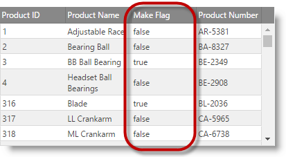
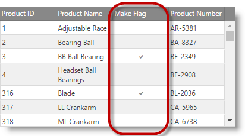

<!--
|metadata|
{
    "fileName": "iggrid-columns-and-layout",
    "controlName": "igGrid",
    "tags": ["Grids","Layouts"]
}
|metadata|
-->

# 列とレイアウト (igGrid)


## 概要

このドキュメントでは、`igGrid` レイアウトおよび列設定について解説します。

### このトピックの内容

このトピックは、以下のセクションで構成されます。

-   [幅と高さの定義](#width-height)
-   [列の定義](#defining-columns)
-   [Column Formatting](#column-formatting)
-   [列にマッパー機能を定義](#defining-mapper)
-   [AutoGenerateColumns](#autoGenerateColumns)
-   [スタイル設定](#styling)
-   [列のチェックボックスのレンダリング](#checkboxes)
-   [関連コンテンツ](#related-content)


## <a id="width-height"></a> 幅と高さの定義

コントロールの幅と高さを定義することによって、グリッド レイアウトを処理する方法をコントロールできます。幅または高さとして定義可能な値は以下のとおりです。

表 1: 幅および高さの値の形式

値の形式|可能な値
---|---
文字列|"500" と "500px" のどちらも有効です。
数値|500 (500px に変換します)。
パーセンテージ文字列|"50%"、"100%" など。


幅と高さを定義した場合、グリッドはスクロール可能な DIV 要素内でラップされます。高さを設定し、`fixedHeaders` を true (デフォルト) に設定すると、ユーザーがスクロールするときにグリッド ヘッダーは固定されたままになります。

> **注:** サンプルに示したように、個々の列の幅を指定することもできます。

幅と高さを設定した場合、グリッドのレンダリングに影響する複数のシナリオがあります。

表 2: ヘッダーおよびスクロールの固定を有効または無効にする効果

固定ヘッダー|スクローリング|詳細
---|---|---
いいえ|いいえ|列の幅を定義する場合、グリッドは幅に応じて伸縮します。列の幅を定義しない場合、グリッドはデータに応じて伸縮します。
はい|はい|ヘッダーは、DIV の中の独立したテーブル内に描画されます (そのため、グリッドに幅が設定され、水平スクロールバーがある場合、スクロール時にヘッダー テーブルはコンテンツと同期します)。
いいえ|はい|ヘッダーの要素は、データがホストされる単一のテーブルの中に描画されます。独立した TABLE または DIV はありません。


## <a id="defining-columns"></a> 列の定義

グリッド列を定義するには、リスト 1 に示すように、列グリッド オプションにオブジェクトを 追加します。

リスト 1: グリッドのオプションとしての列の定義

**JavaScript の場合:**

```js
$("#grid1").igGrid({
       autoGenerateColumns: false, columns: [
            { 
                headerText: "Country Code", 
                key: "Code", 
                width: "100px", 
                dataType: "string", 
                formatter: <formatter function>, 
                format: "" 
            },
            { 
                headerText: "Date", 
                key: "Date", 
                width: "100px", 
                dataType: "date", 
                format: "dateLong"
            },
            { 
                headerText: "Country Name", 
                key: "Name", 
                width: "80px", 
                dataType: "string"
            }
        ],
    responseDataKey: 'records',
    dataSource: remoteService,
    height: '400px'
});
```


列の定義は、キー プロパティを 1 つ以上含む JavaScript オブジェクトです。以下を含めることも可能です。

-   ヘッダー テキスト: `headerText` オプションを使用。
-   幅: `width` オプションを使用 (数値または文字列、px または %)。
-   データ型: `dataType` オプションを使用。

format および `dataType` オプションは様々な方法で構成できます。

-   `dataType` は文字列、数値、日付、ブール値、またはオブジェクトを設定可能です。
-   dataType=”date” (Date オブジェクト) に対応する `format` 列プロパティは、“date”、“dateLong”、“dateLong”、“dateTime”、“timeLong”、または “MM-dd-yyyy h:mm:ss tt” などの明示的なパターンが可能です。
-   dateType=”number” (数値オブジェクト) または dataType=”string” に対応する `format` 列プロパティは、“number”、“double”、“int”、“currency”、または “percent” が可能です。
-   The `format` column property corresponding to dateType=”bool” (bool objects) can be “checkbox”.
-   また、`dataType`=”number” の場合、対応する書式設定は “0.0###”、“#.##”、“0.000” などが可能です。ここで、小数点の後にくるゼロの数は、小数点以下の最小桁数を定義し、小数点の後の合計文字数は、小数点以下の最大桁数を定義します。
-   `dataType` が “date” または “number” 以外の場合、対応する書式設定に“{0}” フラグを含めることができます。この場合、このフラグはセルの値に置換されます。たとえば、format=”Name: {0}” で、セルの値が “Bob” の場合、セルには “Name: Bob” が描画されます。

## <a id="column-formatting"></a> Column Formatting

Column formatting defines how column cell values are displayed in the grid. Formatting operates at the grid rendering phase and doesn't affect the data in the underlying data source. This means that features that operate on the data like Sorting, Filtering, Group By will not consider the formatted cell values.

Column formatting (rendering) is affected by several `igGrid` options. These are column's [`formatter`](%%jQueryApiUrl%%/ui.iggrid#options:columns.formatter), [`format`](%%jQueryApiUrl%%/ui.iggrid#options:columns.format) and [`template`](%%jQueryApiUrl%%/ui.iggrid#options:columns.template). Additionally there's grid's [`autoFormat`](%%jQueryApiUrl%%/ui.iggrid#options:autoFormat) option which affects how the regional settings are applied to the grid.

-  [`autoFormat`](%%jQueryApiUrl%%/ui.iggrid#options:autoFormat) - is a string which identifies how the regional settings are applied globally on the grid for "date" and "number" columns. By default only "date" columns are formatted according the regional settings. This option is overridden by [`format`](%%jQueryApiUrl%%/ui.iggrid#options:columns.format) and [`formatter`](%%jQueryApiUrl%%/ui.iggrid#options:columns.formatter) options if available.

 > **Note:** Regional settings can be accessed with the following expression: 
 ```js
 $.ig.regional.defaults;
 ```
 
 Here is the flow of column rendering when no format decorators are used: 
 ```
 Raw Value -> autoFormat -> (template)* -> Cell Value
 * - optional setting
 ```

 > **Note:** By default when there are no column rendering decorators applied and the Raw Value is null, undefined or empty string ("") a non-breaking space (`&nbsp;`) is rendered instead in the cell.
 
-  [`formatter`](%%jQueryApiUrl%%/ui.iggrid#options:columns.formatter) - is a function or a string name of a function bound to the global window object. It gives you full control on rendering the data source value. When defining formatter function it's up to you to control the format and regional representation of the value. There is a utility function `$.ig.formatter(rawValue, dataType, formatPattern)` which can be used for formatting values either using the regional settings or using custom format pattern.

 **In Javascript:**
 ```js
 var formattedValue = $.ig.formatter(new Date()); //formats the date according to the current regional settings.
 var formattedValue = $.ig.formatter(1000000); //formats the number according to the current regional settings.
 ```

 [`formatter`](%%jQueryApiUrl%%/ui.iggrid#options:columns.formatter) and [`format`](%%jQueryApiUrl%%/ui.iggrid#options:columns.format) options does not operate at the same time. When defined, [`formatter`](%%jQueryApiUrl%%/ui.iggrid#options:columns.formatter) function is considered with priority and [`format`](%%jQueryApiUrl%%/ui.iggrid#options:columns.format) is not used. However value from the [`formatter`](%%jQueryApiUrl%%/ui.iggrid#options:columns.formatter) function is further decorated with a [`template`](%%jQueryApiUrl%%/ui.iggrid#options:columns.template).

 Here is the flow of column rendering when formatter is used:
 ```
 Raw Value -> formatter -> (template)* -> Cell Value
 * - optional setting
 ```

-  [`format`](%%jQueryApiUrl%%/ui.iggrid#options:columns.format) - is a string identifying a format patterns. Internally [`format`](%%jQueryApiUrl%%/ui.iggrid#options:columns.format) option uses the `$.ig.formatter(rawValue, dataType, formatPattern)` function. When set, [`format`](%%jQueryApiUrl%%/ui.iggrid#options:columns.format) overrides the setting of the [`autoFormat`](%%jQueryApiUrl%%/ui.iggrid#options:autoFormat) option and also the default regional settings.

 Here is the flow of column rendering when [`format`](%%jQueryApiUrl%%/ui.iggrid#options:columns.format) is used:

 ```
 Raw Value -> format -> (template)* -> Cell Value 
 * - optional setting
 ```

- [`template`](%%jQueryApiUrl%%/ui.iggrid#options:columns.template) - is a templated string (templating engine used is defined in the `templatingEngine` option).  
 
 Here is the flow of column rendering when [`template`](%%jQueryApiUrl%%/ui.iggrid#options:columns.template) is used:
 
 ```
 Raw Value -> (autoFormat|formatter|format)* -> template -> Cell Value 
 * - optional setting
 ```

## <a id="defining-mapper"></a> 列にマッパー機能を定義

マッパー関数は、複雑なデータオブジェクトから特定のプロパティを抽出する場合に使用でき、値の表示および列のデータ処理に使用される値を定義します。
列 dataType は "object" として指定する必要があり、マッパー機能はレコードから必要なデータを抽出するために使用できます。 
マッピングはデータソース レベルで完了し、すべてのデータ処理をマップ値に基づいて実行することができます。
たとえば、以下のようにデータ ソースで各レコードに複合オブジェクトがある場合: 
```js
var data = [{ "ID": 0, "Name": "Bread", "Description": "Whole grain bread", "Category":  { "ID": 0, "Name": "Food", "Active": true }},
{ "ID": 1, "Name": "Milk", "Description": "Low fat milk",  "Category":   { "ID": 1, "Name": "Beverages", "Active": true } },
 ...
 ];
```
特定のプロパティや 'Category' オブジェクトの複数プロパティから計算済みの値を表示する場合 (単一文字列に ID および Name サブフィールド値を含むための値のマッピングなど)、`mapper` 関数を使用できます。

例:

**JavaScript の場合:**
```js
	mapper: function(record){
	//extracting data from complex object
	return record.Category.ID + " : " + record.Category.Name;
	}				

```
関数は コード例 2 で示すように [`mapper`](%%jQueryApiUrl%%/ui.iggrid#options:columns.mapper) 列オプションで定義されます。特定の列に関連するすべてのデータ操作でデータ レコード毎に値を指定できます。 
この関数は、すべてのデータ レコードを含む単一パラメーターを受け入れ、レコード毎に単一のシンプルな値を返します。 

> **注:** この機能は、グリッドがこの列のデータを抽出する必要がある度に呼び出されます。これには、列に関連するデータ レンダリングやデータ操作処理が含まれます。そのため、複雑なデータの抽出および (または) 計算ロジックがある場合、パフォーマンスに影響することに注意してください。

コード例 2: igGrid の列にマッパー機能を定義します。

**JavaScript の場合:**

```js
  $("#grid").igGrid({
  columns: [
                    { headerText: "", key: "ID", dataType: "number", width: "200px" },
                    { headerText: "Name", key: "Name", dataType: "string", width: "200px" },
                    { headerText: "Description", key: "Description", dataType: "string", width: "200px" },
                    { headerText: "Category", key: "Category", dataType: "object", width: "200px",
						mapper: function(record){
								//extracting data from complex object
								return record.Category.Name;
							}					
					}
                ],
                autoGenerateColumns: false,
                dataSource: northwindProductsJSON,         
               ...
});

```

 **In Javascript:**
 ```js
 var formattedValue = $.ig.formatter(new Date()); //formats the date according to the current regional settings.
 var formattedValue = $.ig.formatter(1000000); //formats the number according to the current regional settings.
 ```
 [`formatter`](%%jQueryApiUrl%%/ui.iggrid#options:columns.formatter) and [`format`](%%jQueryApiUrl%%/ui.iggrid#options:columns.format) options does not operate at the same time. When defined, [`formatter`](%%jQueryApiUrl%%/ui.iggrid#options:columns.formatter) function is considered with priority and [`format`](%%jQueryApiUrl%%/ui.iggrid#options:columns.format) is not used. However value from the [`formatter`](%%jQueryApiUrl%%/ui.iggrid#options:columns.formatter) function is further decorated with a [`template`](%%jQueryApiUrl%%/ui.iggrid#options:columns.template).

 Here is the flow of column rendering when formatter is used:
 ```
 Raw Value -> formatter -> (template)* -> Cell Value
 * - optional setting
 ```

-  [`format`](%%jQueryApiUrl%%/ui.iggrid#options:columns.format) - is a string identifying a format patterns. Internally [`format`](%%jQueryApiUrl%%/ui.iggrid#options:columns.format) option uses the `$.ig.formatter(rawValue, dataType, formatPattern)` function. When set, [`format`](%%jQueryApiUrl%%/ui.iggrid#options:columns.format) overrides the setting of the [`autoFormat`](%%jQueryApiUrl%%/ui.iggrid#options:autoFormat) option and also the default regional settings.

 Here is the flow of column rendering when [`format`](%%jQueryApiUrl%%/ui.iggrid#options:columns.format) is used:
 ```
 Raw Value -> format -> (template)* -> Cell Value 
 * - optional setting
 ```
- [`template`](%%jQueryApiUrl%%/ui.iggrid#options:columns.template) - is a templated string (templating engine used is defined in the `templatingEngine` option).  
 
 Here is the flow of column rendering when [`template`](%%jQueryApiUrl%%/ui.iggrid#options:columns.template) is used:
```
 Raw Value -> (autoFormat|formatter|format)* -> template -> Cell Value 
 * - optional setting
 ```

## <a id="autoGenerateColumns"></a> AutoGenerateColumns

Whenever `autoGenerateColumns` is set to *false*, you are required to manually define columns in the columns array. When `autoGenerateColumns` is *true* (default), you are not required to specify columns. In that case the grid will infer columns automatically from the data source (assuming there is at least one row in it) and add them to the columns collection. Header texts are automatically generated as well, and are equivalent to the keys in the data source. Setting column widths for auto-generated columns is done with `defaultColumnWidth` option, which will apply one and the same column width for all generated columns. When remote data binding is used, header texts are automatically generated only when data is available from the backend on the client. However, in most real-world scenarios it’s best to explicitly define columns.

`autoGenerateColumns` を true に設定し、列を手動で定義した場合、列をユーザーに描画する方法として、いくつかのシナリオが可能です。

-   データ ソース内の列数に一致する列カウントを定義した場合、グリッドは列コレクションに定義した順に列を描画します。また、グリッドは、ユーザーが指定したヘッダー テキスト、*dataType*、幅、および書式設定 (もしあれば) を受け入れます。
-   データ ソース内の列数に一致しない列カウントを定義した場合、定義した列が最初に描画され、そのあとに、データ ソースの残りのすべての列が自動的に生成され、定義した列の後に追加されます。

> **注:** `autoGenerateColumns` が true の場合は、データ ソース内のすべての列が常に描画されます。特定の列を描画したくない場合は、`autoGenerateColumns` を false に設定してから、列配列に必要な列を指定する必要があります。

また、すべての列の幅を個別に指定することも可能です。列の幅を指定した場合にグリッドにも幅が定義されていて、それが、自分で定義したすべての列幅の合計より小さい場合は、水平スクロールバーがグリッドに描画されます。

> **注:** 数個の列にだけ幅を指定し、それと同時にグリッドの幅を定義することは推奨しません。一部の列の幅が狭くなってしまいます。この問題を改善するには、`defaultColumnWidth` グリッド オプションを設定します。

> **注:** 更新機能を使用するには、`autoGenerateColumns` が false に設定される場合、`dataType` プロパティを設定する必要があります。更新機能は、グリッドおよび基本データ ソースの間でレコードを同期するためにプライマリ キーを使用します。プライマリ キーは値およびタイプによって比較されます。


## <a id="styling"></a> スタイル設定

jQuery グリッドは、jQuery UI Theme Roller と完全に互換性があります。そのため、Theme Roller Web アプリケーションを使用して、カスタム テーマを生成したり、既存のテーマを使用して、それをグリッドに適用できます。

最適な縮小および結合されたスタイルを使用するには、リスト 2 にある CSS 定義をインクルードする必要があります。

リスト 2: 必須のスタイルシート定義

**JavaScript の場合:**

```js
<link type="text/css" href="infragistics.theme.css" rel="stylesheet" />
<link type="text/css" href="infragistics.css" rel="stylesheet" />
```

最初の CSS、*jquery.ui.custom.css* は実際のテーマ (つまり、カラー関連のスタイル設定) を表します。これを Theme Roller から生成された CSS ファイルと置換できます。

2 番目の CSS は、Infragistics Ignite UI 用のカスタマイズで、Theme Roller / jQuery UI では使用できないレイアウト関連のルールを含みます。そのため、コントロールが正常に機能することを保証することが必要です。

結合されていない CSS (開発シナリオで使用される) を参照する場合は、リスト 3 に示すようにして参照を追加できます。

リスト 3: 結合または縮小されていない CSS ファイルの参照

**JavaScript の場合:**

```js
<link type="text/css" href="css/themes/infragistics/infragistics.theme.css" rel="stylesheet" />
<link type="text/css" href="css/structure/modules/infragistics.ui.grid.css" rel="stylesheet" />    
<link type="text/css" href="css/structure/modules/infragistics.ui.shared.css" rel="stylesheet" />    
```

要素の外観を変更したい場合には、custom.css ファイルを編集できます。または、あらかじめ定義されているクラス名に対しカスタム CSS ルールを定義します。

グリッドの最上位のコンテナー DIV は、クラス `ui-iggrid` でプレフィックスされるので、これをセレクターとして使用して、グリッドだけを対象にできます。あるいは、カスタム CSS を特定のグリッドにのみ適用したい場合は、グリッドの ID をセレクターとして使用できます。


## <a id="checkboxes"></a> 列のチェックボックスのレンダリング

ブール データ型を含む列の場合、デフォルトでは `igGrid` は true または false の文字列を示します。ただし、`igGrid` 列がブール データを表示するかどうかを選択するチェックボックスのオプションがあり、チェックの有無に応じて、それぞれ true または false になります。`renderCheckboxes` プロパティを true に設定すると、列のチェックボックスがレンダリングされます。チェックボックスをレンダリングするには、列の `dataType` プロパティをブール値に設定する必要があります。

Note that as of 16.1 an improvement in the visual styling of the checkbox is made. It's square box is not going to be rendered when the grid is in display mode. What would be provided is only a plain checkmark. This change is due to refinement of the experience for the end-users, who naturally perceived that this was an interactive element, which they can click to toggle. This is still the case when the `igGrid` enters in edit mode which means that the previous look and feel of checkboxes is preserved for this mode.
Currently the classes are abstracted into the util property `$.ig.checkboxMarkupClasses` which is empty by default. Previous layout of the checkbox can be adopted by the usage of the following classes -
`$.ig.checkboxMarkupClasses = "ui-state-default ui-corner-all ui-igcheckbox-small";`
The property allows custom classes, but any kind of modification should be handled properly so it won't break the layout of the checkbox.

Previous versions of igUpdating had two different behavioral cases for editing checkboxes. First one was when end-user clicks on the checkbox in the cell and the second one was when he clicks outside of the checkbox in the cell. The grid was entering in edit mode in both cases, but in the first one the checkbox value was changed.
Currently there are no differences in behavior for editing checkboxes. It is all consistent. The end-user should enter edit mode first and after that is going to able to change the value of the checkbox.

Here's a suggested workaround to achieve the previous behavior:

-   Specify the following classes before the initialization of the grid:

**In Javascript:**

```js
$.ig.checkboxMarkupClasses = "ui-state-default ui-corner-all ui-igcheckbox-small";
```

-   Add similar event handler for editCellStarted:

**In Javascript:**

```js
features: [
    {
        name: "Updating",
        editMode: "cell",
        editCellStarting: function (evt, ui) {
            if (ui.columnKey === "MakeFlag" && $(evt.originalEvent.target).hasClass("ui-icon-check")) {
                ui.value = !ui.value;
            }
        }
    }
]
```

右の図では、次のコード例が Make Flag 列のチェックボックスをレンダリングする様子を示しています。

<table class="table">
	<tbody>
        <tr>
            <td>

			</td>
            <td>

            </td>
        </tr>
    </tbody>
</table>

図1: ブール値を示す列 チェックボックスがレンダリングされている場合 (右) とされていない場合 (左)

**JavaScript の場合:**

```js
$("#grid1").igGrid({
    autoGenerateColumns: false,
    primaryKey: "ProductID",
    // enabling render checkboxes on a column
    renderCheckboxes: true,
    columns: [ {
            // note: if primaryKey is set and data in primary column contains numbers,
            // then the dataType: "number" is required, otherwise, dataSource may misbehave
            headerText: "(Grid_CheckboxColumn_ColumnHeader_ProductID)", 
            key(Grid_CheckboxColumn_ColumnHeader_ProductNumber)", 
            key: "ProductNumber",
            dataType: "string"
        }, {
            headerText: "(Grid_CheckboxColumn_ColumnHeader_MakeFlag)", 
            key(Grid_CheckboxColumn_ColumnHeader_ModifiedDate)", 
            key: "ModifiedDate",  
            dataType: "date"
        }
    ],
    features: [ {
        name: "Selection",
        mode: "row"
    }, {
        name: "Updating",
        enableAddRow: false,
        editMode: "row",
        // event raised after end row editing but before dataSource was updated
        editCellEnding: function (evt, ui) {
            // get cell’s checkbox value when it is changed
            if (ui.update) {
                if (ui.columnKey === 'MakeFlag' ) {
                    logEvent("editCellEnded (Grid_EventFired) (Grid_ColumnKey) = " + 
                    ui.columnKey + "; (Grid_RowIndex) = " + 
                    ui.rowID + "; (Grid_CellValue) = " + 
                    ui.value + "; $(Grid_Update) = " + 
                    ui.update);
                }
            }
        },
        enableDeleteRow: false,
        columnSettings: [ {
            columnKey: "ProductID",
            readOnly: true
        }, {
            columnKey: "ProductNumber"
        }, {
            columnKey: "MakeFlag"
        }, {
            columnKey: "OrderDate",
            editorType: "datepicker",
            validation: true
        } ]
    } ],
    dataSource: gridData,
    height: "300px"
});
```

**ASPX の場合:**

```csharp
<%= Html.Infragistics().Grid(Model).ID("grid1").AutoGenerateColumns(false).PrimaryKey("ProductID").RenderCheckboxes(true).Columns(column =>
    {
        column.For(x => x.ProductID).HeaderText(this.GetGlobalResourceObject("Grid", "PRODUCT_ID").ToString()).DataType("number");
        column.For(x => x.ProductNumber).HeaderText(this.GetGlobalResourceObject("Grid", "PRODUCT_NUMBER").ToString()).DataType("string");
        column.For(x => x.MakeFlag).HeaderText(this.GetGlobalResourceObject("Grid", "MAKE_FLAG").ToString()).DataType("bool");
        column.For(x => x.ModifiedDate).HeaderText(this.GetGlobalResourceObject("Grid", "MODIFIED_DATE").ToString()).DataType("date");
        }).Features(features => {
            features.Selection().Mode(SelectionMode.Row);
            features.Updating().EnableAddRow(false).EditMode(GridEditMode.Row).EnableDeleteRow(false).ColumnSettings(columnSettings => {
                columnSettings.ColumnSetting().ColumnKey("ProductID").ReadOnly(true);
                columnSettings.ColumnSetting().ColumnKey("ProductNumber");
                columnSettings.ColumnSetting().ColumnKey("MakeFlag");
                columnSettings.ColumnSetting().ColumnKey("ModifiedDate").EditorType(ColumnEditorType.DatePicker).Validation(true);
        });
    }).DataBind().Height("300px").Render()
%>
```


## <a id="related-content"></a> 関連コンテンツ

### サンプル

-   [列の自動生成](%%SamplesUrl%%/grid/auto-generate-columns)
-   [複合オブジェクトの処理](%%SamplesUrl%%/grid/handling-complex-objects)

### トピック
-   [Ignite UI の概要](NetAdvantage-for-jQuery-Overview.html)

 

 


