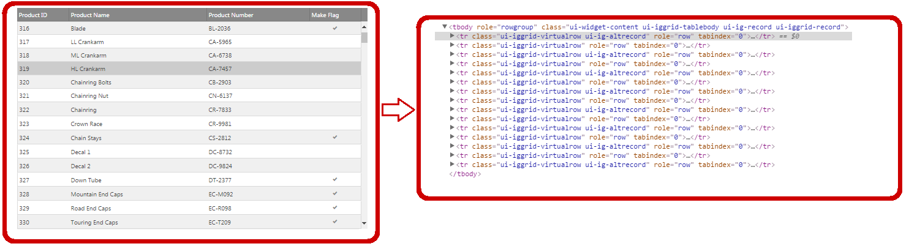

<!--
|metadata|
{
    "fileName": "iggrid-virtualization-overview",
    "controlName": "igGrid",
    "tags": []
}
|metadata|
-->

# 仮想化概要 (igGrid)

## トピックの概要

### 目的

このトピックでは、`igGrid`™ コントロールの仮想化機能について紹介します。

## 概要

仮想化は、アクティブなイン メモリー DOM オブジェクトの数を減らす `igGrid` コントロールの機能です。仮想化は、仮想化されていないグリッドと比較してユーザーからは何も変わりません。

`igGrid` は固定と連続の 2 つの仮想化タイプをサポートします。

仮想化を使用することで、データを数百万レコードを含むソースに容易にバインドでき、その上でデータのかなりの部分をクライアントに一度に描画させることができます。

## サポートされる仮想化のタイプ

次は、`igGrid` コントロールによってサポートされる仮想化タイプの簡単な説明です。

- [固定仮想化](#fixed): 表示される行のみグリッドに描画されます。

- [連続仮想化](#continuous): あらかじめ決められた数の行がグリッドに描画されます。

###  固定仮想化 

固定仮想化では、表示される行だけがグリッドに描画され、描画された行は後で生成されたデータのコンテナとして使われます。ユーザーがグリッドをスクロールすると、ひとかたまりの行のデータが更新され、行 DOM 要素が再利用されます。

既存の DOM 要素を再利用すると、描画速度が一定になり、メモリ フットプリントが非常に低くなります。たとえば、グリッドにレコードを 100 件ロードしても 10,000 件ロードしても、メモリと CPU 消費量はまったく同じです (データ バインドのオーバーヘッドは除く)。

> **注意:** 固定仮想化は列に対してもサポートされます。これによりユーザーはグリッドを水平にスクロールできるようになります。表示されている列に属する表セルだけが HTML DOM 構造に現れるため、この場合、ひとかたまりの DOM 要素は表示される列の数によってさらに制限されます。

グリッドの仮想化は、DOM 要素を再利用するようクライアント側ロジックを実装することで実現できます。そのため、仮想化されたグリッドは追加データをフェッチするためのサーバー要求を行いません。グリッドは、クライアントですでに使用できるデータを処理します。クライアントに設定された全データを一度にロードしたくない場合 (状況によっては望ましくない、特にデータが非常に大きい場合)、仮想化をページングと組み合わせたままでもよく、グリッドを大きなページサイズをもつよう設定します。

固定仮想化の場合、グループ化機能 (ページング、並び替え、フィルタリング、選択など) すべての `igGrid` 機能が動作します。

左に示した図は、1 クライアントに関して 10,000 レコードがロードされたグリッドを示します。右に示した図は、仮想化されたグリッドをサポートするために DOM 内に実際に存在する 16 のHTML 表要素を示します。

**関連トピック:**

-   [仮想化を有効にし、構成する](igGrid-Enabling-and-Configuring-Virtualization.html)

###  連続仮想化 

連続仮想化は事前に決められた数の行を使用します。ユーザーが上下にスクロールすると、仮想化は現在描画されている行が行の次の/前の部分を表示するのに十分かどうかを判断します。十分でなければ、行の現在部分は配置され、行の必要部分が再度作成されます。これにより、1000データ行があったとして、DOM 構造に大変な負荷をかけることになる 1000 行の表の代わりにたとえば30行だけが表示されるとすることになります。

`igGrid` コントロールの各行は複数行にわたることもあります。そのため行の高さは行ごとに異なります。スクロールが起きた後にどの行を表示すべきかを判断するために、仮想化は行の平均高さを計算します。しかし、この計算は現在描画されている行に基づいており、すべての利用可能な行ではないため、この平均高さは予測値となります。ここから、スクロールされるたびに、表示されることになる行が予測されます。そのため、スクローラーが最上部または最下部にある時にはスクローラー位置を誤る可能性があります。仮想化はスクロールの後にそのような状況をチェックし、必要であればスクローラーの位置を訂正します。

左に示した図は、1 クライアントに関して 1,000 レコードがロードされたグリッドを示します。右に示した図は、仮想化されたグリッドをサポートするために DOM 内に実際に存在する 30 のHTML 表要素を示します。

> **注**: 連続仮想化は、ほとんどの Ignite UI コントロールでポートされますので、仮想化モードとしての選択が推薦されます。列仮想化の実装で固定仮想化が必要な場合がありますが、その他の場合は連続仮想化を使用してください。

**関連トピック:**

-   [仮想化を有効にし、構成する](igGrid-Enabling-and-Configuring-Virtualization.html)

### キーボード操作

仮想化が有効でマウスがが仮想テーブル上にある場合、以下のキー操作が可能です。

- UP/DOWN: コンテナーを上または下へスクロール。

##  関連コンテンツ

###  トピック

このトピックの追加情報については、以下のトピックも合わせてご参照ください。

- [仮想化を有効にし、構成する](igGrid-Enabling-and-Configuring-Virtualization.html): このトピックでは、コード例と共に、`igGrid` 内の仮想化機能を有効化し構成する方法について説明します。

###  サンプル

このトピックについては、以下のサンプルも参照してください。

- [仮想化 (固定)](%%SamplesUrl%%/grid/virtualization-fixed): この例では、固定数の行を用いた `igGrid` のHTML 仮想化機能を説明します。

- [連続仮想化](%%SamplesUrl%%/grid/virtualization-continuous): このサンプルでは、`igGrid` コントロールの連続仮想化機能を紹介します。

 

 

