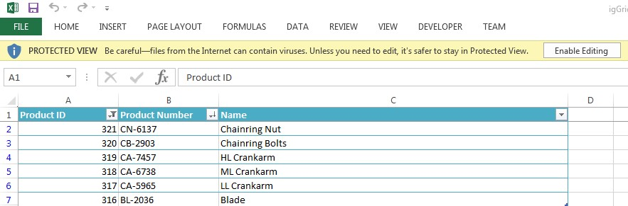

<!--
|metadata|
{
    "fileName": "iggridexcelexporter-overview",
    "controlName": ["igExcel", "igGrid"],
    "tags": ["Exporting"]
}
|metadata|
-->

# Grid Excel エクスポーターの概要
`igGridExcelExporter` コンポーネントにより、igGrid から Microsoft Excel ドキュメントにデータをエクスポートできます。エクスポートは、テーマとワークブックのカスタマイズをサポートし、並べ替え、フィルタリング、ページングなどの機能によりグリッドで操作されたデータを反映します。以下のスクリーンショットは、エクスポートされた igGrid が Excel でどのように表示されるかを示しています。

 

`igGridExcelExporter` には以下の特徴があります。  

 - 全体のテーマのサポート
 - ファイル名とワークシート名の定義をサポート
 - Excel での表スタイルの定義をサポート
 - `igGrid` の`フィルタリング`、`非表示`、`ページング`、`並べ替え`、`集計`、`列固定` および `仮想化` の機能のエクスポートをサポート
 - `igGrid` のヘッダーと代替行スタイルをサポート
 - スキップする `igGrid` 列の定義をサポート
 - エクスポート処理全体でコールバック (イベント) を提供

## 前提条件
- [Ignite UI の概要](NetAdvantage-for-jQuery-Overview.html) - Ignite UI™ ライブラリについての一般的情報。  
- [igGrid の概要](igGrid-Overview.html) - `igGrid` コントロールについての一般的情報。

## 依存関係
igGridExcelExporter は以下のオープン ソース ライブラリに依存しています。

- [FileSaver.js](https://github.com/eligrey/FileSaver.js/): W3C `saveAs` 仕様の polyfill
- [Blob.js](https://github.com/eligrey/Blob.js/): W3C [`Blob`](https://developer.mozilla.org/en-US/docs/Web/API/Blob) インターフェイスの polyfill
  
## igGrid での igGridExcelExporter の使用
エクスポーターの `export` 静的メソッドにグリッドのインスタンスを渡すことにより、グリッドのコンテンツ全体をエクスポートできます。 

```javascript
$.ig.GridExcelExporter.exportGrid($('#grid'), { 	
	fileName: 'igGrid',
	worksheetName: 'Sheet1',
	tableStyle: 'tableStyleLight13';
});
```
エクスポートを実行するときに、ファイル名 (この場合、最終名は `igGrid.xlsx`)、ワークシート名および表スタイルを指定できます。表スタイルは [Office オープン XML の ECMA 仕様](http://www.ecma-international.org/news/TC45_current_work/TC45_available_docs.htm) に従います (表スタイル定義のセクション参照)。

> **注:**: エクスポーターに対する唯一の必須引数はグリッドのインスタンスです。他のプロパティはすべて、明示的に値が提供されていない場合、デフォルトが使用されます。

エクスポーターで使用可能なすべてのプロパティの詳細は、 [API ヘルプ](%%jQueryApiUrl%%/ig.gridexcelexporter#overview) を参照してください。

### 完全なページ サンプル
```html
<!doctype html>
<html>
    <head>
        <link type="text/css" href="/css/themes/infragistics/infragistics.theme.css" rel="stylesheet" />
        <link type="text/css" href="/css/structure/infragistics.css" rel="stylesheet" />
    </head>
    <body>
        
        <button id="export-button">Export</button>
        <table id="grid"></table>
        
        <script type="text/javascript" src="/scripts/lib/jquery.min.js"></script>
        <script type="text/javascript" src="/scripts/lib/jquery-ui.min.js"></script>
        <script type="text/javascript" src="/scripts/lib/infragistics.core.js"></script>
        <script type="text/javascript" src="/scripts/lib/infragistics.lob.js"></script>
        <script type="text/javascript" src="/scripts/lib/FileSaver.js"></script>
        <script type="text/javascript" src="/scripts/lib/Blob.js"></script>
        <script>
            $(function(){
            
                var products = [  
                    { "ProductID": 1, "Name": "Adjustable Race", "ProductNumber": "AR-5381" },  
                    { "ProductID": 2, "Name": "Bearing Ball", "ProductNumber": "BA-8327" },  
                    { "ProductID": 3, "Name": "BB Ball Bearing", "ProductNumber": "BE-2349" },  
                    { "ProductID": 4, "Name": "Headset Ball Bearings", "ProductNumber": "BE-2908" },
                    { "ProductID": 316, "Name": "Blade", "ProductNumber": "BL-2036" },
                    { "ProductID": 317, "Name": "LL Crankarm", "ProductNumber": "CA-5965" },
                    { "ProductID": 318, "Name": "ML Crankarm", "ProductNumber": "CA-6738" },
                    { "ProductID": 319, "Name": "HL Crankarm", "ProductNumber": "CA-7457" },
                    { "ProductID": 320, "Name": "Chainring Bolts", "ProductNumber": "CB-2903" },
                    { "ProductID": 321, "Name": "Chainring Nut", "ProductNumber": "CN-6137" }
                ];
                
                $("#grid").igGrid({
                    autoGenerateColumns: false,
                    primaryKey:"ProductID",
                    width: "1500px",
                    height: "400px",
                    columns: [
                        { key: "ProductID", headerText: "Product ID", width: "150px", dataType:"number"},
                        { key: "ProductNumber", headerText: "Product Number", width: "150px"},
                        { key: "Name", headerText: "Name", width: "200px"},
                    ],
                    dataSource: products
                });
                
                $("#export-button").click(function(){
                    $.ig.GridExcelExporter.exportGrid($("#grid"), { 	
                        fileName: "igGrid",
                        worksheetName: "Sheet1",
                        tableStyle: "tableStyleLight13"
                    });
                });
            });
        </script>
    </body>
</html>
```

## 関連コンテンツ

### トピック
- [JavaScript Excel ライブラリの使用](Using-the-JavaScript-Excel-Library.html)
- [JavaScript Excel ライブラリの概要](JavaScript-Excel-Library-Overview.html)

### <a id="samples"></a> サンプル

-   [基本グリッドを Excel にエクスポート](%%SamplesUrl%%/grid/export-basic-grid)
-   [機能とグリッドを Excel へエクスポート](%%SamplesUrl%%/grid/export-feature-rich-grid)
-   [グリッド Excel エクスポートのカスタマイズ](%%SamplesUrl%%/grid/export-client-events)
-   [進行状況インジケーターとグリッドを Excel へエクスポート](%%SamplesUrl%%/grid/export-grid-loading-indicator)
