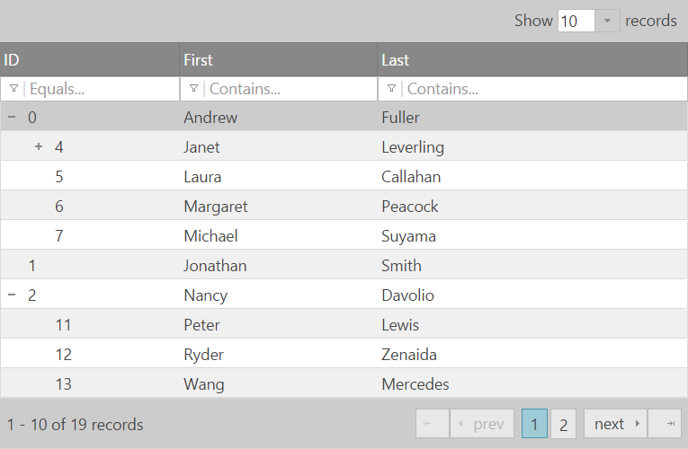

<!--
|metadata|
{
    "fileName": "igtreegrid-overview",
    "controlName": ["igTreeGrid"],
    "tags": ["Grids", "Data Binding", "Getting Started"]
}
|metadata|
-->

# 概要 (igTreeGrid)

`igTreeGrid`™ は、ツリーおよび表形式データの原則を単一のコントロールに結合することにより、階層データを表示します。`igTreeGrid` 内部で、階層データは各行の同じ列を使用して描画され、ユーザーには子データを展開および縮小する方法が提供されます。



`igTreeGrid` は `igGrid` コントロールを継承しているため、同じ機能と機能性を多数使用できます。一部の機能は、階層データの最適なニーズに応じて機能と実装が異なります (フィルタリング、ページングなど)。

柔軟性を維持するために、ツリー グリッドには構成可能な展開インジケーターが用意され、最初のデータ列またはスタンドアロン列にインラインで描画できます。展開インジケーターは、カスタムな視覚化を実現するために、別のルック アンド フィールにカスタマイズすることもできます ([ファイル エクスプローラーのサンプル](%%SamplesUrl%%/tree-grid/file-explorer "File Explorer Sample - File Explorer with Tree Grid Control - Ignite UI™") を参照)。

### このトピックの内容

- [**アーキテクチャの概要**](#architectural-overview)
- [**サポートされるデータ ソース**](#supported-data-sources)
	- [フラット データ ソース](#flat-data)
	- [階層データ ソース](#hierarchical-data)
- [**igGrid との機能の違い**](#feature-differences-iggrid)
- [**igTreeGrid と igHierarchicalGrid の比較**](#tree-vs-hierarchical-grids)
- [**パフォーマンス**](#performance)
- [**はじめに**](#getting-started)
	- [完全なページ サンプル](#full-page-sample)
-  [**キーボード ナビゲーション**](#keyboard-navigation)
-   [**関連コンテンツ**](#related-content)
    -   [トピック](#topics)
    -   [サンプル](#samples)

### ボキャブラリ

`igTreeGrid` をより活用するには、グリッドの [API](%%jQueryApiUrl%%/ui.igtreegrid) とドキュメントで特別な意味を持ついくつかの用語を十分に理解する必要があります。

| Term | Definition |
| --- | --- |
| レベル | 各階層のすべてのデータ項目/行および同じ数の親を適用します。 |
| ルート レベル | 自身に親のない最上位の行。 |
| リーフなしレベル | 少なくとも親と子が 1 づつある行。 |
| リーフ　レベル | 親と子がない階層関係の最下位レベルの項目 |


## <a id="architectural-overview"></a> アーキテクチャの概要

`igTreeGrid` は [`igGrid`](igGrid-Overview.html "igGrid Overview") コントロールを継承しているため、同じ API とエンドユーザー操作の多くを共有しています。一部の領域 (フィルタリングやページングなど) では、ツリー グリッドの実装が `igGrid` の場合とは異なります。これは、表形式で描画される階層データをよりよく操作できるようにするためです。`igGrid` と `igTreeGrid` の機能の違いの詳細は、「[igTreeGrid とigGrid の機能の違い](#feature-differences-iggrid)」を参照してください。

ファイル グリッド コントロールと同様に、`igTreeGrid` は DOM で構造の基礎として `TABLE` 要素または `DIV` 要素を使用します。データは親行の展開インジケーターをクリック/タップすることにより表示されます。そのため、子行の描画に必要な表の行とセルの要素はその場で作成されます。`igTreeGrid` のパフォーマンスに関する詳細は、[パフォーマンス セクション](#performance)を参照してください。

ツリー グリッドは、他の Ignite UI グリッドと同様に、切り離されたアーキテクチャを使用できます。表面下で、`igTreeGrid` は `igTreeHierarchialDataSource` コンポーネントにより支えられています。このデータ ソース コンポーネントは、ツリー グリッドのソース データをユーザーに表示する前に、それに直接影響する機能のロジックを実装します。この特殊なデータ ソースの詳細は、[igTreeHierarchicalDataSource](%%jQueryApiUrl%%/ig.treehierarchicaldatasource) を参照してください。

## <a id="supported-data-sources"></a> サポートされるデータ ソース

`igTreeGrid` は、フラット データと階層データの 2 種類のデータ ソースをサポートします。

> **注:**: **すべてのデータ オブジェクトが一様なスキーマ**を持つことは、ツリー グリッドでのデータの描画における基本です。フラット データ ソース型と階層データ ソース型は、データの階層関係の維持にやや異なるアプローチを使用していますが、残りのデータ メンバーはオブジェクトで同一です。

### <a id="flat-data"></a> フラット データ ソース

フラット データ、すなわち自己参照データは、データのスキーマにプライマリ キー / 外部キーのリレーションシップが存在するシンプルなオブジェクト配列で構成されています。

フラット データ ソースの例を以下に示します。

```javascript
var data = [
  { id: 1, supervisorId: 0, firstName: "John", lastName: "Smith", title: "CEO" },
  { id: 2, supervisorId: 1, firstName: "Mary", lastName: "Edwards", title: "Manager" },
  { id: 3, supervisorId: 2, firstName: "Matthew", lastName: "Jones", title: "Clerk" }
];
```

ここで、`supervisorId` は配列のデータの `id` 値とリレーションシップを持ちます。グリッドでリレーションシップを構成するには、[`primaryKey`](%%jQueryApiUrl%%/ui.igtreegrid#options:primaryKey) オプションと [`foreignKey`](%%jQueryApiUrl%%/ui.igtreegrid#options:foreignKey) オプションの両方に値を提供する必要があります。以下のコード スニペットは、フラット データ ソースでツリー グリッドを初期化する方法を示しています。

```javascript
$('#treegrid').igTreeGrid({
  dataSource: data,
  primaryKey: 'id',
  foreignKey: 'supervisorId',
  ...
});
```

### <a id="hierarchical-data"></a> 階層データ ソース

階層データ ソースは、親データ オブジェクトの配列メンバーとして子データが存在するネストされたリレーションシップを持ちます。以下に階層データ ソースの例を示します。

```javscript
var data = [{
  id : 1,
  firstName : "John",
  lastName : "Smith",
  title : "CEO",
  employees : [{
    id : 2,
    firstName : "Mary",
    lastName : "Edwards",
    title : "Manager",
    employees : [{
      id : 3,
      firstName : "Matthew",
      lastName : "Jones",
      title : "Clerk"
    }]
  }]
}];
```

階層データのリレーションシップは、`employees` メンバーのオブジェクトの配列を使用してマネージされます。階層データでツリー グリッドを初期化するには、[`childDataKey`](%%jQueryApiUrl%%/ui.igtreegrid#options:childDataKey) オプションを使用してリレーションシップを確立する必要があります:

```javascript
$('#treegrid').igTreeGrid({
  dataSource: data,
  primaryKey: 'id',
  childDataKey: 'employees',
  ...
});
```

## <a id="feature-differences-iggrid"></a> igGrid との機能の違い


前述のように、`igTreeGrid` は `igGrid` を継承し、グリッドの一部機能に対してカスタム実装を提供しています。以下の表に、各グリッド機能の違いの一部を強調して示します。

| Feature | igTreeGrid | igGrid |
| --- | --- | --- |
| Sorting | Recursively sorts rows by column within the hierarchical structure of the data | Sorts rows by all data in a column |
| Paging | Creates pages from only root records OR based on all data | Creates pages from all bound data |
| Filtering | Renders matches to filter criteria in context of its hierarchy | Renders only exact matches to filter criteria |

> **注:**: igGrid と異なり、igTreeGrid は `foreignKey` に対して値が設定されている場合、フラット データ ソースを期待します。


## <a id="tree-vs-hierarchical-grids"></a> igTreeGrid と igHierarchicalGrid の比較

`igTreeGrid` と [`igHierarchicalGrid`](igHierarchicalGrid-Overview.html "igHierarchicalGrid Overview") は、いずれも階層データを表示するために作成されていますが、選択する際に注意が必要な違いがあります。2 つのグリッドの最も大きな違いは、`igTreeGrid` は同じ列に各行を表示しますが、`igHierarchicalGrid` は階層レベルごとに異なるスキーマでデータを描画できる点です。以下に、コントロールの違いを詳細にリストします。

`igTreeGrid` の場合:
- 既存の列の内部または固有の列に展開インジケーターを描画できる
- 有効な機能をツリー グリッド全体に適用する
- Column Fixing 機能をサポートする
- Group By 機能はサポートしない (グループ化はツリー グリッドに固有)
- DOM フットプリントは階層グリッドより軽量。ツリー グリッドは単一 `igGrid` インスタンスを使用して描画される

`igHierarchicalGrid` の場合:
- 階層データ ソースのみを描画できる。フラット データ ソースはサポートしない
- 親と異なるデータ スキーマで子データをサポートする
- 各子レイアウトとルート データに対して独立した `igGrid` インスタンス (その完全な DOM を使用して) を作成する
- 各機能は各レイアウトで独立して動作する
- Group By 機能をサポートする

`igTreeGrid` と `igHierarchicalGrid` の間には多くの類似点がありますが、それぞれ独自の目的に使用します。

## <a id="performance"></a> パフォーマンス

ツリー グリッドのオーバーヘッドを最小にする設計だけでなく、大きなデータ セットでパフォーマンスを劇的に向上させる組み込み機能もあります。[仮想化](igGrid-Virtualization-Overview.html) は、実際に描画される行 (DOM 要素) の数をグリッド内で一定に保ちながら、新しいデータの描画のために動的に再使用させることにより、パフォーマンスを向上させます。

> **注:** 現時点では `igTreeGrid` は仮想化の **連続**フレーバーのみをサポートするため、[`virtualizationMode`](%%jQueryApiUrl%%/ui.igtreegrid#options:virtualizationMode) を常に該当する値に設定する必要があります。

```js
$("#treegrid").igTreeGrid({
	//...
	rowVirtualization: true,
	virtualizationMode: "continuous"
});
```

パフォーマンスの向上に役立つその他の機能には、[ロード オン デマンド](igTreeGrid-Load-On-Demand.html)や、[リモート機能](%%SamplesUrl%%/tree-grid/remote-features)を使用してサーバーをローカルに操作する方法などがあります。

> **注:**: ここで説明したパフォーマンス強化は、ツリー グリッドで非常に大きなデータのセットを使用する場合に最高の効果を発揮します。

**関連トピック:** [パフォーマンス ガイド (igGrid)](igGrid-Performance-Guide.html)

## <a id="getting-started"></a> igTreeGrid を使用した作業の開始

`igTreeGrid` の初期化には、グリッドの特性を定義する [`options`](%%jQueryApiUrl%%/ui.igtreegrid#options) オブジェクトを渡す必要があります。以下のコード スニペットは、フィルタリング、並べ替え、ページングを含む、フラット データ ソースにバインドされたグリッドを作成する方法を示しています。

```javascript
$('#treegrid').igTreeGrid({
  dataSource: employees,
  width: '500px',
  height: '375px',
  primaryKey: 'employeeId',
  foreignKey: 'supervisorId',
  autoGenerateColumns: false,
  columns: [
      { headerText: 'ID', key: 'employeeId', width: '150px', dataType: 'number' },
      { headerText: 'First', key: 'firstName', width: '150px', dataType: 'string' },
      { headerText: 'Last', key: 'lastName', width: '150px', dataType: 'string' }
    ],
  features: [
    {
      name: 'Filtering',
      displayMode: 'showWithAncestorsAndDescendants'
      //displayMode: 'showWithAncestors'
    },
    {
      name: 'Sorting'
    },
    {
      name: 'Paging',
      mode: 'allLevels',
      //mode: 'rootLevelOnly',
      pageSize: 5
    }
  ]
});
```
この場合、データ レコード間のリレーションシップを確立するために、`primaryKey` と `foreignKey` の両方の値が存在することに注意してください。

フィルタリング機能とページング機能は、これらの機能に対して使用できるオプション値をコメントとして含めるために示されています。並べ替え、フィルタリング、およびページングを特にツリー グリッドに対して実装する方法について詳細に知ることができます。

### <a id="full-page-sample"></a> 完全なページ サンプル

```html
<!DOCTYPE html>
<html xmlns="http://www.w3.org/1999/xhtml">
<head>
	<meta charset="UTF-8" />
	<title>igTreeGrid</title>
</head>
<body>
	<table id="treegrid"></table>
	<script type="text/javascript" src="http://code.jquery.com/jquery-1.10.1.min.js"></script>
	<script type="text/javascript" src="http://ajax.googleapis.com/ajax/libs/jqueryui/1.9.2/jquery-ui.min.js"></script>
    <script type="text/javascript" src="http://localhost/ig_ui15.1/js/infragistics.loader.js"></script>
	<script type="text/javascript">

        $.ig.loader({
            scriptPath: 'http://localhost/ig_ui15.1/js/',
            cssPath: 'http://localhost/ig_ui15.1/css/',
            resources: 'igTreeGrid.Filtering.Paging.Sorting',
            ready: function () {

                var employees = [
                    { "employeeId": 0, "supervisorId": -1, "firstName": "Andrew", "lastName": "Fuller" },
                    { "employeeId": 1, "supervisorId": -1, "firstName": "Jonathan", "lastName": "Smith" },
                    { "employeeId": 2, "supervisorId": -1, "firstName": "Nancy", "lastName": "Davolio" },
                    { "employeeId": 3, "supervisorId": -1, "firstName": "Steven", "lastName": "Buchanan" },

                    // Andrew Fuller's direct reports
                    { "employeeId": 4, "supervisorId": 0, "firstName": "Janet", "lastName": "Leverling" },
                    { "employeeId": 5, "supervisorId": 0, "firstName": "Laura", "lastName": "Callahan" },
                    { "employeeId": 6, "supervisorId": 0, "firstName": "Margaret", "lastName": "Peacock" },
                    { "employeeId": 7, "supervisorId": 0, "firstName": "Michael", "lastName": "Suyama" },

                    // Janet Leverling's direct reports
                    { "employeeId": 8, "supervisorId": 4, "firstName": "Anne", "lastName": "Dodsworth" },
                    { "employeeId": 9, "supervisorId": 4, "firstName": "Danielle", "lastName": "Davis" },
                    { "employeeId": 10, "supervisorId": 4, "firstName": "Robert", "lastName": "King" },

                    // Nancy Davolio's direct reports
                    { "employeeId": 11, "supervisorId": 2, "firstName": "Peter", "lastName": "Lewis" },
                    { "employeeId": 12, "supervisorId": 2, "firstName": "Ryder", "lastName": "Zenaida" },
                    { "employeeId": 13, "supervisorId": 2, "firstName": "Wang", "lastName": "Mercedes" },

                    // Steve Buchanan's direct reports
                    { "employeeId": 14, "supervisorId": 3, "firstName": "Theodore", "lastName": "Zia" },
                    { "employeeId": 15, "supervisorId": 3, "firstName": "Lacota", "lastName": "Mufutau" },

                    // Lacota Mufutau's direct reports
                    { "employeeId": 16, "supervisorId": 15, "firstName": "Jin", "lastName": "Elliott" },
                    { "employeeId": 17, "supervisorId": 15, "firstName": "Armand", "lastName": "Ross" },
                    { "employeeId": 18, "supervisorId": 15, "firstName": "Dane", "lastName": "Rodriquez" },

                    // Dane Rodriquez's direct reports
                    { "employeeId": 19, "supervisorId": 18, "firstName": "Declan", "lastName": "Lester" },
                    { "employeeId": 20, "supervisorId": 18, "firstName": "Bernard", "lastName": "Jarvis" },

                    // Bernard Jarvis' direct report
                    { "employeeId": 21, "supervisorId": 20, "firstName": "Jeremy", "lastName": "Donaldson" }
                ];

                $('#treegrid').igTreeGrid({
                    dataSource: employees,
                    width: '500px',
                    height: '375px',
                    primaryKey: 'employeeId',
                    foreignKey: 'supervisorId',
                    autoGenerateColumns: false,
                    columns: [
                        { headerText: 'ID', key: 'employeeId', width: '150px', dataType: 'number' },
                        { headerText: 'First', key: 'firstName', width: '150px', dataType: 'string' },
                        { headerText: 'Last', key: 'lastName', width: '150px', dataType: 'string' }
                    ],
                    features: [
					    {
					        name: 'Filtering',
					        displayMode: 'showWithAncestorsAndDescendants'
					        //displayMode: 'showWithAncestors'
					    },
                        {
                            name: 'Sorting'
                        },
                        {
                            name: 'Paging',
                            mode: 'allLevels',
                            //mode: 'rootLevelOnly',
                            pageSize: 5
                        }
                    ]
                });

            }
        });
	</script>
</body>
</html>
```

## <a id="keyboard-navigation"></a> キーボード ナビゲーション 

サポートされる機能については、使用可能な特別なキーボード操作も継承されています。[Selection (igGrid)](igGrid-Selection-Overview.html#keyboard-interaction) でのナビゲーションは、実際に `igHierarchicalGrid` の場合と同様に機能します。つまり、現在選択されているアクティブなセルが、展開 / 縮小、`SPACE / ENTER` ボタンを含む場合、行の子レベルも展開 / 縮小します。


## <a id="related-content"></a> 関連コンテンツ

### <a id="topics"></a> トピック
-   [機能の概要 (igTreeGrid)](igTreeGrid-Features-Overview.html): このトピックでは、`igTreeGrid` コントロールで使用可能なモジュラー機能の基本について説明します。
-   [更新 (igTreeGrid)](igTreeGrid-Updating.html): このトピックでは、`igTreeGrid` コントロールに固有の更新機能の概要を説明します。
-   [ロード オン デマンド (igTreeGrid)](igTreeGrid-Load-On-Demand.html): このトピックでは、`igTreeGrid` ロード オン デマンドのメリットと実装方法を説明します。

### <a id="samples"></a> サンプル
- [igTreeGrid の概要](%%SamplesUrl%%/tree-grid/overview)
- [igTreeGrid のフィルタリング](%%SamplesUrl%%/tree-grid/file-explorer)
- [igTreeGrid の並べ替え](%%SamplesUrl%%/tree-grid/remote-features)
- [igTreeGrid のページング](%%SamplesUrl%%/tree-grid/file-explorer)
