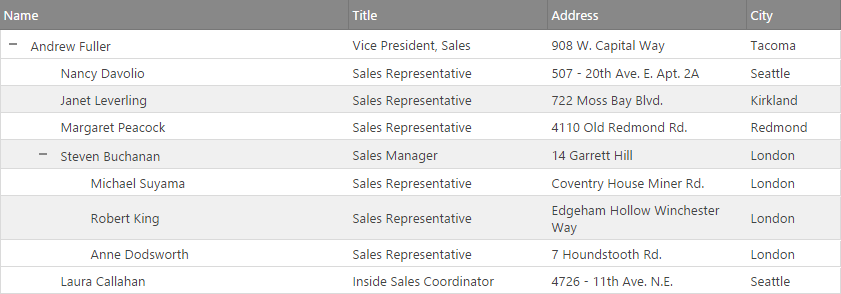
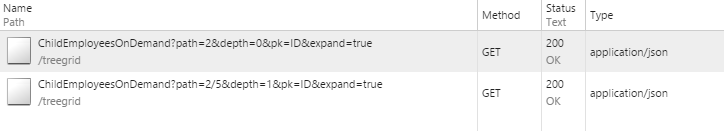

<!--
|metadata|
{
    "fileName": "igtreegrid-load-on-demand",
    "controlName": ["igTreeGrid"],
    "tags": ["Grids", "MVC", "Virtualization"]
}
|metadata|
-->

# ロード オン デマンド (igTreeGrid)

`igTreeGrid` ロード オン デマンド機能により、リモート データ ソースにバインドし、最初に表示されるデータのみをグリッドにロードできます。追加のデータは、親が展開される際に「オン デマンド」で子レコードに対するリモート要求を行うことにより使用可能になります。このタイプの操作により、ページの読み込みやツリー グリッド バインディングがより速くなり、初期フットプリントが軽くなります。結果として最新のデータを提供できる可能性が広がります。

この機能を他のリモート機能と組み合わせることで、完全なデータ仮想化を実現できます。


### 前提条件

以下の表は、このトピックを理解するための前提条件として必要な概念、トピック、および記事の一覧です。

- [コントロールを MVC プロジェクトに追加](Adding-NetAdvantage-Controls-to-an-MVC-Project.html): このトピックでは、ASP.NET MVC アプリケーションで Ignite UI™ コンポーネントを使用した作業の開始方法を説明します。


## 概要

ロード オン デマンド機能は、ユーザーがツリー グリッドのノードを展開する際にサーバーから子ノードのデータを要求します。この方法は、ブラウザーとサーバー間で送信されるデータの量を減らします。

ロード オン デマンドは、サーバー サポートならびに特別なデータ フォーマットを必要とするリモート操作です。バックエンドは[要求](#request-format)を処理し、適切なレベルのデータで応答できなければなりません。現時点では、`igTreeGrid` 機能はサーバーから**階層データのみ**のロードをサポートしています。その理由は、各要求の応答がリーフ レベル行の `ChildDataKey` として構成されるオブジェクト プロパティに設定された `null` を含むためです。空の配列 / コレクションは、ユーザーが展開する場合にインジケーターを描画し、データを要求することを `igTreeGrid` にプロンプトします。

行が展開されると、子レコードのデータがAJAX 呼び出しによりサーバーに要求されます。この機能は、他の[リモート機能](igTreeGrid-Remote-Features.html)により共有される同じ [`dataSourceUrl`](%%jQueryApiUrl%%/ui.igtreegrid#options:dataSourceUrl) アドレスを使用します。すなわち、複数の要求のスタイルを処理できるように、複数のリモート機能のバックエンド実装が必要です。

固有の列での展開インジケーターの描画には、その列の幅としてインデントのサイズを予約する必要があるかを決定する [`initialIndentationLevel`](%%jQueryApiUrl%%/ui.igtreegrid#options:initialIndentationLevel) を提供する必要もあります。これは、リーフ レベルで最もインデントされたインジケーターを描画する十分なスペースを確保するためです。通常はバインドされたデータから決定されますが、リモート シナリオでは、あらかじめ明示的に設定する必要があります。

## <a id="request-format"></a> 要求フォーマット

リモート データ ソースに対する AJAX 呼び出しでは、`igTreeGrid` は多数のパラメーターを提供しています。バインドされた階層に基づく親への**パス**、**デプス**、**プライマリ キー** プロパティの名前などがあります。シナリオとデータに応じて、必要なデータ / レイアウトの特定の部分を識別する 1 つまたは複数のパラメーターを使用できます。

以下の[チュートリアル](#walkthrough)で説明するグリッドで例を示します。



以下の 2 つの要求を生成します。ここで、単一ルート行は「2」というプライマリ キー値を持ちます。

  

また、子レコードのキー値は「5」で、そのデータ要求に `2/5` のパスが生成されます。

> **注:** Ignite UI には、デベロッパーを支援する ASP.NET MVC ヘルパー モデルが付属しています。この機能はプラットフォームに依存しません。ロード オン デマンドは、[`enableRemoteLoadOnDemand`](%%jQueryApiUrl%%/ui.igtreegrid#options:enableRemoteLoadOnDemand) オプションを通じて使用できます。受け取った要求を処理し、JSON として処理済みのデータを返すエンドポイントを提供できるどのようなサーバー側プラットフォームでも実装できます。

## <a id="walkthrough"></a> チュートリアル

ツリー グリッドのロード オン デマンド機能を即座に有効にするには、以下の手順に従ってください。

1. `TreeGridModel` モデルを構成します。[`LoadOnDemand`](Infragistics.Web.Mvc~Infragistics.Web.Mvc.TreeGridModel~LoadOnDemand.html) を `true` に設定し、[`DataSourceUrl`](Infragistics.Web.Mvc~Infragistics.Web.Mvc.GridModel~DataSourceUrl.html) を要求を処理するエンドポイント URL に設定します。

	```csharp
	private TreeGridModel GetTreeGridModel()
	{
		TreeGridModel gridModel = new TreeGridModel();
		gridModel.LoadOnDemand = true;
		gridModel.DataSourceUrl = Url.Action("ChildEmployeesOnDemand");

		gridModel.Width = "100%";
		gridModel.AutoGenerateColumns = false;
		gridModel.Columns = new List<GridColumn>();
		gridModel.Columns.Add(new GridColumn() { Key = "ID", HeaderText = "ID", DataType = "number", Width = "10%", Hidden = true });
		gridModel.Columns.Add(new GridColumn() { Key = "FirstName", HeaderText = "First Name", DataType = "string", Width = "25%" });
		gridModel.Columns.Add(new GridColumn() { Key = "LastName", HeaderText = "Last Name", DataType = "string", Width = "25%" });
		gridModel.Columns.Add(new GridColumn() { Key = "Title", HeaderText = "Title", DataType = "string", Width = "30%" });
		gridModel.Columns.Add(new GridColumn() { Key = "StartDate", HeaderText = "Start Date", DataType = "date", Width = "15%" });
		gridModel.PrimaryKey = "ID";
		gridModel.ChildDataKey = "Employees";
		gridModel.RenderExpansionIndicatorColumn = true;
		gridModel.InitialIndentationLevel = 4;
		return gridModel;
	}
	```
2. 適切なソースを割り当て、ビューにモデルを渡します。

	```csharp
	public ActionResult LoadOnDemand()
	{
		TreeGridModel gridModel = GetTreeGridModel();

        gridModel.DataSource = RepositoryFactory.GetHierarchicalEmployeeData().AsQueryable();
		return View(gridModel);
	}
	```
3. データ要求を処理するコントローラー アクションを作成します。`path` パラメーターを使用し、レコード キー値に対応する個別の識別子に切り離して、ターゲット レベルへのナビゲートに使用します。子データのための空のコレクションを持つレベル データを返します。

	```csharp
	public JsonResult ChildEmployeesOnDemand(string path, int? depth)
    {
        TreeGridModel model = this.GetTreeGridModel();
        IEnumerable<EmployeeData> result = new List<EmployeeData>().AsQueryable();

        //The path represents the primary Keys of the expanded parent rows separated with a slash up to the currently expanded row.
        string[] identifiers = path.Split('/');

        if (identifiers.Length > 0)
        {
            IEnumerable<EmployeeData> data = RepositoryFactory.GetHierarchicalEmployeeData();
            string whereExpr = "";
            for (int i = 0; i < identifiers.Length; i++)
            {
                whereExpr = "ID = " + identifiers[i];
                data = data.AsQueryable().Where(whereExpr).Select(x => x.Employees).FirstOrDefault();
            }
            result = data.Select(e =>
            {
                if (e.Employees != null) { e.Employees = new List<EmployeeData>(); } return e;
            });
        }

        model.DataSource = result.AsQueryable();
        return model.GetData();
    }
	```
	> 注: `igTreeGrid` は、要求されたデータの決定に十分な情報を提供します。その使用は、必要な機能のレベルに完全に依存します。たとえば、基になるデータが一意の**プライマリ キー**を持つ場合、最後の識別子 (すなわち `identifiers[depth]`) を使用して、展開されたレコードに直接アクセスできます。また、提供されたキー名パラメーターは、各データ ビューのルーティング ルールの割り当てや、ソースの問い合わせに使用する述語文字列の作成で使用できます。

4. ビューを作成し、構成されたモデルで `TreeGrid` ラッパーのインスタンスを作成します。

	**CSHTML の場合:**
	```csharp
	@using Infragistics.Web.Mvc
	// ..
	@(Html.Infragistics().TreeGrid(Model))
	```

## <a id="related-content"></a> 関連コンテンツ

### <a id="topics"></a> トピック
-   [機能の概要 (igTreeGrid)](igTreeGrid-Features-Overview.html): このトピックでは、`igTreeGrid` コントロールで使用可能なモジュラー機能の基本について説明します。

### <a id="samples"></a> サンプル
- [ロード オン デマンド](%%SamplesUrl%%/tree-grid/load-on-demand)
- [igTreeGrid リモート機能](%%SamplesUrl%%/tree-grid/overview)
