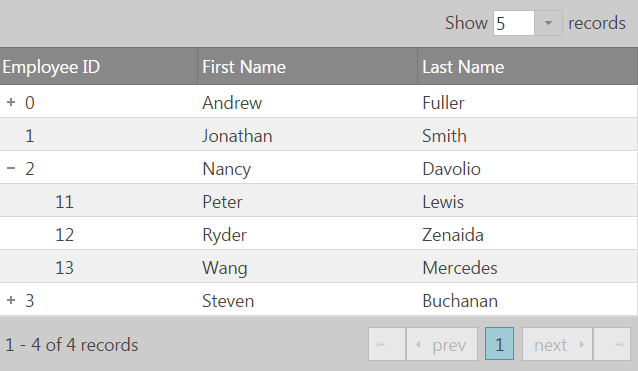
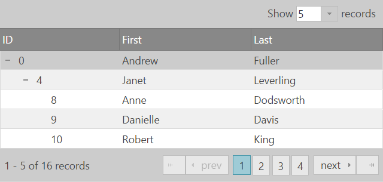


<!--
|metadata|
{
    "fileName": "igtreegrid-features-overview",
    "controlName": ["igTreeGrid"],
    "tags": ["Grids", "Getting Started"]
}
|metadata|
-->

# 機能の概要 (igTreeGrid)

`igTreeGrid` は [`igGrid`](igGrid-Overview.html) コントロールの拡張で、同じモジュラー アーキテクチャ上で構築されています。その機能は `igGrid` の同等の機能から拡張されています。したがって、多くの機能で 2 つのコントロール間の機能と API の等価性が実現され、一部の機能はインタラクティブな階層データの表示のニーズに応じて、さらにカスタマイズされています。


### このトピックの内容

- [**概要**](#introduction)
	- [継承された igGrid の機能](#inherited-features)
	- [サポートされていない機能](#unsupported-features)
- [**固有な機能**](#specialized-features)
	- [並べ替え](#sorting)
	- [ページング](#paging)
	- [フィルタリング](#filtering)
	- [更新](#updating)
-   [**関連コンテンツ**](#related-content)
    -   [トピック](#topics)
    -   [サンプル](#samples)


## <a id="introduction"></a> 概要

ツリー グリッドで機能を有効にするには、`igGrid` と同様に、`features` 配列を定義します。

```js
$("#treegrid").igTreeGrid({
	//... 
	features : [
		{ name : 'Paging' },
		{ name : 'Sorting', firstSortDirection: 'descending' }
	]
});
```

ツリー グリッド API は `igGrid` から継承されているため、これらの機能へのアクセスには、ツリー グリッドに対してネイティブな構文を使用できます。たとえば、並べ替え API を使用する場合、以下を使用できます。

```js
$(".selector").igGridSorting( "option", "firstSortDirection", "ascending");
```

あるいは、ツリー グリッドに匹敵する構文を使用して同じロジックを実行できます。

```js
$(".selector").igTreeGridSorting( "option", "firstSortDirection", "ascending");
```

`.igGridSorting` から `.igTreeGridSorting` でどのように構文が変更されたかに注意してください。

また、サポートされる機能モジュール間の互換性も同じく適用されます。[機能互換性マトリックス (igGrid)](Feature-Compatibility-Matrix%28igGrid%29.html "機能互換性マトリックス (igGrid)") で完全なリストを参照できます。

### <a id="inherited-features"></a> 継承された igGrid の機能
`igGrid` から直接継承された (変更なしに拡張された) 機能は、`igTreeGrid` でも `igGrid` の場合と同様に動作します。以下が含まれます。

-	[列の固定](igGrid-ColumnFixing-Overview.html)
-	[列の非表示](igGrid-Column-Hiding.html)
-	[複数列ヘッダー](igGrid-MultiColumnHeaders-MultiColumnHeaders.html)
-	[レスポンシブ](igGrid-Responsive-Web-Design-Mode-LandingPage.html)
-	[選択](igGrid-Selection-Overview.html)
-	[ツールチップ](igGrid-Tooltips.html)

> **注:** これらの機能の一部で唯一異なるのは、固有の列に描画されない限り、展開インジケーターが最初の列に常駐できることです。

### <a id="unsupported-features"></a> サポートされていない機能

一部の機能は `igTreeGrid` で正常に使用できますが、一部期待どおりに動作しない機能があります。それらはまだサポートされていない機能と考えられます。以下が含まれます。

- 列移動
- 行セレクター
- サイズ変更
- 集計
- 列のグループ化

## <a id="specialized-features"></a> 固有な機能

### <a id="sorting"></a> 並べ替え

1.	列に対する並べ替えは、各レベルで再帰的にグリッドのデータを並べ替えます。機能の影響を受けるレベルの範囲を制御するため、 2 つの追加プロパティ [`fromLevel`](%%jQueryApiUrl%%/ui.igtreegridsorting#options:fromLevel) と [`toLevel`](%%jQueryApiUrl%%/ui.igtreegridsorting#options:toLevel) を使用できます。これらは、並べ替える階層の最初にバインドするレベルと最後にバインドするレベルを定義します。
2.	親レコードが並べ替えられる列にデータを持っていない場合、グリッドのレコード位置は変更されず、並べ替えはその子行に対してのみ適用されます。
3.	並べ替えは展開状態を保持します。


### <a id="paging"></a> ページング

データに追加の階層レベルが導入されるため、ページングにはデフォルトでルート レベル レコードを操作する [`mode`](%%jQueryApiUrl%%/ui.igtreegridpaging#options:mode) オプションが追加されています。グリッドのページあたりに描画される表示レコードは、ルート レコードの展開状態、子の数、階層のデプスに応じて大きく変化します。一方、ページ数は一定の状態です。

次の例では、配列の`flatDS` は **4 つのルートレベル ノード** のみを持ちます。

```js
$("#treegrid").igTreeGrid({
	dataSource: flatDS,
	primaryKey: "employeeID",
	foreignKey: "PID", 
	features: [{
		name: 'Paging',
		mode: 'rootLevelOnly'
	}]
});
```



表示されるすべてのレコードにページングを適用するには、 `mode` を `allLevels` に設定します。このモード設定は、データの位置にかかわらず、表示されるすべてのレコードに対してページングを適用します。`allLevels` モードは、ページングを動的に制御します。たとえば、行の展開や縮小に伴い、使用可能なページ数が変化します。

```js
$("#treegrid").igTreeGrid({
	dataSource: flatDS,
	primaryKey: "employeeID",
	foreignKey: "PID", 
	features: [{
		name: 'Paging',
		mode: 'allLevels'
	}]
});
```




### <a id="filtering"></a> フィルタリング

`igTreeGrid` のフィルタリング機能は、すべてのレベルにわたって列データ全体に適用され、データ構造がフラットであるかのように動作します。

**関連トピック:** [フィルタリング (igTreeGrid)](igTreeGrid-Filtering.html)


### <a id="updating"></a> 更新

拡張された更新機能は、単一グリッド内の階層構造のサポートを追加し、インライン編集エクスペリエンスや行編集テンプレートのような機能性を維持し、基となる [`igTreeHierarchicalDataSource`](%%jQueryApiUrl%%/ig.treehierarchicaldatasource) のメリットを活用しています。

**関連トピック:** [更新 (igTreeGrid)](igTreeGrid-Updating.html)


## <a id="related-content"></a> 関連コンテンツ

### <a id="topics"></a> トピック
-   [ロード オン デマンド (igTreeGrid)](igTreeGrid-Load-On-Demand.html): このトピックでは、`igTreeGrid` ロード オン デマンドのメリットと実装方法を説明します。
-	[リモート機能 (igTreeGrid)](igTreeGrid-Remote-Features.html): このトピックでは、`igTreeGrid` 機能を使用してリモート操作を実行するための概要と実装の詳細を説明します。

### <a id="samples"></a> サンプル
- [igTreeGrid の概要](%%SamplesUrl%%/tree-grid/overview)
- [ロード オン デマンド](%%SamplesUrl%%/tree-grid/load-on-demand)
- [igTreeGrid リモート機能](%%SamplesUrl%%/tree-grid/remote-features)
