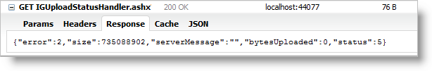

<!--
|metadata|
{
    "fileName": "igupload-using-http-handler-and-modules",
    "controlName": "igUpload",
    "tags": ["Data Binding","Data Presentation"]
}
|metadata|
-->

# HTTP ハンドラーおよびモジュールの使用 (igUpload)
 
`igUpload` コントロールによるアップロードを容易にするために、アップロードしたデータを処理し保存するサーバー ロジックを実装する必要があります。クライアント専用の `igUpload` は任意の数の異なるサーバー技術と連携できます。Ignite UI™ には、ASP.NET を使用したサーバー側の実装が含まれています。このトピックでは、HTTP モジュールと HTTP ハンドラーを構成し、アップロードしたデータを受け取るサーバー イベントを処理する方法について説明します。

## HTTP モジュール
HttpModule を構成すると、ファイル アップロード処理を管理できます。これは、HTTP Request 処理にプラグインする .NET IHttpModule インターフェイスを実装します。そのため、アップロード コントロールからの要求だけでなく、すべての要求が HttpModule を通過します。これは、HttpModule が、アップロード コントロールに関連する要求だけをフィルタリングするからです。

以下の例は、IIS6 (または開発サーバー) 用または IIS7 サーバー配備用の HttpModule を構成する方法を説明しています。

## IIS6 (開発環境) の場合
**Web.config の場合:**

```
<system.web>    
	<httpModules>
        <add name="IGUploadModule type="Infragistics.Web.Mvc.UploadModule" />
    </httpModules>
    <!--OPTIONAL: Set the maximum request length. By default the request lenght is 4 MB. More info: http://msdn.microsoft.com/ja-jp/library/e1f13641(v=vs.85).aspx-->
    <httpRuntime executionTimeout="3600" maxRequestLength="2097151000"/>
</system.web>
```

## IIS7 の場合:
**Web.config の場合:**

```
<system.webServer>
    <modules runAllManagedModulesForAllRequests="true">
        <add name="IGUploadModule" type="Infragistics.Web.Mvc.UploadModule" 
                                   preCondition="managedHandler" />
    </modules>    
	<security>      
		<requestFiltering>    
			<!--OPTIONAL: Set the maximum request length. By default the request lenght is ~30 MB. More info: http://www.iis.net/configreference/system.webserver/security/requestfiltering/requestlimits-->        
			<requestLimits maxAllowedContentLength="2097151000"/>      
		</requestFiltering>    
	</security>
</system.webServer>
```

## HTTP ハンドラー
HttpHandler は、.NET IHttpHandler インターフェイスを実装し、クライアント ウィジェットとの通信に使用します。ハンドラーには、2 つの主要な機能、つまり、クライアントからコマンドを受信する機能とクライアントに状態を返す機能があります。

アップロード コントロールとハンドラーの間のすべての要求は、AJAX 経由で送信されます。ハンドラーは JSON でステータス メッセージを返すので、通信の手段として AJAX を使用するのは自然な選択です。

HttpModule とは違い、HttpHandler は URL 経由でアクセス可能です。すべてのファイルに送信されたコマンドが、URL のパラメーターになります。コマンドは次の 3 つのタイプのいずれかです。

-   **Status**: 現在のファイルの状態を返します。JSON 応答には、合計バイト数、アップロード済みバイト数、現在のファイルのエラー状態の情報が含まれています。JSON 形式は次の通りです。
-   **Cancel**: このコマンドが要求されると、ファイル アップロード処理がキャンセルされます。
-   **fileSize**: アップロードするファイルのサイズをハンドラーからコントロールに表示する必要がある場合、このコマンドは 2 つの特別なケースで呼び出されます。1 つ目のケースは、`autostartupload` プロパティが `false` に設定されている場合です。ユーザーがアップロードを開始するまでファイルが処理されないため、サイズ情報が必要です。2 つ目のケースは、`autostartupload` プロパティが True に設定されていて、アップロード キューにファイルが配置されているものの、アップロード処理が開始されていない場合です。

開発サーバーまたは IIS7 の場合、ハンドラーを有効にするには、適切なセクションを Web.config ファイルに追加する必要があります。

## IIS6 (開発環境) の場合
**Web.config の場合:**

```
<system.web>
    <httpHandlers>
         <add verb="GET" type="Infragistics.Web.Mvc.UploadStatusHandler" 
                         path="IGUploadStatusHandler.ashx" />
    </httpHandlers>
</system.web>
```

## IIS7 の場合:
**Web.config の場合:**

```
<system.webServer>
    <handlers>
        <add name="IGUploadStatusHandler" path="IGUploadStatusHandler.ashx" verb="*"
             type="Infragistics.Web.Mvc.UploadStatusHandler" preCondition="integratedMode" />
   </handlers>
</system.webServer>
```

>**注:** この例では、IGUploadStatusHandler.ashx をハンドラーのデフォルト名として使用しています。この名前およびハンドラーへのパスは推奨値です。

## UploadProgressManager とサーバー イベント
[UploadProgressManager](Infragistics.Web.Mvc~Infragistics.Web.Mvc.UploadProgressManager.html) は、ハンドラーとモジュールがプロキシ クラスを使用して通信するよう設計されたサーバー アーキテクチャです。このクラスは単一のオブジェクトとして実装されます。インスタンスは [UploadProgressManager.Instance](Infragistics.Web.Mvc~Infragistics.Web.Mvc.UploadProgressManager~Instance.html) プロパティによってアクセスできます。このクラスは、サーバー イベントをアタッチし、トリガーする役割もします。これらのイベントでは、ファイル アップロード処理に対して、アップロード済みファイルの削除や移動、アップロードのキャンセル、状態情報の修正などの操作を実行できます。**表 1** は利用可能なサーバー側イベントをリストします:


**表 1:** サーバー側イベント

<table class="table table-bordered">
	<thead>
		<tr>
            <th>
イベント
			</th>

            <th>
説明
			</th>

            <th>
引数
			</th>

            <th>
キャンセル可能
			</th>
        </tr>
	</thead>
	<tbody>
        

        <tr>
            <td>
UploadStarting
			</td>

            <td>
ファイルのアップロードが開始しているときにトリガーされます。この段階では、ファイルがアップロードされていません。要求ヘッダーからの情報は `UploadStartingEventArgs` 引数に利用可能です。この情報を使用すると、検証ルールを実装し、アップロードをキャンセルするかどうかを決定できます。
			</td>

            <td>
                <ul>
                    <li>
object - イベントをトリガーした UploadProgressManager インスタンスを含みます。
					</li>

                    <li>
[UploadStartingEventArgs](Infragistics.Web.Mvc~Infragistics.Web.Mvc.UploadStartingEventArgs.html) - アップロードするファイルの情報を含みます。
					</li>
                </ul>
            </td>

            <td>
true
			</td>
        </tr>

        <tr>
            <td>
FileUploading
			</td>

            <td>
ファイルの各部分がサーバーにアップロードされたときにトリガーされます。このイベントで、FileUploadingEventArgs.FileChunk プロパティから現在の部分を読み込み、ファイルを手動的に処理できます。

                注: このイベントは[ファイルをストリームとして保存](igUpload-Saving-Files-as-Stream.html)シナリオで使用されます。このイベントは FileSaveType="memorystream" の場合のみにトリガーされます。
			</td>

            <td>
                <ul>
                    <li>
object - イベントをトリガーした UploadProgressManager インスタンスを含みます。
					</li>

                    <li>
[FileUploadingEventArgs](Infragistics.Web.Mvc~Infragistics.Web.Mvc.FileUploadingEventArgs.html) - アップロードされているファイルの現在のデータ部分を含みます。
					</li>
                </ul>
            </td>

            <td>
true
			</td>
        </tr>

        <tr>
            <td>
UploadFinishing
			</td>

            <td>
ファイルのアップロードが完了しているときにトリガーされます。この段階では、ファイルはすでにアップロードされていますが、一時的な名前のままです。`igUpload` はファイルをリリースしているので、自由に変更できます。
			</td>

            <td>
                <ul>
                    <li>
object - イベントをトリガーした UploadProgressManager インスタンスを含みます。
					</li>

                    <li>
[UploadFinishingEventArgs](Infragistics.Web.Mvc~Infragistics.Web.Mvc.UploadFinishingEventArgs.html) - アップロードされたファイルの情報を含みます。
					</li>
                </ul>
            </td>

            <td>
true
			</td>
        </tr>

        <tr>
            <td>
UploadFinished
			</td>

            <td>
ファイルのアップロードが完了したときにトリガーされます。この段階では、ファイルはアップロードされており、オリジナルの名前で変更されています。古いファイル名と同じ名前のファイルがある場合は上書きされ、最後のファイルのみが使用可能になります。
			</td>

            <td>
                <ul>
                    <li>
object - イベントをトリガーした UploadProgressManager インスタンスを含みます。
					</li>

                    <li>
[UploadFinishedEventArgs](Infragistics.Web.Mvc~Infragistics.Web.Mvc.UploadFinishedEventArgs.html) - アップロードされたファイルの情報を含みます。
					</li>
                </ul>
            </td>

            <td>
false
			</td>
        </tr>
    </tbody>
</table>

ASP.NET MVC の場合、`igUpload` コントロールのサーバー側イベントにアタッチ/デタッチするには、UploadProgressManager メソッドを使用します。各メソッドの最初パラメーターは、イベントにアタッチするコントロールの ID ([UploadModel.ControlId](Infragistics.Web.Mvc~Infragistics.Web.Mvc.UploadModel~ControlId.html)) です。**表 2** は、UploadProgressManager メソッドおよびイベント ハンドラーにあった地する相対イベントをリストします。

**表 2:** サーバー側イベントにアタッチするために使用される UploadProgressManager メソッド。

UploadProgressManager メソッド|イベント|例
---|---|---
AddStartingUploadEventHandler|UploadStarting|`UploadProgressManager .Instance.AddStartingUploadEventHandler("upload1" , startingUploadHandler);`
AddFileUploadingEventHandler |FileUploading|`UploadProgressManager .Instance.AddFileUploadingEventHandler("upload1" , fileUploadingHandler);`
AddFinishingUploadEventHandler |UploadFinishing |`UploadProgressManager .Instance.AddFinishingUploadEventHandler("upload1" , fileFinishingHandler);`
AddFinishedUploadEventHandler |UploadFinished |`UploadProgressManager .Instance.AddFinishedUploadEventHandler("upload1" , fileFinishedHandler);`


**注:** コントローラー アクションで `igUpload` サーバー側イベントにアタッチしないでください。コントローラー アクションがアプリケーション ライフサイクルで複数回起動する可能性があるため、単一のイベント ハンドラーが複数回にアタッチする結果が可能です。サーバー側イベントに一回のみアタッチします。MVC プロジェクトの Global.asax ファイルのアプリケーション開始ロジックでサーバー側イベントを処理してください。

## ファイル状態とエラーのサーバー側列挙体
アップロード情報がサーバーからクライアントに転送されるとき、それには現在のアップロードの状態データが含まれています。応答データには次の項目が含まれています。

-   アップロード済みバイト数
-   ファイル状態情報
-   発生する可能性がある例外に関するエラー情報

**表 3** は、アップロード状態の応答の詳細を示し、表 4 は、ファイルのエラー コードを示しています。

記載したデータを含む JSON 応答の例を図 2 に示します。


**注:** その他の JSON プロパティ (`size`、`serverMessage`、`bytesUploaded` など) は、エラーや状態のようにサーバー上の列挙型として作成する必要はありません。これらは動的に変更できる文字列または数値です。

**Table 3:** UploadStatus タイプの列挙体

値|説明
---|---
0 | ファイルは開始されていません。
1 | ファイルのアップロードが始まりました。
2 | ファイルのアップロードが終了しました。
3 | ファイルが見つかりません。ディクショナリにキーが見つからない場合この状態を使用します。
4 | クライアント コマンドでファイルのアップロードをキャンセルします。
5 | ファイル サイズを超えました。
6 | ファイルのアップロード時のエラー。
7 | サーバー側のイベント ハンドラーからファイルのアップロードをキャンセルします。
8 | クライアント接続を切断することによってファイルのアップロードをキャンセルします。
9 | すべてのコンテンツがアップロードされていて、ファイル名が一時的なファイル名である場合のファイルの状態。

**Table 4:** FileError タイプの列挙体

値|説明
---|---
-1 | エラーなし。
0 | 要求からファイル名を取得するときにファイル エラーが発生します。
1 | MIME の種類の検証に失敗しました。
2 | ファイル サイズを超えました。
3 | ファイルをアップロードする一時フォルダーが見つかりません。
4 | 要求ヘッダー解析中のエラー。
5 | 指定したキーを持つファイルが、要求に存在しません。
6 | ファイルの保存に失敗するとエラーが発生します。
7 | ファイル コンテンツを書き込もうとするとエラーが発生します。
8 | ファイル コンテンツを初めて書き込もうとしたときにエラーが発生しました。
9 | ファイルを削除しようとしたときにエラーが発生しました。
10 | イベント ハンドラーでファイルのアップロード開始時にアップロードがキャンセルされたときにエラーが発生しました。

## 関連リンク
-   [Ignite UI の概要](NetAdvantage-for-jQuery-Overview.html)
-   [Ignite UI で JavaScript リソースを使用](Deployment-Guide-JavaScript-Resources.html)
-   [igUpload の概要](igUpload-Overview.html)

 

 


