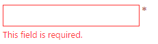

<!--
|metadata|
{
    "fileName": "igvalidator-overview",
    "controlName": "igValidator",
    "tags": ["Getting Started"]
}
|metadata|
-->

# igValidator の概要

`igValidator` コントロールは、従来とは異なる新しいルック アンド フィールを提供します。このコントロールは、すべてのフォーム要素およびエディター、コンボ ボックスなどの既存のコンポーネントやユーザー入力を収集するためのその他のコンポーネントで簡単に操作できるように設計されています。このコントロールは、通知ウィジェットのデザインを活用し、その視覚エフェクトを使用して、必要な success メッセージと error メッセージを表示します。

### このトピックの内容

- [概要](#introduction)
- [igValidator のセットアップ](#setting-up)
- [検証の優先順位](#validation-priority)
- [関連コンテンツ](#related-content)

## <a id="introduction"></a> 概要

`igValidator` コントロールの主な目的は、デフォルトで、合格した検証と失敗した検証について直ちにエンドユーザーに通知することです。ユーザーがエディターの入力をぼかした場合、フィードバック メッセージが即座に表示され、エディターの状態に関する有益な情報を提供します。たとえば、現在のフィールドの必要の有無、要求されたデータの入力の有無などの詳細を示すメッセージを表示できます。

`igValidator` は、success と error のメッセージを使用して、異なる[構成](#setting-up)や複数の[検証ルール](#validation-priority)をサポートします。メッセージは、定義済みの [`messageTarget`](%%jQueryApiUrl%%/ui.igValidator#options:messageTarget) に配置、または `igNotifier` ウィジェットに渡すことができます。ウィジェットの場合は、入力されたデータが検証ルールに適合しないと特定の入力が赤色で表示され、現在の操作に問題があることを通知します。

`requiredIndication` プロパティを使用すると、オプションで必要なフォーム要素を事前にアドバイスできます。また、`optionalIndication` プロパティで特定のフィールドがオプションであることを示すこともできます。

すべての`igValidator` オプションについては、[igValidator API](%%jQueryApiUrl%%/ui.igvalidator) を参照してください。

## <a id="setting-up"></a> igValidator のセットアップ

バリデーター コントロールは、複数のターゲット (フィールド) で個別に、またはサポートされる Ignite UI コントロール、エディター、コンボおよびレーティングを統合した状態で構成できます。このコントロールのカスタマイズと構成で使用できる多数のオプションがあります。

### 他の Ignite UI コントロールからの構成

```html
<div id="textEditor"></div>
```
```js
$('#textEditor').igTextEditor({
  inputName: "pass",
  textMode: "password",
  validatorOptions: {
    required: true,
    onblur: true,
    lengthRange: [6, 20],
    requiredIndication: true
  }
});
```



> **注:** エディター コントロールから構成するとバリデーターは、追加の`フィールド`のコレクションをサポートしません。

### 1 つのフィールドのスタンドアロンの igValidator
以下の例では、単一のターゲット ファイルによるバリデーターの基本的な使用方法を示します。特定のエディター コントロールおよびコンボのみでなく、任意のHTML フォーム要素がターゲットになります。

```html
<div id="validator"></div>
```

```js
$('#validator').igTextEditor();

$('#validator').igValidator({
  required: true,
  onblur: true,
  requiredIndication: true
});
```

### 複数のフィールドによるスタンドアロンの igValidator
このコントロールは、複数の検証オプションと 1 つのセレクターを持つ各フィールドが記述された、[`フィールド`](%%jQueryApiUrl%%/ui.igvalidator#options:fields)のコレクションをサポートします。有効な jQuery セレクターを提供する必要があるフィールドは、すべての検証ルールとトリガーを含むことができますが、その他のフィールドまたはイベント ハンドラーは含まれません。主要なオプションのレベルのルールは、そのようなオプションが提供されない場合、フィールドにより継承されます。

```html
<form id="validationForm">
    <fieldset>
        <h4> Feedback form</h4>
        <p> Enter your name: (Validation onsubmit, required)</p>
        <input type="text" id="grpEdit1"></input>
        <p> Enter date: (Validation onblur, not required on submit)</p>
        <input type="text" id="grpEdit2"></input>
        <p> Give us rating: ( Validation onsubmit, minimum value = 1.5) </p>
        <div id="rating"></div>
        <p> Subscribe for free samples : (Validation onsubmit,required)</p>
        <div id="igCheckboxEditor"></div>
        <br>
        <input type="submit" value="Submit"></input>
    </fieldset>
</form>
```

```js
$("#rating").igRating({
		precision : "half",
		valueAsPercent : false
	});
	$("#igCheckboxEditor").igCheckboxEditor();

	$('#validationForm').igValidator({
		required : true, //inherited
		fields : [{
				selector : "#grpEdit1",
				onblur : false // override default
			}, {
				selector : "#grpEdit2",
				date : true,
				required : false, // override
				onchange : true
			}, {
				selector : "#rating",
				successMessage : "Thanks!",
				onchange : true,
				valueRange : {
					min : 1.5,
					errorMessage : "At least 1.5 stars required (custom message)"
				},
				notificationOptions : {
					mode : "popover"
				}
			}, {
				selector : "#igCheckboxEditor",
				onchange : true
			}
		]
	});
```

> **注**: 前述の 2 つのスタンドアロン構成ではどちらも、Ignite UI エディター コントロールで強化されたフィールドをサポートしますが、バリデーターがそれらのフィールドを検出し、正しく処理するためには、事前に初期化する必要があります。他のコントロールより先にバリデーターを初期化できない場合は、[`updateField`](%%jQueryApiUrl%%/ui.igvalidator#methods:updateField) メソッドを使用して、バリデーターのフィールドを更新できます。

## <a id="validation-priority"></a> 検証の優先順位

異なった基準に従って検証する複数のシナリオでは、単一の入力に複数のバリデーターを使用できる場合があります。このような場合、単一の入力で実行するバリデーションの順番を明確に記載することが重要です。最初に簡単な検証を実行し、次に条件を少しずつ高度にしていきます。検証ルールが 1 つ失敗すると、後続の検証が実行されずに、現在の検査が無効として終了します。

デフォルトの検証の優先順位は、以下のとおりです (重要度の高い検証を優先します)。
1.	要件
2.	Infragistics エディター (オプション)*
3.	Number
4.	Date
2.	LengthRange
3.	ValueRange
4.	EqualsTo
5.	メール
6.	パターン (正規表現)
7.	カスタム関数

\* この手順はオプションで `igEditor` を使用する場合のみ発生されます。特定の条件 (選択、必須マスク フィールドなど) が満たされた場合、バリデーターは、チェックするためにエディターで `isValid` を呼び出します。

## <a id="related-content"></a> 関連コンテンツ

- [バリデーターの概要のサンプル](%%SamplesUrl%%/validator/overview)
-	[igValidator jQuery API](%%jQueryApiUrl%%/ui.igValidator)
