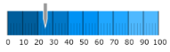

<!--
|metadata|
{
    "fileName": "whats-new-in-2017-volume1",
    "controlName": [],
    "tags": []
}
|metadata|
-->

# 2017 Volume 1 の新機能

このトピックでは、Ignite UI™ 2017 Volume 1 リリースのコントロールと新機能および拡張機能を紹介します。

## 新機能の概要

以下の表に 2017 Volume 1 の新機能の概要を示します。追加の詳細は以下のとおりです。

### igSpreadsheet

機能 | 説明
---|---
[igSpreadsheet - 新しいコントロール](#spreadsheet)| igSpreadsheet は、最新のあらゆるブラウザーで Excel ドキュメントを視覚化する jQuery ウィジェットです。

### igScheduler

機能 | 説明
---|---
[igScheduler - 新しいコントロール](#scheduler)| igScheduler は、時間範囲および関連アクティビティを表示し、管理するスケジュール ソリューションを提供する jQuery ウィジェットです。

### igDataSource

機能 | 説明
---|---
[Filter By Text](#filterbytext)| The igDataSource component provides a way to search for a specific words or phrases in all of its fields.

### igGrid

機能 | 説明
---|---
[Date Handling](#griddatehandling)| The igGrid provides a way to control the display and edit of date values for clients in different time zones.
[More Flexible Caption](#gridcaption)| igGrid's new caption is designed to be more flexible and customizable.
[GroupBy 集計](#groupSummaries)| GroupBy 機能により集計行を各グループのデータ アイランドの下に表示できるようになりました。

### igCombo

機能 | 説明
---|---
[Knockout の Disable ハンドラー](#comboKnockoutDisable)| Knockout の Disable バインディング ハンドラーがコンボで実装されます。

### Editors

機能 | 説明
---|---
[Knockout の Disable ハンドラー](#editorsKnockoutDisable)| Knockout の Disable バインディング ハンドラーがエディターで実装されます。

### igNumericEditor

機能 | 説明
---|---
[10 進数の丸み](#roundDecimals)| 数値エディターに小数部を持つ値の丸みを許可する新しい [`roundDecimals`](ui.ignumericeditor#options:roundDecimals) オプションを追加しました。

### igDateEditor/igDatePicker

機能 | 説明
---|---
[データ処理](#dateHandling)| データ変換を処理する際にエディターの設定が必要です。

### igDatePicker

機能 | 説明
---|---
[日付の選択オプション MVC ラッパー](#pickerOptionsWrapper) | DatePicker MVC ラッパーを使用する場合に、日付の選択オプションの追加のラッパーが利用できます。

### igDataChart

機能 | 説明
---|---
[Zoom Enabling Options](#zoomEnablingProperties) | New options called [`isHorizontalZoomEnabled`](%%jQueryApiUrl%%/ui.igDataChart#options:isHorizontalZoomEnabled) and [`isVerticalZoomEnabled`](%%jQueryApiUrl%%/ui.igDataChart#options:isHorizontalZoomEnabled) have been added which control whether zooming is allowed on either the horizontal or vertical axis.

### igMap

機能 | 説明
---|---
[Map Imagery Tile Path](#tilePathProperty) | The option called [`tilePath`](%%jQueryApiUrl%%/ui.igMap#options:backgroundContent.tilePath) has been added to the [`backgroundContent`](%%jQueryApiUrl%%/ui.igMap#options:backgroundContent) options.  Users can use this property to specify a URL where the tile images are located.

### igRadialGauge, igLinearGauge, igBulletGraph
機能 | 説明
---|---
[Design Changes](#gaugeDesignChanges) | The visuals for the gauges have been updated.

## <a id="spreadsheet"></a>igSpreadsheet

2017.1 バージョンで igSpreadsheet コントロールを追加しました。最新のあらゆるブラウザーで Excel ドキュメントを視覚化する jQuery ウィジェットです。MVC バージョンでは、コントロールの以下の領域と機能が使用できます。

-   構成可能なコンポーネント領域
    -   数式バー
    -   コンテキスト メニュー
    -   タブ バー領域
    -   ヘッダー

-   コントロールの変更

    -   選択
    -   サイズ変更
    -   非表示
    -   ペインのフリーズ
    -   ペインの分割
    -   ズーム

-   データの変更
    -   セル、列、行の挿入と削除
    -   元に戻す / やり直し
    -   コピー / 貼り付け
    -   データ検証
    -   ワークシート
    -   ハイパーリンク

-   外観の構成
    -   グリッド線
    -   セルの配置
    -   セルの境界線
    -   フォント スタイル


#### 関連トピック
-   [igSpreadsheet の概要](igspreadsheet-overview.html)
-   [igSpreadsheet の追加](adding-igspreadsheet.html)
-   [igSpreadsheet の構成](igspreadsheet-configuring.html)


#### 関連サンプル
-   [概要](%%SamplesUrl%%/spreadsheet/overview)
-   [表示の構成](%%SamplesUrl%%/spreadsheet/create-view-save)
-   [エクセル ファイルからデータをインポート](%%SamplesUrl%%/spreadsheet/loading-data)

## <a id="igScheduler"></a> igScheduler
### 新しいコントロール

`igScheduler`™ コントロールは、時間範囲および関連アクティビティを表示し、管理するスケジュール ソリューションを提供します。

### サポートされる機能
-   予定の作成、編集、削除
    -   月単位の表示で構成可能な予定表示モード (インジケーターまたはイベントの件名)
    -   予定を色付きリソースへの割り当て
-   別のビューの使用 (月ビューおよび予定一覧ビュー)
    -   月ビューおよび予定一覧ビューの間の切り替え
    -   月ビューでの予定一覧ビュー
    -   構成可能な予定一覧ビューの日の表示範囲
-   終日イベントのサポート
-   デスクトップ、タブレット、および携帯レイアウト
-   レスポンシブ デザイン
    -   デスクトップ環境に最適化された UI
-   リソースの色スキーマ サポート
-   キーボード ナビゲーション サポート
-   ローカライズのサポート


#### 関連トピック
-   [igScheduler の概要](igScheduler-Overview.html)
-   [igScheduler の構成](igscheduler-configuring.html)
-	[igScheduler の追加](igscheduler-adding-igscheduler.html)
-	[igScheduler の構成](igscheduler-Configuring.html)
-	[igScheduler のスタイル設定](igscheduler-using-themes.html)
-	[アクセシビリティの遵守 (igScheduler)](igscheduler-accessibility-compliance.html)
-	[既知の問題と制限 (igScheduler)](igscheduler-known-limitations.html)

#### 関連サンプル

-   [igScheduler 予定一覧ビュー](%%SamplesUrl%%/scheduler/agenda-view)
-   [igScheduler 予定インジケーター](%%SamplesUrl%%/scheduler/appointment-indicators)

## igDataSource

### <a id="filterbytext"></a> Filter By Text

The igDataSource component provides a way to search for a specific words or phrases in all of its fields via the 'filterByText' method.

#### Related Topics
-   [igDataSource Overview](igspreadsheet-overview.html)

#### Related Samples
-   [Simple Filtering](%%SamplesUrl%%/grid/simple-filtering)

## igGrid

### <a id="griddatehandling"></a> Date Handling

When enabled for the igGrid, the option [`enableUTCDates`](%%jQueryApiUrl%%/ui.iggrid#options:enableUTCDates) affects only the dates serialization. Enables/Disables serializing client date as [UTC ISO 8061](https://en.wikipedia.org/wiki/ISO_8601#UTC) string instead of using the local time and zone values.

In order to handle the displaying of the dates, there is an option in the date columns' definition - [`dateDisplayType`](%%jQueryApiUrl%%/ui.iggrid#options:columns.dateDisplayType). As a date value is received from the server it goes through a formatter function to display the date. If [`dateDisplayType`](%%jQueryApiUrl%%/ui.iggrid#options:columns.dateDisplayType) is set to "local", the final result for the specified column returns date values via the standard date object methods (getFullYear(), getMonth(), getDate(),getHours() etc.) and if set to "utc" UTC equivalents ( getUTCFullYear(), getUTCMonth(), getUTCDate(), getUTCHours() etc.) are used. 

### <a id="gridcaption"></a> Grid's Caption

The igGrid's caption now provides the ability to render HTML elements in it in order to give the user more customizability and flexability. It also comes with useful events for full control of its initialization.

### <a id="groupSummaries"></a> GroupBy 集計

GroupBy 集計機能は、そのアイランドにあるデータ列の集計情報を表示するグループ データ アイランドの上下に追加の集計行を表示します。集計行は、関連するグループが展開された場合のみ表示されます。


#### 関連トピック
-   [GroupBy 集計の機能概要 (igGrid)](igGrid-GroupBy-Summaries.html)

#### 関連サンプル
-   [集計とグループ化](%%SamplesUrl%%/grid/grouping)

## igCombo

### <a id="comboKnockoutDisable"></a> Knockout の Disable ハンドラー

開発者がコンボ コントロールに Knockout の [`disabled`](http://knockoutjs.com/documentation/disable-binding.html) バインディング ハンドラーを適用したい場合、ハンドラーは動作せず、自動的に有効/無効にしません。コンボにコントロールの有効化/無効化を処理する特別なロジックがあります。そのため、Knockout `disabled` ハンドラーを使用時に予期される動作を実装する追加の `igComboDisable` バインディング ハンドラーが作成されます。

#### 関連トピック
-   [Knockout サポートの構成 (igCombo)](igCombo-KnockoutJS-Support.html#)

## エディター

### <a id="editorsKnockoutDisable"></a> Knockout の Disable ハンドラー

開発者がエディターに Knockout の [`disabled`](http://knockoutjs.com/documentation/disable-binding.html) バインディング ハンドラーを適用したい場合、ハンドラーは動作せず、自動的に有効/無効にしません。エディターにコントロールの有効化/無効化を処理する特別なロジックがあります。そのため、Knockout `disabled` ハンドラーを使用時の予期される動作を実装する追加の `igEditorDisable` バインディング ハンドラーが作成されます。

#### 関連トピック
-   [Knockout サポートの構成 (エディター)](Configuring-Knockout-Support-%28Editors%29.html)

## igNumericEditor

### <a id="roundDecimals"></a> 10 進数の丸み

製品の以前バージョンで、ユーザーが `maxDecimals` オプションで定義される数より大きい小数位がある値を数値エディターに入力すると、値が切り捨てられます。つまり、`maxDecimals` が `3` に設定されるエディターが `123.4567` の値を受けると、`123.456` に切り捨てられます。製品の 17.1 バージョンで新しい [`roundDecimals`](ui.ignumericeditor#options:roundDecimals) オプションを追加しました。デフォルトで有効で、JavaScript の `Math.round()` 関数を使用して数値を丸めます。`123.4567` の値は丸めて、エディターで `123.457` として表示されます。[`roundDecimals`](ui.ignumericeditor#options:roundDecimals) オプションが無効な場合、値を切り捨て、以前のバージョンと同じように `123.456` を表示します。

## igDateEditor/igDatePicker

### <a id="dateHandling"></a> データ処理

エディターの日付をクライアントからサーバーへ、またはサーバーからクライアントへ転送する場合、オプション [`enableUTCDates`](%%jQueryApiUrl%%/ui.igdateeditor#options:enableUTCDates) および [`displayTimeOffset`](%%jQueryApiUrl%%/ui.igdateeditor#options:displayTimeOffset) を使用してエディターを構成し、適切に日付を転送します。

#### 関連トピック
-   [17.1 の enableUTCDate オプションの移行](igDateEditor-migrating-date-handling-in-17-1.html)
-   [Ignite UI コントロールを異なるタイム ゾーンで使用](Using-IgniteUI-controls-in-different-time-zones.html)

## igDatePicker

### <a id="pickerOptionsWrapper"></a> 日付の選択オプション MVC ラッパー

追加の MVC ラッパーを使用して DatePicker MVC ラッパーが日付の選択オプションの定義を許可するよう拡張されます。新しいラッパーは、すべての jQuery UI 日付の選択オプションを含み、igDatePicker に適用することができます。以下は、MVC で構成する方法です。

```
@(Html.Infragistics()
	.DatePicker()
	.DropDownAnimationDuration(1000)
	.DatePickerOptions(options => {
		 options.DefaultDate("+8");
		 options.MinDate("-5d");
		 options.MaxDate("+10d");

		 options.FirstDay(FirstWeekDay.Monday);
		 options.ShowWeek(true);

		 options.ShowOtherMonths(true);
		 options.SelectOtherMonths(true);

		 options.ChangeMonth(true);
		 options.ChangeYear(true);
		 options.AddClientEvent("onChangeMonthYear", "onChangeMonthYearHandler");

		 options.ShowButtonPanel(true);
		 options.GoToCurrent(true);

		 options.ShowAnim(AnimationEffect.Show);

		 options.AddClientEvent("onSelect", "onSelectHandler");
		 options.AddClientEvent("onClose", "onCloseHandler");
	})
	.Render())
```

## igDataChart
### <a id="zoomEnablingProperties"></a> Zoom Enabling Options

New options called [`isHorizontalZoomEnabled`](%%jQueryApiUrl%%/ui.igDataChart#options:isHorizontalZoomEnabled) and [`isVerticalZoomEnabled`](%%jQueryApiUrl%%/ui.igDataChart#options:isVerticalZoomEnabled) were added, deprecating the existing [`horizontalZoomable`](%%jQueryApiUrl%%/ui.igDataChart#options:horizontalZoomable) and [`verticalZoomable`](%%jQueryApiUrl%%/ui.igDataChart#options:verticalZoomable) options respectively.  The older options are being left as-is in this release for backwards compatibility with existing applications.

## igMap
### <a id="tilePathProperty"></a> Map Imagery Tile Path

Open Street Map can now accept custom tile source by re-purposing the *tileSource* option off of the *backgroundContent* object.

**In JavaScript**

	$(function () {
            $("#map").igMap({
                width: "700px",
                height: "500px",
                windowRect: { left: 0.1, top: 0.1, height: 0.7, width: 0.7 },
                // specifies imagery tiles from OpenStreetMap
                backgroundContent: {
                    type: "openStreet",
                    tilePath: "tile.openstreetmap.org/{Z}/{X}/{Y}.png"
                }
            });
        });
		
Before this change *tilePath* was only relevant to the Bing Map. After the change it is applicable to the Open Street Map as well.

Omitting the protocol specifier (*http:* or *https:*) in the URL allows for the control to detect and use the protocol of the hosting web site. It is also possible to force the control into desired protocol by explicitely setting it in the *tilePath* option:

**In JavaScript**

    tilePath: "https://tile.openstreetmap.org/{Z}/{X}/{Y}.png"

*{Z}*, *{X}*, and *{Y}* tokens are replaced during tile rendering by Zoom, Horizontal location, and Vertical location of each tile respectively.

## igRadialGauge, igLinearGauge, igBulletGraph
### <a id="gaugeDesignChanges"></a> Design Changes

The igRadialGauge, igLinearGauge and igBulletGraph have new styling provided when you include `infragistics.theme.css`.  The new styling looks as follows:

#### igRadialGauge:


#### igLinearGauge:


#### igBulletGraph:

