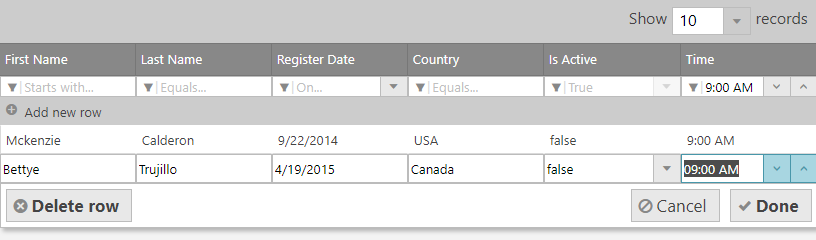
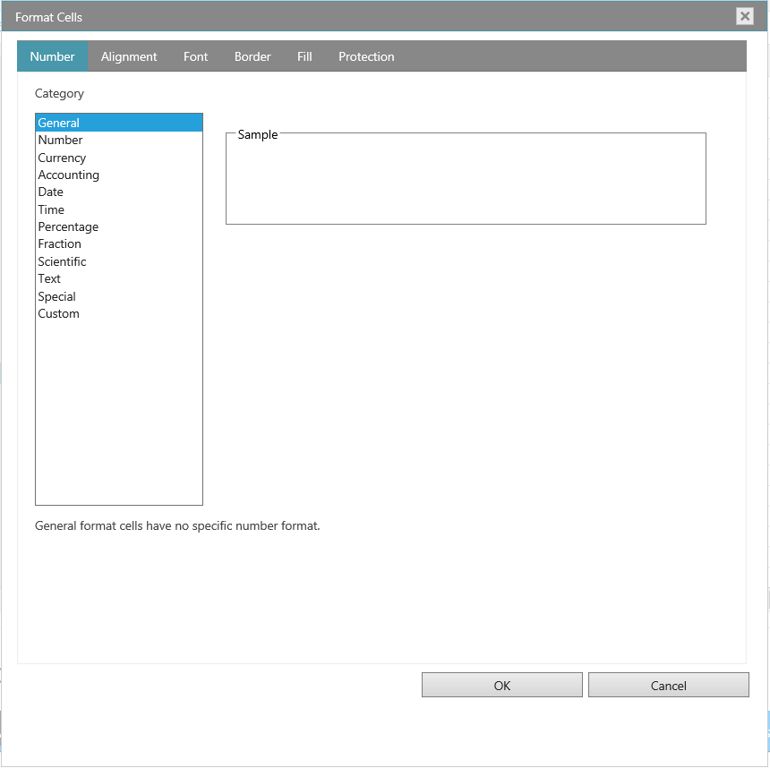
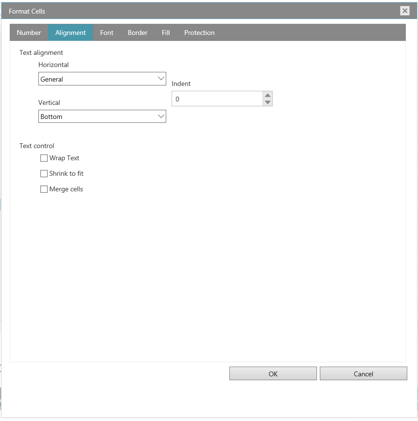
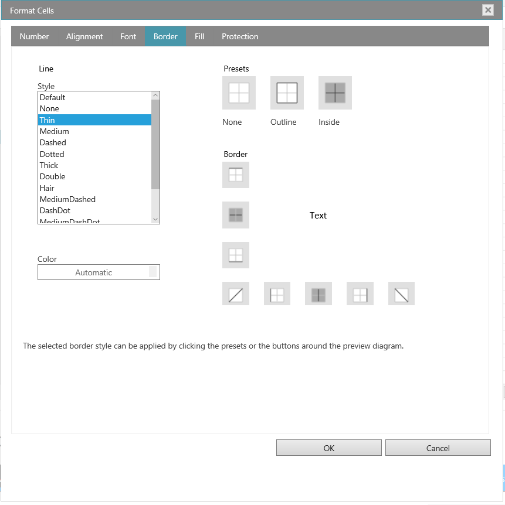

<!--
|metadata|
{
    "fileName": "whats-new-in-2018-volume2",
    "controlName": [],
    "tags": []
}
|metadata|
-->

# 2018 Volume 2 の新機能

このトピックでは、Ignite UI™ 2018 Volume 2 リリースのコントロールと新機能および拡張機能を紹介します。

### 概要

以下の表は、2018 Volume 2 リリースの新機能の概要です。機能の詳細については表の下をご覧ください。

### igGrid
機能 | 説明
---|---
[時刻列](#TimeColumn) | igGrid の時刻列
[フィルター セルのカスタム エディター プロバイダー](#FilteringCustomProvider) | igGrid のフィルター セルでカスタム エディター プロバイダーの実装が可能

### igSpreadsheet
機能 | 説明
---|---
[FormatCells ダイアログ](#FormatCellsDialog)| スプレッドシートの FormatCells ダイアログ

## igGrid の時刻列
###  時刻列

時刻列の新しい列型を igGrid コントロールに追加しました。使用するには、列の `dataType` を `time` に設定します。定義済みのタイムピッカー エディターを使用して時刻データをフィルターして更新できます。

## 関連コンテンツ
### サンプル
[フィルタリング](%%SamplesUrl%%/grid/simple-filtering)

## igGrid のフィルター セルのカスタム エディター プロバイダー
###  フィルター セルのカスタム エディター プロバイダー

フィルター セルのためにカスタム エディター プロバイダーを作成できます。つまり、igGrid コンテンツをフィルターするために igEditorProvider クラスを拡張してカスタム エディターを設定できます。詳細については、以下のサンプルを参照してください。

## 関連コンテンツ
### サンプル
[Excel スタイル フィルタリング](%%SamplesUrl%%/grid/filtering-combo-editor-provider)

## FormatCellsDialog

###  スプレッドシートの FormatCellsDialog

igSpreadsheet を使用してセル データの表示方法を変更できます。たとえば、小数点の右にある桁数を指定、あるいはセルにパターンおよび境界線を追加できます。この設定を「セルの書式設定」ダイアログ ボックスでアクセスして変更できます。

- 表示形式タブ

デフォルトですべてのワークシート セルが一般的な数値形式で書式設定されます。一般的な形式では、セルに入力された値はそのまま使用されます。たとえば、セルに 36526 と入力して Enter を押した場合、セル コンテンツは 36526 と表示されます。セルで一般的な数値形式が使用されるためです。ただし、最初にセルを通貨として書式設定した場合、数字 36526 は $36,526.00 として表示されます。

- 配置タブ

テキストと数値を配置し、配置タブを使用してセルの方向を変更してテキスト コントロールを指定できます。

- フォント タブ

用語「フォント」は、書体 (Arial など) とその属性 (ポイント サイズ、フォント スタイル、下線、色、エフェクト) を指します。セル書式設定ダイアログ ボックスのフォント タブを使用してこれらの設定を制御します。ダイアログ ボックスのプレビュー セクションのレビューで設定のプレビューを表示できます。

- 罫線タブ

Excel で単一セルまたはセルの範囲の周りに境界線を配置できます。セルの左上角から右下角、またはセルの左下角から右上角へ線を描画できます。線のスタイル、線の太さ、または線の色を変更してデフォルト設定のセルの境界線をカスタマイズできます。

- 塗りつぶしタブ

セル書式設定ダイアログ ボックスの塗りつぶしタブを使用して選択セルの背景色を設定します。[パターン リスト] を使用して 2 色パターンまたはセル背景にシェードを適用できます。

- 保護タブ

[保護] タブでワークシートをロックしてデータや数式を保護できます。このオプションは、ワークシートも保護しない限り、効果はありません。

#### 関連トピック
[igSpreadsheet FormatCell ダイアログ](igspreadsheet-FormatCell-Dialog.html)

