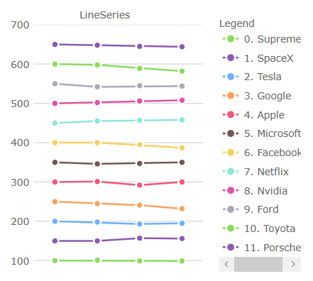
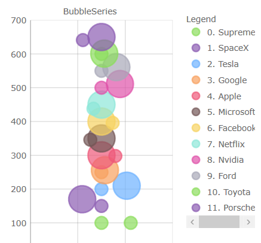
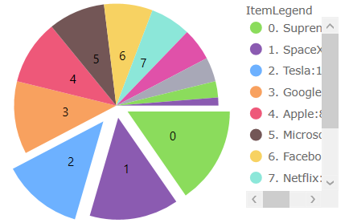
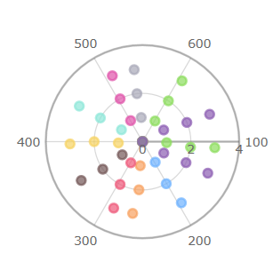

<!--
|metadata|
{
    "fileName": "whats-new-in-2021-volume1",
    "controlName": [],
    "tags": []
}
|metadata|
-->

# What's New in 2021 Volume 1

This topic presents the new features for the %%ProductFamilyName%%™ 2021 Volume 1 release.

## Chart Features

This release introduces several new and improved visual design and configuration options for all of the chart components. e.g. Data Chart, Category Chart, and Financial Chart.

### Redesigned Chart Defaults (i.e.1-6):

1. New color palette for series/markers in all charts

  | 
------------- | -------------
  | 

2. Changed Bar/Column/Waterfall series to have square corners instead of rounded corners 

3. Changed Scatter High Density series’ colors for min/max heat properties  

4. Changed Financial/Waterfall series’ colors for negative fill of their visuals

5. Changed marker's thickness to 2px from 1px

6. Changed marker's fill to match the marker's outline for PointSeries, BubbleSeries, ScatterSeries, PolarScatterSeries 

Note, you can use set [`MarkerFillMode`](%%jQueryApiUrl%%/ui.igDataChart#options:markerFillMode) property to Normal to undo this change

7. Compressed labelling for the TimeXAxis and OrdinalTimeXAxis 

8. New Marker Properties:

- [`MarkerFillMode`](%%jQueryApiUrl%%/ui.igDataChart#options:markerFillMode) - Can be set to 'MatchMarkerOutline' so the marker depends on the outline
- [`MarkerFillOpacity`](%%jQueryApiUrl%%/ui.igDataChart#options:markerFillOpacity) - Can be set to a value 0 to 1
- [`MarkerOutlineMode`](%%jQueryApiUrl%%/ui.igDataChart#options:markerOutlineMode) - Can be set to 'MatchMarkerBrush' so the marker's outline depends on the fill brush color

9. New Series [`OutlineMode`](%%jQueryApiUrl%%/ui.igDataChart#options:series.outlineMode) Property:

Can be set to toggle the series outline visibility. Note, for Data Chart, the property is on the series

10. New Plot Area Margin Properties:

The plot area margin properties define the bleed over area introduced into the viewport when the chart is at the default zoom level. A common use case is to provide space between the axes and first/last data points. Note, the link:{DataChartLink}.{DataChartName}{ApiProp}ComputedPlotAreaMarginMode.html[ComputedPlotAreaMarginMode], listed below, will automatically set the margin when markers are enabled. The others are designed to specify a `Number` to represent the thickness, where PlotAreaMarginLeft etc. adjusts the space to all four sides of the chart. These new properties were added:

- [`PlotAreaMarginLeft`](%%jQueryApiUrl%%/ui.igDataChart#options:plotAreaMarginLeft)
- [`PlotAreaMarginTop`](%%jQueryApiUrl%%/ui.igDataChart#options:plotAreaMarginTop)
- [`PlotAreaMarginRight`](%%jQueryApiUrl%%/ui.igDataChart#options:plotAreaMarginRight)
- [`PlotAreaMarginBottom`](%%jQueryApiUrl%%/ui.igDataChart#options:plotAreaMarginBottom)
- [`ComputedPlotAreaMarginMode`](%%jQueryApiUrl%%/ui.igDataChart#options:computedPlotAreaMarginMode)

11. New Highlighting Properties

Several configurations to the series highlighting as been added. In previous releases the highlighting was limited to fade on hover. These new properties were added:

- [`HighlightingMode`](%%jQueryApiUrl%%/ui.igDataChart#options:highlightingMode) - Sets whether hovered or non-hovered series to fade, brighten
- [`HighlightingBehavior`](%%jQueryApiUrl%%/ui.igDataChart#options:highlightingBehavior) - Sets whether the series highlights depending on mouse position eg. directly over or nearest item

12. Added Highlighting for the following series:

- Stacked
- Scatter
- Polar
- Radial 
- Shape

13. Added Annotation layers to the following series:

- Stacked
- Scatter
- Polar
- Radial
- Shape

14. Added support for overriding the data source of individual stack fragments within a stacked series 

15. Added custom style events to Stacked, Scatter, Range, Polar, Radial, and Shape series

16. Added support to automatically sync the vertical zoom to the series content

17. Added support to automatically expanding the horizontal margins of the chart based on the initial labels displayed 

### Chart Legend Features:

1. Added Horizontal Orientation for ItemLegend

The following chart types can use ItemLegend in horizontal orientation: 

- Bubble
- Donut
- Pie 

2. [`LegendHighlightingMode`](%%jQueryApiUrl%%/ui.igDataChart#options:legendHighlightingMode) - Enables series highlighting when hovering over legend items

### Geographic Map Features (CTP):

1. Added support for wrap around display of the map (scroll infinitely horizontally)  

2. Added support for shifting display of some map series while wrapping around the coordinate origin  

3. Added support for highlighting of the shape series 

4. Added support for some annotation layers for the shape series 

<!--TODO ADD CONTENTS - sample structure from 20-2 below

### %%ProductNameASPNETCore%%
<Infragistics %%ProductNameASPNETCore%% now supports ASP.NET Core for .NET 5 projects. For more information see the [Using %%ProductNameASPNETCore%%](Using-IgniteUI-Controls-in-ASP.NET-Core-project.html) topic.

### %%ProductNameASPNETCore%% Tag Helpers
%%ProductNameASPNETCore%% Tag Helpers now support ASP.NET Core for .NET 5 projects. For more information see the [Using %%ProductNameASPNETCore%% Tag Helpers](using-ignite-ui-tag-helpers.html) topic.

### Infragistics Documents
Infragistics Documents assemblies are now available for ASP.NET Core for .NET 5 projects.-->
