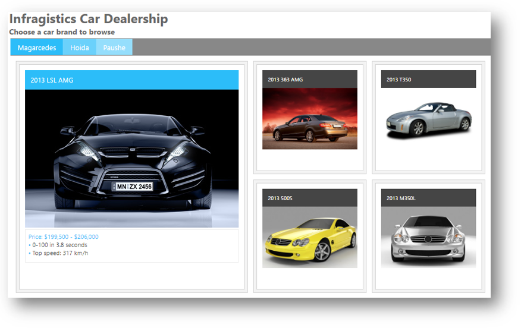
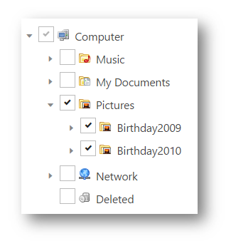

<!--
|metadata|
{
    "fileName": "typescript-samples",
    "controlName": [],
    "tags": []
}
|metadata|
-->

# TypeScript サンプル

## トピックの概要
このトピックでは、Ignite UI コントロールと TypeScript のサンプルについて説明します。

### このトピックの内容

このトピックは、以下のセクションで構成されます。
-   [要件](#requirements)
-   [タイル マネージャー サンプル](#tile_manager_sample)
    -   [プレビュー](#tile_manager_sample_preview)
    -   [詳細](#tile_manager_sample_details)
-   [ダイアログ ウィンドウ サンプル](#dialog_window_sample)
	  -   [プレビュー](#dialog_window_sample_preview)
	  -   [詳細](#dialog_window_sample_details)
-   [テンプレート エンジンのサンプル](#templating_engine_sample)
      -   [プレビュー](#templating_engine_preview)
      -   [詳細](#templating_engine_steps)
-   [円チャート サンプル](#pie_chart_sample)
    -   [プレビュー](#pie_chart_preview)
    -   [詳細](#pie_chart_details)
-   [バーコード サンプル](#barcode_sample)
    -   [プレビュー](#barcode_preview)
    -   [詳細](#barcode_details)
-   [ツリー サンプル](#tree_sample)
    -   [プレビュー](#tree_sample_preview)
    -   [詳細](#tree_sample_details)
-   [関連コンテンツ](#related_content)

### <a id="requirements"></a>要件
これらのサンプルを実行するには、以下が必要となります。
-   必要な Ignite UI の JavaScript と CSS ファイル
-   必要な Ignite UI TypeScript の定義

### <a id="tile_manager_sample"></a>タイル マネージャー サンプル
このサンプルは、`igTileManager` を TypeScript で使用する方法を示します。

#### <a id="tile_manager_sample_preview"></a>プレビュー
以下のスクリーンショットは最終結果のプレビューです。



#### <a id="tile_manager_sample_details"></a>詳細

HTML を作成 - 車メーカーを持つ 3 つのタブがあり、選択した車の写真を読み込む `igTileManager` があります。

**HTML の場合:**
```html
<h1 class="hOne">Infragistics Car Dealership</h1>
<h3>Choose a car brand to browse</h3>
<div id="car-tabs">
    <ul>
        <li><a href="#magarcedesDashboard">Magarcedes</a></li>
        <li><a href="#hoidaDashboard">Hoida</a></li>
        <li><a href="#pausheDashboard">Paushe</a></li>
    </ul>

    <div id="magarcedesDashboard" class="dashboard"></div>
    <div id="hoidaDashboard" class="dashboard"></div>
    <div id="pausheDashboard" class="dashboard"></div>
</div>
```

​<a id="tile_manager_steps_ds"></a>データソースの作成 - クラス `CarData` および `Info`、3 つの 車メーカーのデータを初期化します。すべてを `Cars` 配列に保存します。


**TypeScript の場合:**
```typescript
/// <reference path="../../js/typings/jquery.d.ts" />
/// <reference path="../../js/typings/jqueryui.d.ts" />
/// <reference path="../../js/typings/igniteui.d.ts" />

class Info {
    description: string
    constructor(_description: string) {
        this.description = _description;
    }
}

class CarData {
    name: string;
    picture: string;
    priceRange: string;
    extras: Info[];
    constructor(_name: string, _picture: string, _priceRange: string, _extras: Info[]) {
        this.name = _name;
        this.picture = _picture;
        this.priceRange = _priceRange;
        this.extras = _extras;
    }

    addExtra(_extra) {
        this.extras.push(_extra);
    }
}

var Magarcedes: CarData[] = [];
Magarcedes.push(new CarData("2013 LSL AMG", "../../images/samples/tile-manager/car-dealership/shutterstock_139519967.jpg",
    "$199,500 - $206,000", [new Info("0-100 in 3.8 seconds"), new Info("Top speed: 317 km/h")]));
...

var Hoida: CarData[] = [];
Hoida.push(new CarData("2013 Candy", "../../images/samples/tile-manager/car-dealership/shutterstock_57034834.jpg",
    "$21,661 - $29,404", [new Info("Gas I4 2.5L engine"), new Info("Highway fuel efficiency 35 mpg")]));
...

var Paushe: CarData[] = [];
Paushe.push(new CarData("2013 CST", "../../images/samples/tile-manager/car-dealership/shutterstock_38288989.jpg",
    "$39,095 - $59,090", [new Info("Available All Wheel Drive"), new Info("Available touch-screen glide-up navigation with voice recognition"),
        new Info("Leather seating surfaces"), new Info("Adaptive Remote Start")]));
...

var Cars: CarData[][] = [];
Cars.push(Magarcedes);
Cars.push(Hoida);
Cars.push(Paushe);
```

​<a id="tile_manager_steps_tm"></a>igTileManager の作成- `igTileManager` とタブを作成します。次に最初の車メーカーをあらかじめ選択し、タブが選択されたときに `igTileManager` データソースで更新するようタブを設定します。

**TypeScript の場合:**
```typescript
$(function () {
    var activated: boolean[] = [false, false, false, false],
    options: IgTileManager = {
            columnWidth: 210,
            columnHeight: 210,
            marginLeft: 10,
            marginTop: 10,
            dataSource: Cars,
            items: [
                { rowIndex: 0, colIndex: 0, rowSpan: 2, colSpan: 2 },
                { rowIndex: 0, colIndex: 2, rowSpan: 1, colSpan: 1 },
                { rowIndex: 1, colIndex: 2, rowSpan: 1, colSpan: 1 },
                { rowIndex: 2, colIndex: 0, rowSpan: 1, colSpan: 1 },
                { rowIndex: 2, colIndex: 1, rowSpan: 1, colSpan: 1 },
                { rowIndex: 2, colIndex: 2, rowSpan: 1, colSpan: 1 }
            ],
            maximizedTileIndex: 0,
            maximizedState: '<figure><figcaption>${name}</figcaption></figure><ul><li>Price: ${priceRange}</li>' +
            '{{each ${extras} }}<li>${extras.description}</li>{{/each}}</ul>',
            minimizedState: '<figure><figcaption>${name}</figcaption>'
        };

    // ページの読み込みで表示されるタブの初めての初期化
    options.dataSource = Cars[0];
    activated[0] = true;
    $('#magarcedesDashboard').igTileManager(options);

    var tabOptions: JQueryUI.TabsOptions = {
        activate: function (event, ui) {
            var index = ui.newTab.index();
            if (!activated[index]) {
                options.dataSource = Cars[index];
                ui.newPanel.igTileManager(options);
                activated[index] = true;
            } else {
                ui.newPanel.igTileManager('reflow');
            }
        }
    }

    $('#car-tabs').tabs(tabOptions);
});
```

### <a id="dialog_window_sample"></a>ダイアログ ウィンドウ サンプル
このサンプルは、`igDialog` を TypeScript で使用する方法を紹介します。

#### <a id="dialog_window_sample_preview"></a>プレビュー
以下のスクリーンショットは最終結果のプレビューです。


#### <a id="dialog_window_sample_details"></a>詳細
HTML を作成 - `igDialog` で Infragistics サイトを表示します。

**HTML の場合:**
```html
<button id="openDialog"></button>

    <div id="dialog">
            <iframe src="http://www.infragistics.com" frameborder="0" width= "100%" height="100%"></iframe>
    </div>
```

<a id="dialog_window_steps_ts"></a>igDialog を作成 - `igDialog` を閉じた状態で作成します。ボタンの `click` イベントにイベント ハンドラーをアタッチすると、ボタンがクリックしたときにモーダル ダイアログは表示されます。

**TypeScript の場合:**
```typescript
$(function () {

    // Initialize the open button with igButton
    $("#openDialog").igButton({ labelText: "Open Dialog" });

    // Initialize the igDialog
    $("#dialog").igDialog({
        state: "closed",
        modal: true,
        draggable: false,
        resizable: false,
        height: 500,
        width: 400
    });

    $("#openDialog").on({
        click: function (e) {
            // Open the igDialog
            $("#dialog").igDialog("open");
        }
    });
});
```

### <a id="templating_engine_sample"></a>テンプレート エンジンのサンプル
このサンプルは、`igTemplatingEngine` を TypeScript で使用する方法を紹介します。

#### <a id="templating_engine_preview"></a>プレビュー
以下のスクリーンショットは最終結果のプレビューです。


####<a id="templating_engine_steps"></a>詳細
HTML を作成 - このサンプルは、TypeScript で Infragistics テンプレート エンジンを使用してネストされたテンプレートを使用する方法を紹介します。この例では、各アクターの映画コレクションは繰り返され、映画データはツリーで表示されます。

**HTML の場合:**
```html
<script id="colTmpl" type="text/template">
    <div class='tree'>
        <ul>
            {{each ${movies} }}
            <li>
                ${movies.name}
                <ul>
                    <li>Genre: ${movies.genre}</li>
                    <li>Year: ${movies.year}</li>
                    <li>
                        <a>
                            <span class='ratingLabel' style='float:left'>Rating:</span>
                            <span class='rating'>${movies.rating}</span>
                        </a>
                    </li>
                    <li class='clear'>Languages: ${movies.languages}</li>
                    <li>Subtitles: ${movies.subtitles}</li>
                </ul>
            {{/each}}
        </ul>
    </div>
</script>

<div id="resultGrid"></div>
```

`Movie` および `Actor` クラスを追加し、映画およびアクターのデータを初期化します。

**TypeScript の場合:**
```typescript
/// <reference path="http://www.igniteui.com/js/typings/jquery.d.ts" />
/// <reference path="http://www.igniteui.com/js/typings/jqueryui.d.ts" />
/// <reference path="http://www.igniteui.com/js/typings/igniteui.d.ts" />

class Movie {
    name: string;
    year: number;
    genre: string;
    rating: number;
    languages: string;
    subtitles: string;
    constructor(inName: string, inYear: number, inGenre: string, inRating: number, inLanguage: string, inSubs: string) {
        this.name = inName;
        this.year = inYear;
        this.genre = inGenre;
        this.rating = inRating;
        this.languages = inLanguage;
        this.subtitles = inSubs;
    }
}

class Actor {
    firstName: string;
    lastName: string;
    nationality: Object;
    movies: Movie[];
    constructor(inFirstName: string, inLastName: string, inNationality: Object, inMoviesArray: Movie[]) {
        this.firstName = inFirstName;
        this.lastName = inLastName;
        this.nationality = inNationality;
        this.movies = inMoviesArray;
    }
}

var moviesDWashington: Movie[] = [];
moviesDWashington.push(new Movie("American Gangster", 2007, "Biography, Crime, Drama", 7.9, "English, German", "Japanese, English"));

var moviesAJolie: Movie[] = [];
moviesAJolie.push(new Movie("In the Land of Blood and Honey", 2011, "Drama, Romance, War", 3.2, "English", "English, French"));

var moviesPCruz: Movie[] = [];
moviesPCruz.push(new Movie("Sahara", 2005, "Action, Adventure, Comedy", 5.9, "English, Spanish", "Japanese, French"));

var moviesGClooney: Movie[] = [];
moviesGClooney.push(new Movie("Ocean's Thirteen", 2007, "Crime, Thriller", 6.9, "English", "Spanish, French"));

var moviesJRoberts: Movie[] = [];
moviesJRoberts.push(new Movie("Eat Pray Love", 2010, "Drama, Romance", 5.3, "English, German", "Spanish, French"));

var actors: Actor[] = [];
actors.push(new Actor("Denzel", "Washington", { key: "USA", value: "USA" }, moviesDWashington));
```

次に `igGrid` および `igTree` コントロールを初期化します。

**TypeScript の場合:**
```typescript
$(function () {
    var i = 0, currentValue, limit,
        imagesRoot = "http://www.igniteui.com/images/samples/templating-engine/multiConditionalColTemplate";

    $("#resultGrid").igGrid({
        dataSource: actors,
        width: "100%",
        autoGenerateColumns: false, 
        columns: [
            { headerText: "First Name", key: "firstName", width: 100 },
            { headerText: "Last Name", key: "lastName", width: 200 },
            { headerText: "Nationality", key: "nationality", width: 100, template: " ${nationality.value} " },
            { headerText: "Movies", key: "movies", width: 500, template: $("#colTmpl").html() },
        ],
        rendered: function () {
            initializeInnerControls();
        },
        features: [
            {
                name: "Paging",
                type: "local",
                pageSize: 3,
                pageSizeChanged: function () {
                    initializeInnerControls();
                },
                pageIndexChanged: function () {
                    initializeInnerControls();
                }
            }
        ]
    }); 

    function initializeInnerControls() {
        $(".tree").igTree({ hotTracking: false });
        limit = $('.rating').length;
        for (i = 0; i < limit; i++) {
            currentValue = parseFloat($($('.rating')[i]).html());
            $($('.rating')[i]).igRating({
                voteCount: 10,
                value: currentValue,
                valueAsPercent: false,
                precision: "exact"
            });
        }
    }
});
```

### <a id="pie_chart_sample"></a>円チャート サンプル
このサンプルでは、凡例および複数のレイアウト オプションを持つ円チャート コントロールを TypeScript で作成する方法を紹介します。
#### <a id="pie_chart_preview"></a>プレビュー
以下のスクリーンショットは最終結果のプレビューです。


#### <a id="pie_chart_details"></a></a>詳細

HTML を作成 - ラベル位置、線、角度、半径、および凡例を含む複数のオプションを設定する可能な円チャートを作成します。

**HTML の場合:**
```html
<div id="pieChart"></div>
    <div id="legend"></div>

    <table class="options">
        <tr>
            <td>Start Angle:</td>
            <td>
                <div id="angle" class="slider"></div>
            </td>
        </tr>
        <tr>
            <td>Radius:</td>
            <td>
                <div id="radius" class="slider"></div>
            </td>
        </tr>
        <tr>
            <td>Label Position:</td>
            <td>
                <div class="comboContainer">
                    <select id="labelPosition">
                      <option value="none">None</option>
                        <option value="center">Center</option>
                        <option value="insideEnd">Inside End</option>
                        <option value="outsideEnd" selected="selected">Outside End</option>
                        <option value="bestFit">Best Fit</option>
                    </select>
                </div>
            </td>
        </tr>
        <tr>
            <td>Leader Line:</td>
            <td>
                <div class="comboContainer">
                    <select id="leaderLine">
                        <option value="straight" selected="selected">Straight</option>
                        <option value="arc">Arc</option>
                        <option value="spline">Spline</option>
                    </select>
                </div>
            </td>
        </tr>
    </table>
```

データ ソースを作成 - `PieChartCountryPopulation` クラスを追加し、国人口データを初期化します。`PieChartCountryPopulation` 配列に保存されます。

**TypeScript の場合:**
```typescript
/// <reference path="../../js/typings/jquery.d.ts" />
/// <reference path="../../js/typings/jqueryui.d.ts" />
/// <reference path="../../js/typings/igniteui.d.ts" />

class PieChartCountryPopulation {
    countryName: string;
    population2008: number;
    constructor(inName: string, populationIn2008: number) {
        this.countryName = inName;
        this.population2008 = populationIn2008;
    }
}

var pieChartSample: PieChartCountryPopulation[] = [];
pieChartSample.push(new PieChartCountryPopulation("China", 1333));
pieChartSample.push(new PieChartCountryPopulation("India", 1140));
pieChartSample.push(new PieChartCountryPopulation("United States", 304));
pieChartSample.push(new PieChartCountryPopulation("Indonesia", 228));
pieChartSample.push(new PieChartCountryPopulation("Brazil", 192));
```

igPieChart を作成 - レイアウトを構成するには、`igCombo`、および `slider` を作成し、`igPieChart` を作成します。

```typescript
$(function () {
    $('#pieChart').igPieChart({
        dataSource: pieChartSample,
        width: "430px",
        height: "430px",
        dataLabel: 'countryName',
        dataValue: 'population2008',
        explodedSlices: [2, 3, 4],
        radiusFactor: .6,
        startAngle: -30,
        labelsPosition: "outsideEnd",
        leaderLineType: "straight",
        labelExtent: 40,
        legend: { element: 'legend', type: "item" }
    });

    $("#angle").slider({
        slide: function (event, ui) {
            $("#pieChart").igPieChart("option", "startAngle", ui.value);
        },
        min: 0,
        max: 360
    });

    $("#radius").slider({
        slide: function (event, ui) {
            $("#pieChart").igPieChart("option", "radiusFactor", ui.value / 1000.0);
        },
        min: 0,
        max: 1000,
        value: 600
    });

    $("#labelPosition").igCombo({
        enableClearButton: false,
        mode: "dropdown",
        selectionChanged: function (evt, ui) {
            if ($.isArray(ui.items) && ui.items[0] != undefined) {
                $("#pieChart").igPieChart("option", "labelsPosition", ui.items[0].data.value);

                $("#labelExtent").slider("option", "disabled", ui.items[0].data.value != "outsideEnd");
                $("#leaderLine").igCombo("option", "disabled", ui.items[0].data.value != "outsideEnd" ? true : false);
            }
        }
    });

    $("#leaderLine").igCombo({
        enableClearButton: false,
        mode: "dropdown",
        selectionChanged: function (evt, ui) {
            if ($.isArray(ui.items) && ui.items[0] != undefined) {
                $("#pieChart").igPieChart("option", "leaderLineType", ui.items[0].data.value);
            }
        }
    });
});
```

### <a id="tree_sample"></a>ツリー サンプル
このサンプルは、`igTree` を TypeScript で使用する方法を紹介します。

#### <a id="tree_sample_preview"></a>プレビュー
以下のスクリーンショットは最終結果のプレビューです。



#### <a id="tree_sample_details"></a>詳細
HTML を作成 - フォルダーおよびファイルを含むファイル エクスプローラーを表す `igTree` を作成します。

**HTML の場合:**
```html
<div id="tree"></div>
```

データ ソースを作成 - フォルダー、サブフォルダー、およびファイルを含む階層構造を作成します。

**TypeScript の場合:**
```typescript
/// <reference path="../../js/typings/jquery.d.ts" />
/// <reference path="../../js/typings/jqueryui.d.ts" />
/// <reference path="../../js/typings/igniteui.d.ts" />

class FileType {
    name: string;
    type: string;
    imageUrl: string;
    folder: FileType[];
    constructor(inName: string, inType: string, inImageUrl: string, inFolder: FileType[]) {
        this.name = inName;
        this.type = inType;
        this.imageUrl = inImageUrl;
        this.folder = inFolder;
    }
}

function createSubfolderFiles(parentFolder: FileType, subFolders: string[], files: string[][],
    folderPicture: string, filePicture: string) {
    var fileIndex, subFolderIndex;
    for (subFolderIndex = 0; subFolderIndex < subFolders.length; subFolderIndex++) {
        parentFolder.folder.push(new FileType(subFolders[subFolderIndex], "Folder", folderPicture, []));

        for (fileIndex = 0; fileIndex < files[subFolderIndex].length; fileIndex++) {
            parentFolder.folder[subFolderIndex].folder.push(new FileType(files[subFolderIndex][fileIndex], "File", filePicture, []));
        }
    }
}

var folderMusic = new FileType("Music", "Folder", "../../images/samples/tree/book.png", []);
var musicSubFolders = ["Y.Malmsteen", "WhiteSnake", "AC/DC", "Rock"];
var musicFiles = [["Making Love", "Rising Force", "Fire and Ice"], ["Trouble", "Bad Boys", "Is This Love"],
    ["ThunderStruck", "T.N.T.", "The Jack"], ["Bon Jovi - Always"]];
createSubfolderFiles(folderMusic, musicSubFolders, musicFiles, "../../images/samples/tree/book.png", "../../images/samples/tree/music.png");

...

var folderDeleted = new FileType("Deleted", "Folder", "../../images/samples/tree/bin_empty.png", []);
var folderComputer = new FileType("Computer", "Folder", "../../images/samples/tree/computer.png", []);
folderComputer.folder.push(folderMusic);
folderComputer.folder.push(folderDocuments);
folderComputer.folder.push(folderPictures);
folderComputer.folder.push(folderNetwork);
folderComputer.folder.push(folderDeleted);

var files = [folderComputer];
```

`igTree` を作成 - `igTree` を作成し、生成されたデータ ソースにバインドします。

**TypeScript の場合:**
```typescript
$(function () {
    var options: IgTree = {
        checkboxMode: 'triState',
        singleBranchExpand: true,
        dataSource: $.extend(true, [], files),
        initialExpandDepth: 0,
        pathSeparator: '.',
        bindings: {
            textKey: 'name',
            valueKey: 'type',
            imageUrlKey: 'imageUrl',
            childDataProperty: 'folder'
        },
        dragAndDrop: true,
        dragAndDropSettings: {
            allowDrop: true,
            customDropValidation: function (element) {
                // Validates the drop target
                var valid = true,
                    droppableNode = $(this);

                if (droppableNode.is('a') && droppableNode.closest('li[data-role=node]').attr('data-value') === 'File') {
                    valid = false;
                }

                return valid;
            }
        }
    }

    $("#tree").igTree(options);
});
```

### <a id="barcode_sample"></a>バーコード サンプル
このサンプルでは、バーコードの作成で TypeScript の使用方法を紹介し、設定の構成を紹介します。
#### <a id="barcode_preview"></a>プレビュー
以下のスクリーンショットは最終結果のプレビューです。


#### <a id="barcode_details"></a></a>詳細

HTML を作成 - Infragistics サイトへのハイパーリンクを含むデータに基づいてバーコードを作成します。バーコード モードを変更するには、`エンコード モード`および `ECI ヘッダーの表示モード`を使用します。

**HTML の場合**
```html
<table class="options">
    <tr>
        <td style="text-align:left;">
            <div id="barcode"></div>
        </td>
    </tr>
    <tr>
        <td>Data:</td>
        <td>
            <input id='combo' dir="ltr"></input>
        </td>
        <td>
            <input id="setButton" type="button" value="Set" style="width:50px; float: left;" />
        </td>
    </tr>
    <tr>
        <td>Encoding Mode:</td>
        <td>
            <div class="comboContainer">
                <select id="encodingMode">
                    <option value="undefined">Undefined</option>
                    <option value="numeric">Numeric</option>
                    <option value="alphanumeric">Alphanumeric</option>
                    <option value="byte" selected="selected">Byte</option>
                    <option value="anji">Kanji</option>
                </select>
            </div>
        </td>
    </tr>
    <tr>
        <td>Eci Header Display Mode:</td>
        <td>
            <div class="comboContainer">
                <select id="eciHeaderDisplayMode">
                    <option value="hide" selected="selected">Hide</option>
                    <option value="show">Show</option>
                </select>
            </div>
        </td>
    </tr>
</table>
```
データ ソースを作成 - `IGProducts` クラスを追加し、 Infragistics 製品データを初期化します。`igProductsData` 配列で保存されます。

**TypeScript の場合**
```typescript
/// <reference path="../../js/typings/jquery.d.ts" />
/// <reference path="../../js/typings/jqueryui.d.ts" />
/// <reference path="../../js/typings/igniteui.d.ts" />

class IGProducts {
    id: number;
    name: string;
    constructor(productId: number, productName: string) {
        this.id = productId;
        this.name = productName;
    }
}

var igProductsData: IGProducts[] = [];
igProductsData.push(new IGProducts(1, "http://www.infragistics.com/products/ultimate"));
igProductsData.push(new IGProducts(2, "http://www.infragistics.com/products/professional"));
igProductsData.push(new IGProducts(3, "http://www.infragistics.com/products/jquery"));

```
igBarcode を作成 - レイアウトを構成するには、`igCombo` などのコントロールを作成し、`igBarcode` を作成します。

```typescript
$(function () {
    $("#barcode").igQRCodeBarcode({
        height: "300px",
        width: "100%",
        data: "http://www.infragistics.com/products/jquery/samples",
    });

    $("#dataInput").igTextEditor({
        width: "300px",
        value: "http://www.infragistics.com/products/jquery/help"
    });

   $("#setButton").click(function () {
        $("#barcode").igQRCodeBarcode("option", "data", $("#dataInput").igTextEditor("value"));
    });

	$('#combo').igCombo({
		dataSource: igProductsData,
		textKey: 'Name',
		valueKey: 'ID',
		width: "500px",
		initialSelectedItems: [{
			index: 0
		}]
	});

    $("#encodingMode").igCombo({
        enableClearButton: false,
        mode: "dropdown",
        selectionChanged: function (evt, ui) {
            if ($.isArray(ui.items) && ui.items[0] != undefined) {
                $("#barcode").igQRCodeBarcode("option", "encodingMode", ui.items[0].data.value);
            }
        }
    });

    $("#eciHeaderDisplayMode").igCombo({
        enableClearButton: false,
        mode: "dropdown",
        selectionChanged: function (evt, ui) {
            if ($.isArray(ui.items) && ui.items[0] != undefined) {
                $("#barcode").igQRCodeBarcode("option", "eciHeaderDisplayMode", ui.items[0].data.value);
            }
        }
    });
});
```

### <a id="related_content"></a>関連コンテンツ
以下のトピックでは、このトピックに関連する追加情報を提供しています。

[TypeScript での Ignite UI の使用](Using-Ignite-UI-with-TypeScript.html) - このトピックでは、Ignite UI の型定義を TypeScript で使用する方法の概要を説明します。
